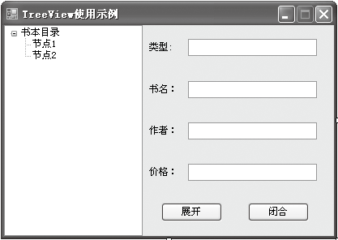
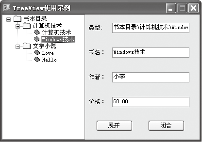

### 14.2　树形控件


**本节视频教学录像：9分钟**

TreeView控件是一个树形控件。该控件可以为用户显示节点层次结构，每个节点又可以包含子节点，包含子节点的节点叫父节点。用户可以按展开或折叠的方式显示父节点和所包含的子节点。另外，通过设置TreeView的CheckBoxes属性，还可以决定是否在节点旁边显示复选框。

树形视图控件用TreeView类封装，主要用于显示层次结构的数据信息，如同Windows中显示的文件和目录。它一般由项或节点（TreeNode）构成，节点还可以包含子节点，可以展开或收起节点，并且每个节点都可以包含标题和图标。

下表列出了TreeView类的常用成员及说明。其中Nodes属性用于设置TreeView控件中的所有节点，其属性值TreeNodeCollection表示分配给树视图控件的树节点。

| 成员名称 | 类别 | 说明 |
| :-----  | :-----  | :-----  | :-----  | :-----  |
| PathSeparator | 属性 | 用于由节点FullPath属性返回的路径的字符串的分隔符 |
| Nodes | 属性 | 设置TreeView控件中的所有节点 |
| Add() | 方法 | 将先前创建的树节点添加到树节点集合的末尾 |
| AddRange() | 方法 | 将先前创建的一组树节点添加到集合中 |
| Clear() | 方法 | 从集合中删除所有树节点 |
| ExpandAll | 方法 | 展开所有树节点，包含子节点 |
| Insert() | 方法 | 创建具有指定键、文本和图像的树节点，并将其插入集合中指定索引处 |
| Remove() | 方法 | 从树节点集合中移除指定的树节点 |
| RemoveAt() | 方法 | 从树节点集合的指定索引处移除树节点 |
| RemoveByKey() | 方法 | 从集合中移除具有指定键的树节点 |

**【范例14-2】 TreeView控件使用示例。**

（1）启动Visual Studio 2013，新建一个C# Windows窗体应用程序，项目名称为“TreeViewDemo”。

（2）在窗体上添加1个TreeView控件、4个Lable控件、4个TextBox控件和2个Button控件，设计如下图所示的界面。


（3）双击【展开】按钮，切换到代码窗口，输入以下代码（代码14-2.txt）。

```c
01  private void InitTreeView(TreeView treeView) //自定义方法实现TreeView的初始化
02  {
03          treeView.CheckBoxes = false;         //不显示复选框
04          treeView.FullRowSelect = true; 
05          ImageList imageList = new ImageList();
06          imageList.Images.Add(new Icon("Folder.ico"));
07          imageList.Images.Add(new Icon("OpenFolder.ico"));
08          imageList.Images.Add(new Icon("Book.ico"));
09          treeView.ImageList = imageList;     //设置图像集合
10          treeView.LabelEdit = false;         //设置不能编辑
11          treeView.PathSeparator = "\\";      //用\\符号为分隔符
12          treeView.Scrollable = true;         //显示滚动条
13          treeView.ShowLines = true;          //显示连线
14          treeView.ShowNodeToolTips = true;
15          treeView.ShowPlusMinus = true;      //显示＋－号
16          treeView.ShowRootLines = true;
17          treeView.AfterSelect += new TreeViewEventHandler(treeView_AfterSelect);
18  }
19  void treeView_AfterSelect(object sender, TreeViewEventArgs e)
20  {
21          if (e.Node.Tag != null)
22          {
23                  Book book = e.Node.Tag as Book;
24                  this.txtPath.Text = e.Node.FullPath;
25                  this.txtBookName.Text = book.BookName;
26                  this.txtAuthor.Text = book.Author;
27                  this.txtPrice.Text = book.Price;
28          }
29  }
30  private void AddNode(TreeView treeView)      //定义动态添加树节点的过程
31  {
32          //添加节点
33          TreeNode MainNode = treeView.Nodes[0];
34          treeView.BeginUpdate();
35          MainNode.Nodes.Clear();
36          //增加第1个分类节点
37          TreeNode Catalog1 = new TreeNode("计算机技术");
38          Catalog1.ImageIndex = 0;
39          Catalog1.SelectedImageIndex = 1;
40          Book Book1 = new Book();
41          Book1.BookName = "计算机技术";
42          Book1.Author = "小王";
43          Book1.Price = "20.00";
44          TreeNode BookNode1 = new TreeNode(Book1.BookName);
45          BookNode1.ImageIndex = 2;
46          BookNode1 .SelectedImageIndex = 2;
47          BookNode1.Tag = Book1;//
48          Book Book2 = new Book();
49          Book2.BookName = "Windows技术";
50          Book2.Author = "小李";
51          Book2.Price = "60.00";
52          TreeNode BookNode2 = new TreeNode(Book2.BookName);
53          BookNode2.ImageIndex = 2;
54          BookNode2.SelectedImageIndex = 2;
55          BookNode2.Tag = Book2;//
56          Catalog1.Nodes.Add(BookNode1);
57          Catalog1.Nodes.Add(BookNode2);
58          MainNode.Nodes.Add(Catalog1);
59          //增加第2个分类节点
60          TreeNode Catalog2 = new TreeNode("文学小说");
61          Catalog2.ImageIndex = 0;
62          Catalog2.SelectedImageIndex = 1;
63          Book Book3 = new Book();
64          Book3.BookName = "Love";
65          Book3.Author = "LN";
66          Book3.Price = "39.00";
67          TreeNode BookNode3 = new TreeNode(Book3.BookName);
68          BookNode3.ImageIndex = 2;
69          BookNode3.SelectedImageIndex = 2;
70          BookNode3.Tag = Book1;//
71          Book Book4 = new Book();
72          Book4.BookName = "Hello";
73          Book4.Author = "Lily";
74          Book4.Price = "20.00";
75          TreeNode BookNode4 = new TreeNode(Book4.BookName);
76          BookNode4.ImageIndex = 2;
77          BookNode4.SelectedImageIndex = 2;
78          BookNode4.Tag = Book4;//
79          Catalog2.Nodes.Add(BookNode3);
80          Catalog2.Nodes.Add(BookNode4);
81          MainNode.Nodes.Add(Catalog2);
82          reeView.EndUpdate();
83  }
84  public class Book
85  {
86          public string BookName = string.Empty;
87          public string Author = string.Empty;
88          public string Price = string.Empty;
89  }
90  private void btExpand_Click(object sender, EventArgs e)
91  {
92          this.treeView1.ExpandAll();         //展开树节点
93  }
94  private void btCollapse_Click(object sender, EventArgs e)
95  {
96          this.treeView1.CollapseAll();        //闭合树节点
97  }
98  private void Form1_Load(object sender, EventArgs e)
99  {
100          this.InitTreeView(this.treeView1);  //初始化
101          this.AddNode(this.treeView1);       //初始化树节点
102 }
```

**【运行结果】**

单击工具栏中的【启用调试】按钮
，即可看到窗体界面，如下图所示，单击【展开】按钮，即可展开TreeView中的所有节点；选择任意一个子节点，即可将该节点的详细信息显示在右边的文本框中；单击【闭合】按钮，即可闭合所有节点。


**【范例分析】**

在这个程序中，第1~18行初始化树的相关设置，如设置树视图控件的复选框不显示等，还向窗体中动态添加了一个ImageList控件，利用该控件向节点上添加图片；第19~29行定义了树视图控件的选定树节点时触发的事件，即选中树节点时，窗体右边的各个文本框中显示所选节点相对应的信息；第30~83行程序虽然比较长，但非常简单，实现了动态向树节点中添加项，同样，我们也可以通过树视图控件的属性窗口实现向控件中添加节点信息；第84~89行定义了一个Book类，在类中定义了类的3个属性；第90行到程序结束定义了3个事件，即载入窗体事件、展开按钮的Click事件和闭合按钮的Click事件。

