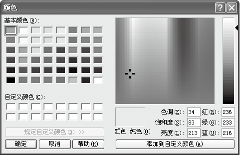

### 14.4.2　颜色对话框

ColorDialog控件用于选择颜色，它允许用户从调色板中选择颜色或自定义颜色，如下图所示。


下表列出了ColorDialog类的常用成员及其说明。

| 成员名称 | 类别 | 说明 |
| :-----  | :-----  | :-----  | :-----  | :-----  |
| AllowFullOpen | 属性 | 禁止和启用“自定义颜色”按钮 |
| FullOpen | 属性 | 是否最先显示对话框的“自定义颜色”部分 |
| ShowHelp | 属性 | 是否显示“帮助”按钮 |
| Color | 属性 | 在对话框中显示的颜色 |
| AnyColor | 属性 | 显示可选择任何颜色 |
| CustomColors | 属性 | 是否显示自定义颜色 |
| SolidColorOnly | 属性 | 是否只能选择纯色 |
| HelpRequest | 事件 | 当单击“帮助”按钮时要处理的事件 |

下面对比较重要的3个成员进行介绍。

（1）AllowFullOpen属性。

语法如下。

```c
object.AllowFullOpen[=boolean]
```

参数说明如下。

object：一个对象表达式。

boolean：一个布尔表达式，指定用户是否可以使用该对话框定义自定义颜色。取值为True，允许用户使用该对话框自定义颜色；取值为False，不允许使用该对话框自定义颜色。

（2）Color属性。

语法如下。

```c
object.Color[=Color]
```

参数说明如下。

object：一个对象表达式。

Color：表示用户选定的颜色。

（3）FullOpen属性。

语法如下。

```c
object.FullOpen[=boolean]
```

参数说明如下。

object：一个对象表达式。

boolean：一个布尔表达式，指定在打开对话框时创建自定义颜色的控件是否可见。取值为True，表示可见；取值为False，表示不可见。

下面演示如何创建ColorDialog组件的实例，并设置其属性。代码如下。

```c
01  ColorDialog cD = new ColorDialog();        //创建颜色对话框对象cD
02  cD.AllowFullOpen = true                    //用户是否可以使用该对话框定义自定义的颜色
03  cD.FullOpen = true;                        //创建自定义颜色的控件是否可见
04  cD.ShowHelp = true;                        //显示帮助按钮
05  cD.CustomColors = new int[]{0,0,0,0,0,0};
06  if (cD.ShowDialog() == DialogResult.OK)    //用户单击了“确定”按钮
07  {
08          rTB.SelectionColor = cD.Color;     //获取用户选择的颜色
09  }
10  else
11  {        
12          rTB.SelectionColor = Color.Black;
13  }
```

