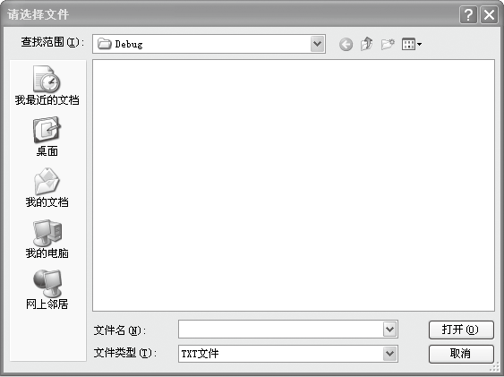

### 14.4.3　文件对话框

文件对话框包括打开文件对话框（OpenFileDialog）和保存文件对话框（SaveFileDialog）。打开文件对话框组件允许用户选择要打开的文件，指定组件的Filter属性可以过滤文件类型，如下图所示。


保存文件对话框组件允许用户将文件保存到指定的位置。SaveFileDialog控件继承了OpenFileDialog控件的大多数属性、方法和事件。

下表列出了OpenFileDialog类的常用成员及其说明。

| 成员名称 | 类别 | 说明 |
| :-----  | :-----  | :-----  | :-----  | :-----  |
| AddExtension | 属性 | 控制是否将扩展名自动添加到文件名上 |
| CheckFileExists | 属性 | 指示在用户指定文件不存在时是否显示警告 |
| CheckPathExists | 属性 | 在对话框返回之前，检查指定的路径是否存在 |
| DefalutExt | 属性 | 默认的文件扩展名。当用户键入文件名时，如果未指定扩展名，将在文件名的后面添加此扩展名 |
| FileName | 属性 | 第一个在对话框中显示的文件，或用户选择的最后一个文件 |
| Filter | 属性 | 对话框中显示的文件筛选器 |
| IniTialDirectory | 属性 | 对话框的初始目录 |
| Multiselect | 属性 | 控制是否可以在该对话框中选择多个文件 |
| ShowHelp | 属性 | 启用“帮助”按钮 |
| Title | 属性 | 将显示对话框标题栏的字符串 |

下面对比较重要的3个成员进行介绍。

（1）Filter属性。获取或设置当前文件名筛选器字符串，该字符串决定对话框的“文件类型”或“另存为保存类型”框中出现的选择内容。

例如，使对话框只能打开相关的图片文件（.bmp、.gif、.jpg）的代码如下。

```c
OpenFileDialog1.Filter= "bmp文件(*.bmp)|*.bmp|gif文件(*.gif)|*.gif|jpg文件(*.jpg)|*.jpg";
```

（2）RestoreDirectory属性。获取或设置一个值，该值指示对话框在关闭前是否还原当前目录。

（3）ShowDialog方法。显示OpenFileDialog控件。

语法如下。

```c
object.ShowDialog()
```

下面演示如何创建OpenFileDialog组件的实例，并设置其属性。代码如下。

```c
01  OpenFileDialog Ofd = new OpenFileDialog();    //创建打开文件对话框对象
02  Ofd.Title = "打开播放文件对话框";               //设置对话框标题
03  Ofd.InitialDirectory = @"C:\";                //对话框初始目录
04  Ofd.Filter = "影视文件(*.rmvb)|*.rmvb|所有文件(*.*)|*.*";   //定义文件筛选器
05  Ofd.FilterIndex = 1;                         //在对话框中默认显示的文件筛选器索引
06  Ofd.ShowHelp = true;                         //打开文件对话框显示帮助按钮
07  Ofd.HelpRequest += new System.EventHandler(this.ShowOpenDialogHelp);
08  Ofd.ShowDialog();
```

保存文件对话框的代码如下。

```c
01  SaveFileDialog Sfd = new SaveFileDialog();  //创建保存文件对话框对象
02  Sfd.Title = "保存文件对话框";                //设置对话框标题
03  Sfd.InitialDirectory = @"C:\";              //对话框初始目录
04  Sfd.Filter = "Word文档(*.doc)|*.doc|所有文件(*.*)|*.*";   //定义文件筛选器
05  Sfd.FilterIndex = 1;                        //在对话框中默认显示的文件筛选器索引
06  Sfd.AddExtension = true;                    //自动在文件名中添加扩展名
07  Sfd.CreatePrompt = true;                    //提示用户是否创建指定文件名的文件
08  Sfd.OverwritePrompt = true;                 //提示用户是否覆盖指定文件名的文件
09  Sfd.CheckPathExists = true;
10  Sfd.ShowDialog();
```

