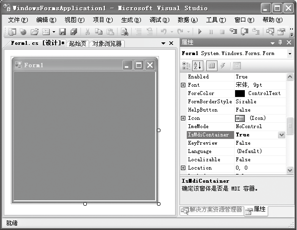
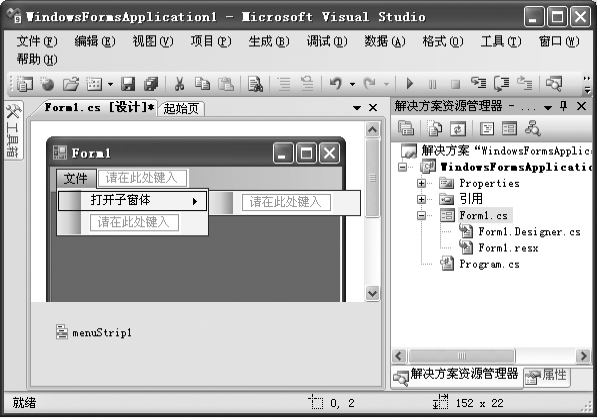
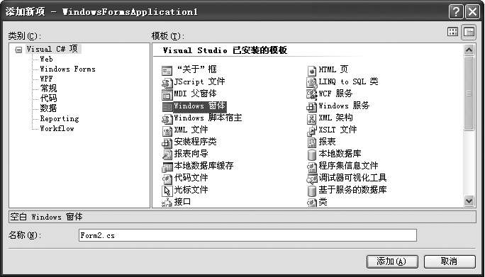
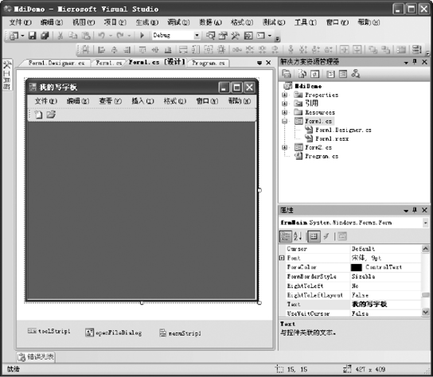
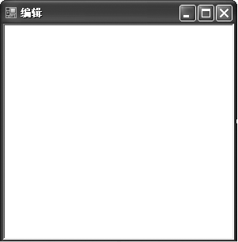
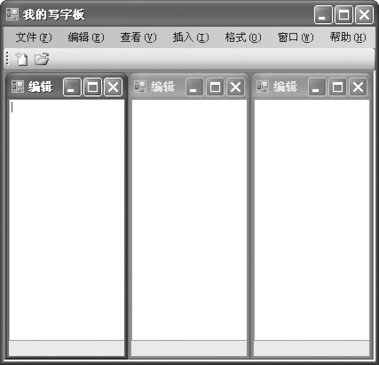

### 14.4.5　多文档界面编程

多文档界面（Multiple Document Interface，MDI）是一种应用非常广泛的窗体类型，在一个主窗体内包含多个子窗体，子窗体永远不会显示在主窗体的外面。

#### 1．多文档界面应用程序简介

MDI由一个父窗体和若干个子窗体组成。MDI允许同时显示多个子窗体，我们平常使用Word、Excel时碰到的就是MDI。用MDI可以在一个应用程序中同时打开多个视图窗口对应不同的文档类，这样可以大大地提高程序的工作效率。

创建MDI窗体有3个主要步骤，分别为创建MDI父窗体、创建MDI子窗体和从父窗体调用子窗体。

MDI应用程序打开多个子窗体时，需要合理安排子窗体的排列方式。要排列WinForms中的子窗口，需要调用Form类的LayoutMdi方法来使用MdiLayout枚举的成员，该枚举指定了MDI子窗口在MDI父窗口中的布局。下表列出了MdiLayout枚举的成员。

| 成员名称 | 说明 |
| :-----  | :-----  | :-----  | :-----  |
| ArrangeIcons | 排列所有MDI子窗体的图标 |
| Cascade | 层叠排列子窗口 |
| TileHorizontal | 水平平铺子窗口 |
| TileVertical | 垂直平铺子窗口 |

在Visual Studio 2013中新建C# Windows应用程序，选中Windows应用程序的默认窗体Form1，然后在“属性窗口”中将其IsMdiContainer属性设为True，将该窗体指定为子窗口的多文档界面容器，如下图所示。


在Form1窗体中添加一个MenuStrip控件，用来从父窗体调用子窗体。设置MenuStrip控件的一个顶级菜单项和一个子菜单项，如下图所示。


在【解决方案资源管理器】中选中含有父窗体的Windows应用程序，单击鼠标右键，在弹出的快捷菜单中选择【添加】
【新建项】或【添加】
【Windows窗体】菜单项，弹出如下图所示的【添加新项】对话框。


在对话框中选择“Windows窗体”，并在【名称】文本框中输入名称，然后单击【添加】按钮，在当前应用程序中添加一个新的Windows窗体。

选择MDI父窗体中的MenuStrip控件的【打开子窗体】菜单项，触发其Click事件，并在该事件下添加如下代码。

```c
01  private void 打开子窗体ToolStripMenuItem_Click(object sender, EventArgs e)
02  {
03          Form2 frmchild=new Form2() ;        //实例化窗口
04          frmchild.MdiParent = this;          //设置子窗体的父窗体
05          frmchild.Show();                    //显示窗口
06  }
```

完成上述操作后，运行Windows应用程序，当选择【打开子窗体】菜单项时，程序就会创建一个新的多文档界面子窗体。

#### 2．多文档界面应用程序编程

本小节通过一个实例介绍如何实现多文档界面应用程序的编程。

**【范例14-3】 创建一个简单写字板应用程序。**

（1）启动Visual Studio 2013，新建一个Windows应用程序，项目名称为“MdiDemo”。添加控件MenuStrip、ToolStrip和OpenFileDialog，设计如下图所示的界面。


（2）添加子窗体form2，界面如下图所示，在form2窗体中添加控件textBox1，并将控件的Multiline属性设置为True。


（3）切换到Form1的代码窗口，输入以下代码（代码14-3-1.txt）。

```c
01  private void toolStripNew_Click(object sender, EventArgs e)  //新建窗口操作
02  {
03          frmEdit frm = new frmEdit();
04          //使新建的Form2窗体的父窗体为当前窗体
05          frm.MdiParent = this;
06          ToolStripMenuItem newWindowItem = new ToolStripMenuItem(frm.Text);
07          mnuWindows.DropDownItems.Add(newWindowItem);
08          frm.Show();
09  }
10  private void mnuCascade_Click(object sender, EventArgs e)    //层叠操作菜单
11  {
12          //层叠窗口
13          this.LayoutMdi(MdiLayout.Cascade);
14  }
15  private void mnuVerticle_Click(object sender, EventArgs e)   //垂直平铺操作菜单
16  {
17           //垂直平铺
18          this.LayoutMdi(MdiLayout.TileVertical);
19  }
20  private void mnuHorizontal_Click(object sender, EventArgs e)         //水平平铺操作菜单
21  {
22          //水平平铺
23          this.LayoutMdi(MdiLayout.TileHorizontal);
24  }
25  //打开文本文件
26  private void toolStripButtonOpen_Click(object sender, EventArgs e)        //打开操作菜单
27  {
28          //设置标题
29          openFileDialog.Title = "我的记事本－－打开文件对话框";
30   
31          //设置目录
32          string dir = @"C:\";
33          openFileDialog.InitialDirectory = dir;
34   
35          //设置过滤器
36          string filter = "文本文件(*.txt)|*.txt";
37          openFileDialog.Filter = filter;
38   
39          //限制多选
40          openFileDialog.Multiselect = false;
41   
42          //显示对话框
43          if (openFileDialog.ShowDialog() == DialogResult.Cancel)
44          {
45                  return;
46          }
47          else
48          {
49                  //新建编辑窗体并使其标题为打开的文件名
50                  frmEdit frm = new frmEdit();
51                  frm.Text = openFileDialog.FileName;
52         
53                  //读取文件的内容
54                  StreamReader sr = new StreamReader(openFileDialog.OpenFile());
55                  frm.TextBoxText = sr.ReadToEnd();
56   
57                  //显示窗体为MDI子窗体
58                  frm.MdiParent = this;
59                  frm.Show();
60          }
61  }
```

（4）切换到Form2窗体的代码视图，在代码窗口中输入以下代码（代码14-3-2.txt）。

```c
01  public string TextBoxText   //自定义属性获取或设置textBox1中的文本
02  {
03          get        //获取textBox1中的文本
04          {
05                  return textBox1.Text;
06          }
07          set        //设置textBox1中的文本
08          {
09                  textBox1.Text = value;
10          }
11  }
```

**【运行结果】**

单击工具栏中的【启用调试】按钮
，即可生成窗体界面。单击工具栏中的第一个“新建”按钮，则生成子窗体，多次单击即可生成多个子窗体。单击【窗口】菜单的各个子菜单，还可以对多个子窗体进行排列，如下图所示。


**【范例分析】**

程序的第1～9行是工具栏上【新建】按钮的Click事件，实现了在父窗体内新建一个子窗体；frm为Form2窗体的实例对象名，通过frm设置MdiParent属性为当前窗体；第10～24行为菜单项【窗口】的子菜单的单击事件，分别实现了子窗口的层叠、垂直平铺和水平平铺；第26～61行为工具栏上【打开】按钮的Click事件，实现了打开C盘目录下文本文件的读取，并以一个新窗口显示读取的文件，代码“StreamReader sr = new StreamReader(openFileDialog.OpenFile())”创建了一个StreamReader类的一个实例，StreamReader类用于读取标准文本文件的各行信息。在Form2窗体的代码中定义了窗体的属性TextBoxText，此属性应用在了Form1代码中的第55行“frm.TextBoxText = sr.ReadToEnd()”中。

