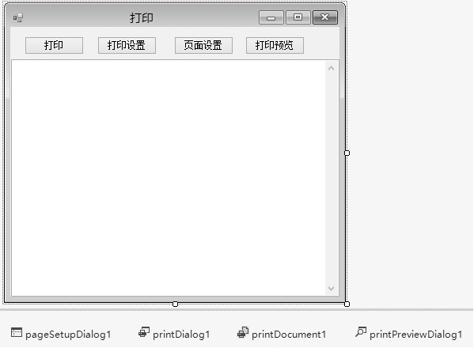
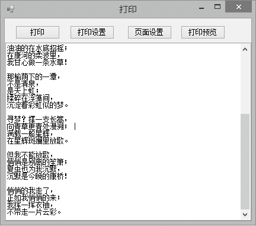
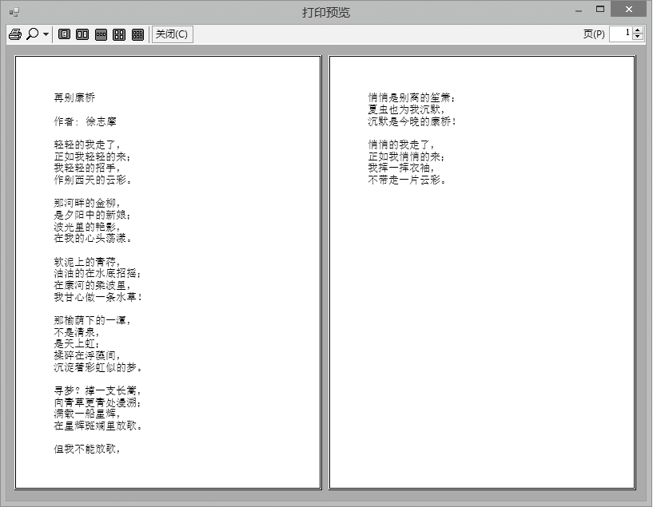

### 15.2　打印的基本操作


**本节视频教学录像：10分钟**

在Windows应用程序中，使用打印控件的步骤如下。

（1）编写打印逻辑步骤处理PrintDocument的一些事件。调用其Print()方法时，将依据下面的排列顺序依次触发。

BeginPrint

PrintPage

EndPrint

（2）选择打印机。在打印对话框（PrintDialog）中选择打印机。必须使用PrintDocument控件将其传递到打印机的PrintDialog控件中。

（3）选择页面设置。用户选择了打印机，准备打印时，允许选择页面设置。创建一个PageSetupDialog控件，并将PageSettings实例传递到该控件中，使用户可以操纵页面设置。

（4）显示打印预览窗口。添加PrintPreviewDialog控件，将PrintDocument控件传递给PrintPreview的Document属性。

**【范例15-1】 打印示例。**

（1）新建一个C# Windows窗体应用程序，项目名称为“PrintDemo”。

（2）向Windows窗体中添加四个按钮控件、一个文本框控件、一个PageSetupDialog对话框、一个PrintDialog对话框、一个PrintDocument组件和一个PrintPreviewDialog对话框，设计如下图所示的界面。


（3）选中printDocument组件，添加BeginPrint和PrintPage的事件处理，切换到代码视图，首先定义两个成员变量（代码15-1-1.txt）。

```c
01  private Font printFont;                     //打印使用的字体
02  private int lineNo = 0;                     //行号
```

在printDocument1_BeginPrint事件中编写如下代码（代码15-1-2.txt）。

```c
01  lineNo = 0;                                //设置行号的初始值
02  printFont = new Font("宋体", 20);          //初始化字体
```

在printDocument1_PrintPage事件中编写如下代码（代码15-1-3.txt）。

```c
01  float linesPerPage = 0;                   //每页的行数
02  float yPos = 0;                           //每行的Y坐标
03  int count = 0;                            //已输出行数
04  float leftMargin = e.MarginBounds.Left;   //页面的左边距
05  float topMargin = e.MarginBounds.Top;     //页面的上边距
06  string line = null;                       //行的文本
07
08  // 计算每页的行数
09  linesPerPage = e.MarginBounds.Height printFont.GetHeight(e.Graphics);
10  
11  // 输出TextBox中的每一行
12  while (count < linesPerPage && lineNo<textBox1.Lines.Length )
13  {
14          line = textBox1.Lines[lineNo++];
15          yPos = topMargin + (count *printFont.GetHeight(e.Graphics));
16          e.Graphics.DrawString(line, printFont, Brushes.Black,leftMargin, yPos, new
             StringFormat());
17           count++;
18  }
19  // 是否分页
20  if (line != null)
21          e.HasMorePages = true;
22  else
23          e.HasMorePages = false;
```

在“打印”按钮的Click事件中编写如下代码（代码15-1-4.txt）。

```c
printDocument1.Print();    //开始打印
```

在“打印设置”按钮的Click事件中编写如下代码（代码15-1-5.txt）。

```c
01  printDialog1.Document = printDocument1;
02  printDialog1.ShowDialog();
```

在“页面设置”按钮的Click事件中编写如下代码（代码15-1-6.txt）。

```c
01  pageSetupDialog1.Document = printDocument1;
02  pageSetupDialog1.ShowDialog();
```

在“打印预览”按钮的Click事件中编写如下代码（代码15-1-7.txt）。

```c
01  printPreviewDialog1.Document = printDocument1;
02  printPreviewDialog1.ShowDialog();
```

**【运行结果】**

单击工具栏中的【启用调试】按钮
，即可显示窗体界面，在文本框内输入一段文本，然后单击【打印】按钮，则会把文本框中的内容输出到默认打印机；单击【打印预览】按钮，则会弹出【打印预览】对话框。



**【范例分析】**

本范例非常简单，需要注意的是如何实现分页，首先计算每页的行数=页面高度/行高，然后在当前页已满时判断是否还有行没有输出，如有，则设置e.HasMorePages为真，以实现分页。

