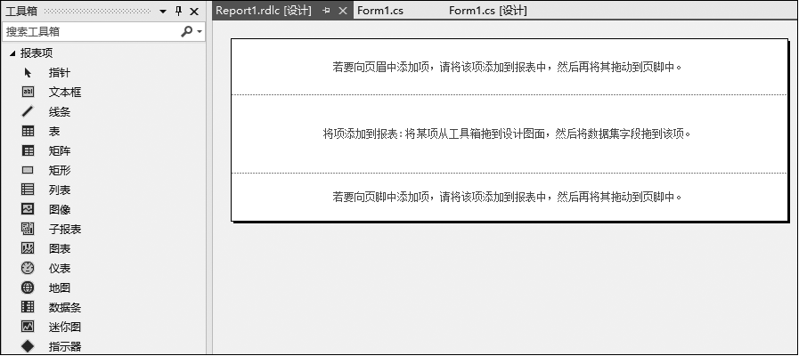
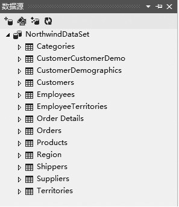
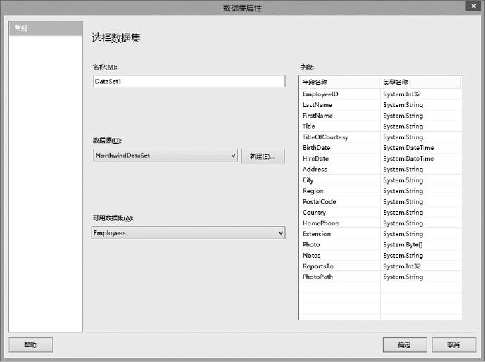
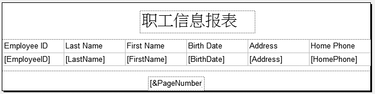
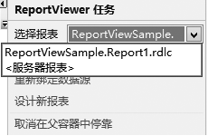
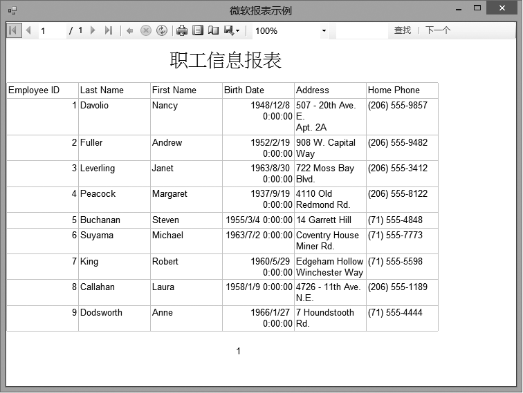
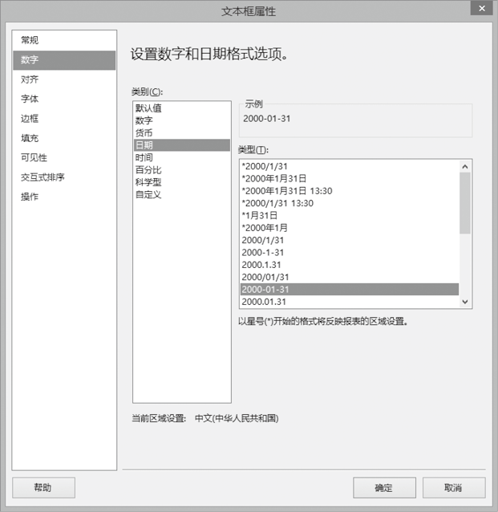

### 15.3　微软报表


**本节视频教学录像：8分钟**

微软报表指的是Visual Studio 2013中包括报表设计功能和 ReportViewer 控件，可以向应用程序中添加功能齐全的报表，报表可以包含表格格式数据、聚合数据和多维数据。提供 ReportViewer控件的目的是可以处理和显示应用程序中的报表。控件有两种版本，ReportViewer Web 服务器控件是一个用于在ASP.NET AJAX项目中驻留报表的ASP.NET AJAX控件，ReportViewer Windows窗体控件用于在Windows应用程序项目中驻留报表。我们将通过一个示例来演示微软报表的使用方法。

**【范例15-2】 使用微软报表。**

（1）启动Visual Studio 2013，新建一个C# Windows窗体应用程序，项目名称为“ReportViewSample”。

（2）向Windows窗体中添加一个ReportViewer控件，会创建一个名为reportViewer1新的实例。通过设置reportViewer1.Dock = Fill，报表查看器将会填充窗体的整个区域，以显示报表。在完成第一步与第二步操作之后，窗体如下图所示。


（3）创建报表。

① 从“项目”菜单中选择“添加新项”。

② 在“添加新项”对话框中选择“报表”，为报表键入名称，并单击“添加”。

③ 在“报表”菜单中选择“添加页眉”和“添加页脚”，报表的设计界面如下图所示。


请参考后面的章节，给项目添加一个数据源和数据集，本例我们使用的数据源以SQL Server 2000所提供的Northwind数据库为例，创建数据集时，选择该数据库的所有表，建好的数据源如下图所示。


④ 在“页眉”区内放入一个文本框，将内容更改为“职工信息报表”，居中，字体放大加粗，如下图所示。


⑤ 双击“报表项”中的“表”，会弹出“数据集属性”对话框，如下图所示。


选择数据源和可用数据集后，单击“确定”按钮，会在报表中添加一个表，如下图所示。


⑥ 给表添加列，并选择数据集中的字段，然后将“页码”从“内置字段”中拖到页脚区域，如下图所示。


⑦ 保存后，返回Form1的窗体设计界面，为报表浏览器选择我们设计的报表，如下图所示。


⑧ 在“Form1_Load”方法的最后，添加如下代码（代码15-2.txt）。

```c
this.reportViewer1.RefreshReport();
```

**【运行结果】**

单击工具栏中的【启用调试】按钮
，即可预览我们刚才定义的报表，如下图所示。


根据运行结果，适当调整各列的列宽。可以对行数据进行格式化，在报表设计界面选中数据部分的单元格，单击鼠标右键，打开“文本框属性”对话框，可以对字体、格式、边框等进行设置，如下图所示。


