### 15.4　水晶报表


**本节视频教学录像：6分钟**

Crystal Reports（水晶报表）是一款商务智能（BI）软件，主要用于设计及产生报表。水晶报表是业内最专业、功能最强的报表系统之一，它除了强大的报表功能外，最大的优势是实现了与绝大多数流行开发工具的集成和接口。在VS.Net平台做过报表开发的程序员，一定都对水晶报表的强大、高效、集成等特性留下了深刻印象。 除了开发新程序外，在工作中我们常需要接触到很多较早的软件系统报表功能升级的需求，如果能结合水晶报表这一强大的工具，往往能事半功倍。遗憾的是在Visual Studio 2013中没有集成水晶报表工具，需要自己从网上下载并安装。Visual Studio 2013要求安装SP9或者更高版本的，在本书中我们使用CRforVS_13_0_10.exe（SP10），由于安装非常简单，在此不再叙述。安装成功后，在工具箱中会添加水晶报表的组件，如下图所示的矩形框部分。

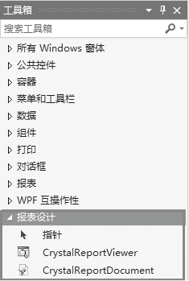
下面我们先来认识一下水晶报表的结构。打开报表，可以看到水晶报表分为5个报表节，如下图所示。

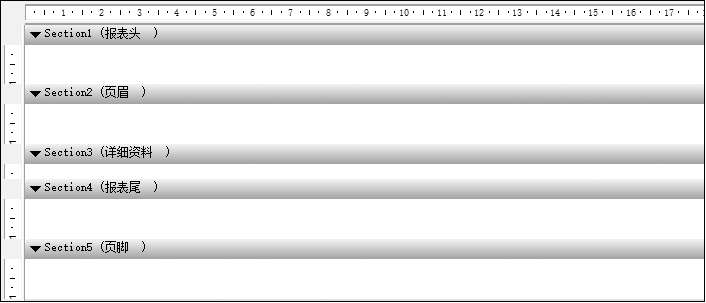
（1）报表头。

放在“报表头”中的对象，只在报表开头显示一次，一般是显示表名或者其他一些表的信息。

（2）页眉。

放在“页眉”中的信息，可以在每页都显示。

（3）详细资料。

放在“详细资料”中的信息随每条记录输出。

（4）报表尾。

报表尾和报表头对应，放在这里的信息只会在报表中出现一次，就是在报表数据显示结束后显示。

（5）页脚。

页脚与页眉对应，显示在每一个报表页面的底部，通常用来显示页码等信息。

下面我们通过一个范例来学习一下水晶报表的设计。

**【范例15-3】 使用水晶报表。**

（1）启动Visual Studio 2013，新建一个C# Windows窗体应用程序，项目名称为“CrystalReportSample”。

（2）向Windows窗体中添加一个CrystalReportViewer控件，会创建一个名为crystalReportViewer1新的实例。通过设置crystalReportViewer1.Dock = Fill，报表查看器将会填充窗体的整个区域，以显示报表。在完成第一步与第二步操作之后，窗体如下图所示。

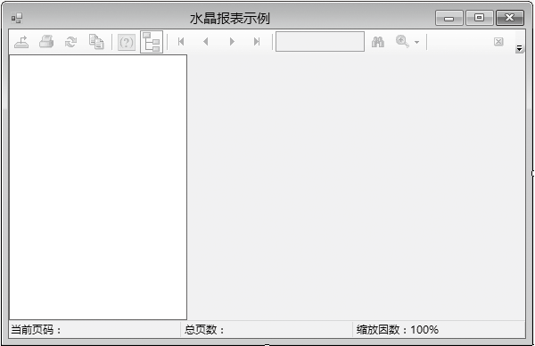
参照前面的方法，给本例添加一个数据源。

（3）创建报表。

① 从“项目”菜单中选择“添加新项”。

② 在“添加新项”对话框中选择“Crystal Reports”， 为报表键入名称，并单击“添加”，将打开如下图所示的对话框。

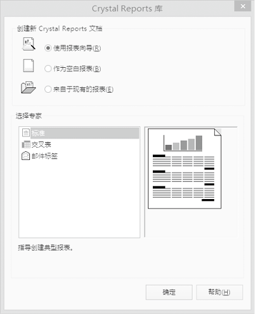
③ 在“Crystal Report库”对话框中选择“使用报表向导”和“标准”选项，单击“确定”按钮，打开“标准报表创建向导”对话框，如下图所示。

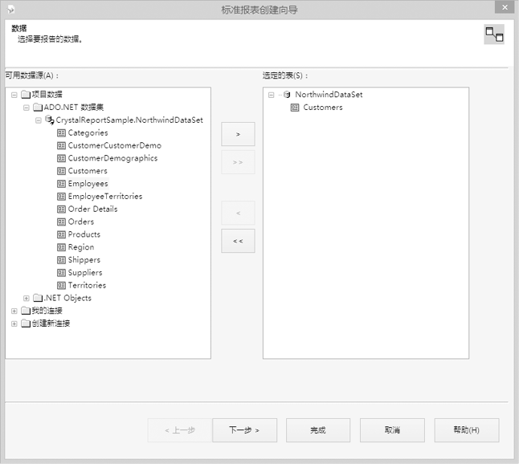
④ 在“标准报表创建向导”对话框中选择“Customers”表，单击“下一步”按钮，如下图所示。

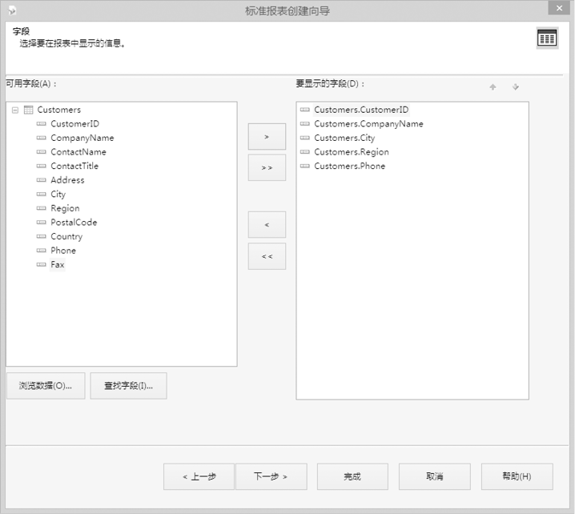
⑤ 在“标准报表创建向导”对话框中选择“Customers”表中的列，单击“完成”按钮，创建的CrystalReport1.rpt如下图所示。

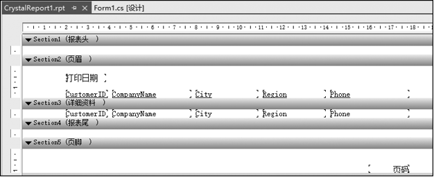
⑥ 保存后，返回Form1的窗体设计界面，为报表浏览器选择我们设计的报表，如下图所示。

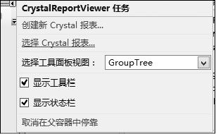
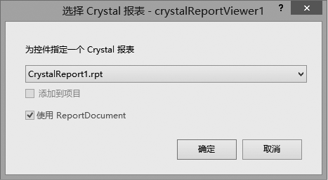
（4）为Form1_Load事件添加如下代码(代码15-3.txt)。

```c
01  SqlConnection cn = new SqlConnection(Properties.Settings.Default.NorthwindConnectionString);
02  SqlDataAdapter da = new SqlDataAdapter(“Select * from Customers”, cn);
03  DataSet ds = new DataSet();
04  da.Fill(ds, “Customers”);
05  this.CrystalReport11.SetDataSource(d);
```

（5）打开App.config文件，添加矩形框内的代码，否则运行程序会出错。

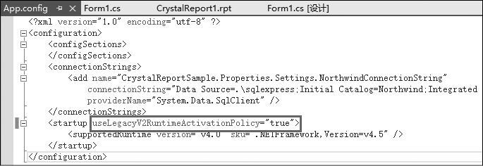
（6）单击工具栏中的【启用调试】按钮
，即可预览我们刚才定义的表。

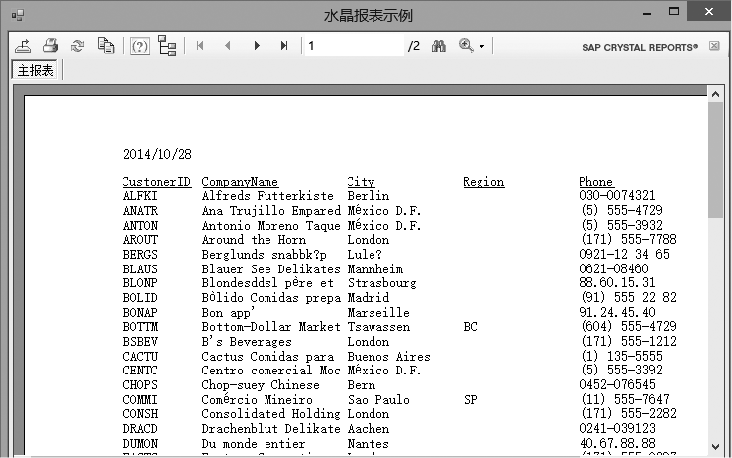
（7）当然这个报表不是很美观，可以对报表进行一些美化，如添加报表头，修改打印日期的格式，修改页脚中的页码格式，修改列标题为中文，增大行距，并给报表增加网格线，修改后的报表如下图所示。

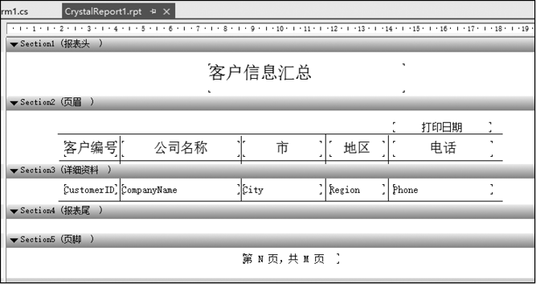
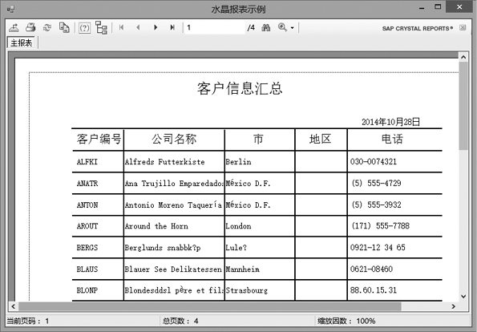
**【范例15-4】 交叉报表。**

（1）启动Visual Studio 2013，新建一个C# Windows窗体应用程序，项目名称为“CrystalReportCrossSample”。

（2）向Windows窗体中添加一个CrystalReportViewer控件，会创建一个名为crystalReportViewer1新的实例。通过设置crystalReportViewer1.Dock = Fill，报表查看器将会填充窗体的整个区域，以显示报表。

（3）创建报表。

① 从“项目”菜单中选择“添加新项”。

② 在“添加新项”对话框中选择“Crystal Reports”，为报表键入名称，并单击“添加”。

在“Crystal Report库”对话框中选择“使用报表向导”和“交叉表”，单击“确定”按钮，打开“标准报表创建向导”对话框。

这次直接从数据库中获取数据，不使用数据集。如果数据库连接没有创建，双击如下图所示的“建立新连接”，将打开“OLE DB（ADO）”对话框。

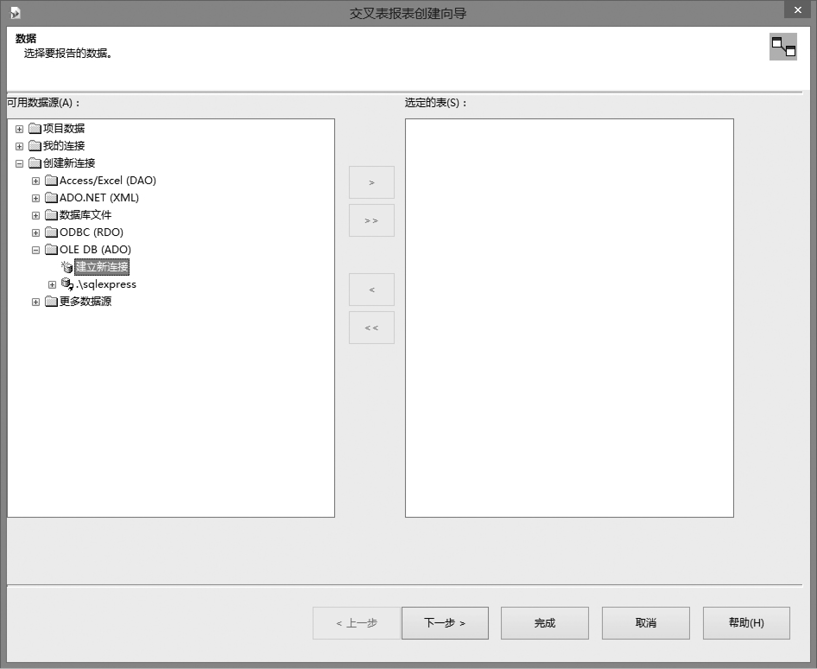
③ 在“OLE DB（ADO）”对话框中选择“Microsoft OLE DB Provider for SQL Server”，单击“下一步”按钮，如下图所示。

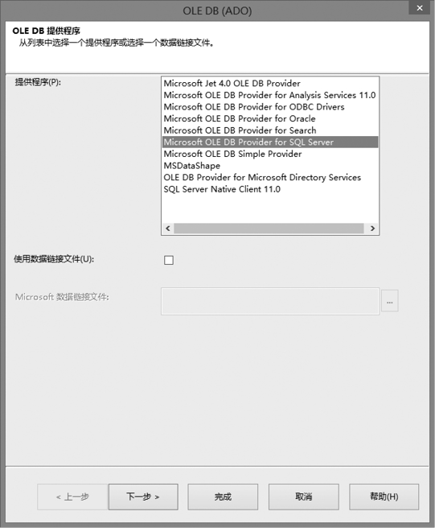
④ 设置数据库的连接信息，如下图所示，然后单击“完成”按钮，完成数据库连接的创建。

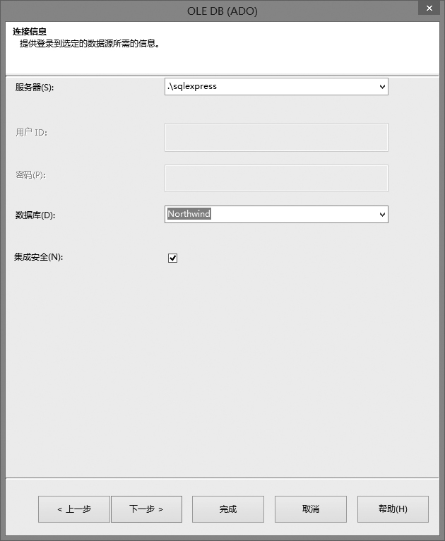
⑤ 展开新创建的连接，双击“添加命令”，打开“将命令添加到报表”对话框，如下图所示，并添加如下SQL语句。

```c
01  SELECT Categories.CategoryName, Orders.ShipRegion, sum([Order Details]. UnitPrice*[Order
    Details].Quantity)
02  FROM [Order Details] INNER JOIN
03  Orders ON [Order Details].OrderID = Orders.OrderID INNER JOIN
04  Products ON [Order Details].ProductID = Products.ProductID INNER JOIN
05  Categories ON Products.CategoryID = Categories.CategoryID
06  GROUP BY Categories.CategoryName, Orders.ShipRegion
```

该语句的作用是统计各类商品在各个地区的销售额。

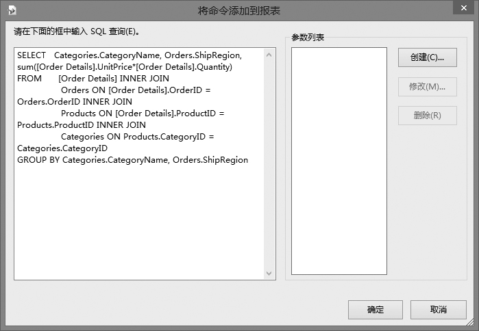
⑥ 在弹出的对话框中设置交叉表的行、列和汇总字段，如下图所示。

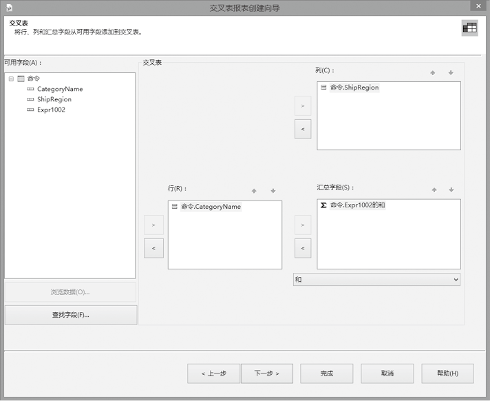
⑦ 单击“下一步”按钮，可以给报表添加一个图表，以便更方便地查看数据的分布情况或趋势。

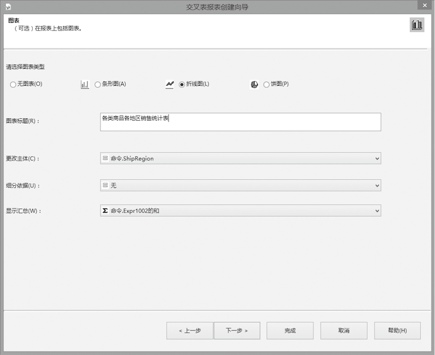
⑧ 单击“完成”按钮，即可结束报表向导。返回Form1的窗体设计界面，为报表浏览器选择我们设计的报表。

**【运行结果】**

单击工具栏中的【启用调试】按钮
，即可预览我们刚才定义的表。

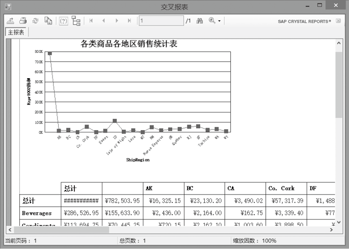
在这个例子当中我们发现，并没有在Form1窗体的Load事件中编写任何程序代码，数据就可以正常地显示，而上一个例子是从数据集中加载数据，必须编写代码从数据库中读取数据来填充数据集。为什么会这样呢？

水晶报表在程序控制上有两种模式，也就是我们常说的PULL模式和PUSH模式。

PULL模式指的是由水晶报表模板（引擎）直接连接数据库(源)，从数据库(源)里拉取数据， 需在水晶报表里设置好数据库信息以及相关的表。当我们在程序中调用水晶报表引擎，挂载模板后，水晶报表引擎会根据模板里的数据库信息及表信息主动连接数据库，返回数据给报表模板，模板根据设计样式进行呈现。交叉报表这个示例使用的就是PULL模式。

而PUSH模式是由应用程序从数据源获取数据，然后把数据推送给水晶报表引擎。水晶报表本身不跟数据库进行交互，如上一个示例，报表显示的数据是由数据集提供的，而数据集中的数据由应用程序负责提供。

