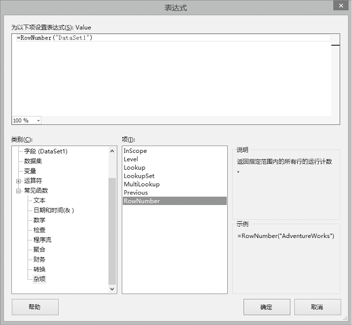
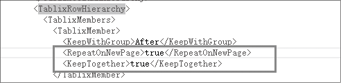
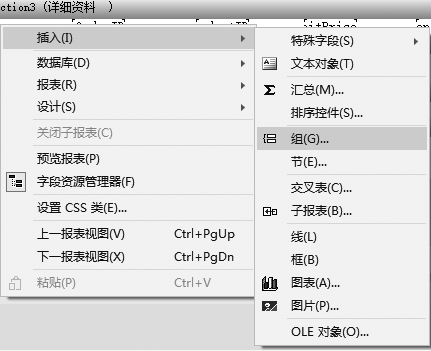
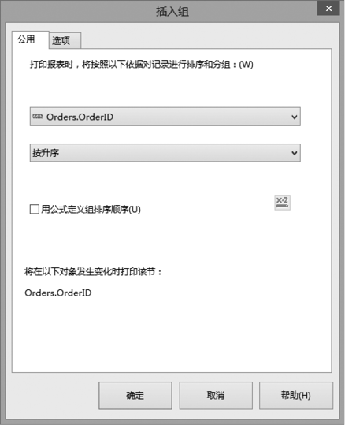

### 15.5　高手点拨

**本节视频教学录像：2分钟**

#### 1．如何在报表中添加序号

在某些情况下，在报表的左侧需要显示一个“序号”列，可以添加一个列，在数据部分单击鼠标右键，选择“表达式”，将打开如下图所示的对话框。

设置表达式为“RowNumber("DataSet1")”，需要注意RowNumber函数需要一个String类型的参数，表示要对其应用聚合函数的报表项所在的数据表、对象、分组或数据区域的名称。如果指定数据表或对象，则不会在整个数据集中重置该运行值。如果指定分组，则会在组表达式更改时重置该运行值。如果指定数据区域，则会为该数据区域的每个新实例重置该运行值。

#### 2．在微软报表中，如果数据量大，分页后如何在每页显示表头

在解决方案资源管理器中选中报表文件，单击鼠标右键，选择打开方式，使用XML编辑器打开。在文件中找到“TablixRowHierarchy”部分，增加矩形框中的内容，如下图所示。

#### 3．在报表中如何对数据进行分组

① 在微软报表中选中数据行左侧的单元格，单击鼠标右键，在弹出菜单中选择“添加组”，如下图所示。

② 在水晶报表中，在“详细资料”的空白处单击鼠标右键，依次选择“插入”
“组”菜单，打开“插入组”对话框，并在对话框中设置分组的列和排序，如下图所示。

