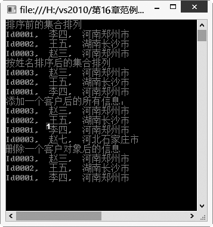
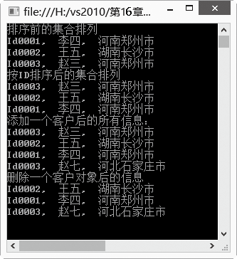

### 16.2.1　ArrayList类

ArrayList是System.Collections命名空间中的非泛型集合类，类似于数组，有人称其为动态数组，其容量可以根据需要自动扩充，元素的索引也可根据元素数量重新分配，可以动态实现元素的添加、删除等操作。可以将ArrayList类理解为Array的优化版本，该类既有数组的特征，又有集合的特性，例如，既可以通过下标进行元素访问，对元素进行排序、搜索，又可以像处理集合一样添加，在指定索引处插入及删除元素。下表列出了ArrayList类的几个常用属性。

| 属性名称 | 属性说明 |
| :-----  | :-----  | :-----  | :-----  |
| Capacity | 获取或设置 ArrayList 可包含的元素数，默认为4 |
| Count | 获取 ArrayList 中实际包含的元素数 |
| Item | 获取或设置指定索引处的元素 |

下表列出了ArrayList类的常用方法。

| 方法名称 | 方法说明 |
| :-----  | :-----  | :-----  | :-----  |
| Add() | 将元素添加到 ArrayList 的结尾处 |
| AddRange() | 在ArrayList 的末尾增加一定范围内的元素 |
| Clear() | 清除ArrayList 中所有的元素 |
| Contains() | 检查某元素是否在 ArrayList 中 |
| IndexOf() | 返回 ArrayList 中某个元素值的第一个匹配项对应的索引 |
| Insert() | 将元素插入 ArrayList 的指定索引处 |
| Remove() | 从 ArrayList 中移除特定元素的第一个匹配项 |
| Reverse() | 将 ArrayList 或它的一部分中的元素的顺序反转 |
| Sort() | 对 ArrayList 或它的一部分中的元素进行排序 |

由于ArrayList中元素的类型默认为object，因此在获取集合元素时需要强制进行类型转换。并且由于object是引用类型，在与值类型进行转换时会引起装箱和拆箱的操作，因此需要付出一些性能代价。

> 
> **技巧**
> 为了实现上面的例子，必须在using区添加System.Collections命名空间。

#### 1．创建ArrayList

为了创建ArrayList，可以使用3种重载构造函数中的一种，还可以使用ArrayList的静态方法Repeat创建一个新的ArrayList。这3个构造函数的声明如下。

使用默认的初始容量创建ArrayList，该实例并没有任何元素。格式如下。

```c
public ArrayList();
```

使用实现了ICollection接口的集合类来初始化新创建的ArrayList。格式如下。

```c
public ArrayList(ICollection c);
```

指定一个整数值来初始化ArrayList的容量，创建ArrayList。格式如下。

```c
public ArrayList(int capacity);
```

ArrayList的4种创建方法举例如下。

```c
01  //1.使用默认的初始容量创建ArrayList，该实例并没有任何元素
02  ArrayList al1 = new ArrayList();  //创建一个ArrayList对象al1
03  al1.Add("Hello");                 //向al1的末尾添加一个集合元素
04  al1.Add("C#");                    //向al1的末尾添加一个集合元素
05  al1.Add(“World!”);                //向al1的末尾添加一个集合元素
06  //输出al1中的容量和元素个数
07  Console.WriteLine("该ArrayList的容量是：{0}，元素个数是,{1}", al1.Capacity, al1.Count); 
08  //2.使用实现了ICollection接口的集合类来初始化新创建的ArrayList
09  //该实例与参数中的集合具有相同的初始容量
10  ArrayList al2 = new ArrayList(al1);  //创建ArrayList对象al2，并用al1初始化al2  
11  //3.经由指定一个整数值来初始化ArrayList的容量
12  ArrayList al3 = new ArrayList(18);   //创建ArrayList对象al3，容量初始为指定的数值18
13  Console.WriteLine("该ArrayList的容量是：{0}，元素个数是,{1}", al1.Capacity, al1.Count);
14  //4.将指定abc字符串重复3次构造数组
15  ArrayList al4 = ArrayList.Repeat("abc", 3);   //指定abc字符串重复3次构造ArrayList对象al4
```

#### 2．向ArrayList中添加元素的方法

创建好ArrayList后，有两种方法可以向ArrayList中添加元素。

（1）Add方法可以将单个元素添加到列表的尾部；AddRange方法可以获取一个实现ICollection接口的集合实例，例如，Array、Queue、Stack等，并将这个集合实例按顺序添加到列表的尾部。

（2）也可以使用Insert和InsertRange方法向ArrayList中指定的位置插入元素。Insert方法用于添加单个元素到指定的索引位置，InsertRange从指定的位置开始添加一个实现了ICollection接口的实例。例如：

```c
01  ArrayList al = new ArrayList(20);  //声明一个接受20个元素的ArrayList
02  al.Add(“我是元素1");                //使用ArrayList的Add方法添加集合元素
03  al.Add(“我是元素2");                //使用ArrayList的Add方法添加集合元素
04  al.Add(“我是元素3");                //使用ArrayList的Add方法添加集合元素
05  string[] strs = {"我是元素4"， "我是元素5", "我是元素6" };//定义一个有三个元素的字符串数组
06  al.AddRange(strs);                 //使用AddRange方法按集合参数中元素的顺序添加
07  al.Insert(0,"新增第1个元素");       //在ArrayList的指定索引0处添加一个新元素
08  ArrayList list2=newArrayList();    //创建一个ArrayList对象list2
09  list2.Add("我是新增元素1");         //使用ArrayList的Add方法添加集合元素
10  list2.Add(“我是新增元素2");         //使用ArrayList的Add方法添加集合元素
11  al.InsertRange(2,list2);           //将list2中的两个元素插入到al中的索引为2的位置
```

#### 3．删除ArrayList中的元素

ArrayList提供了3种方法可以将指定元素从集合中移除，这3种方法是Remove、RemoveAt和RemoveRange。

+ Remove方法接受一个object类型的参数，用于移除指定元素值的第1个匹配集合元素。
+ RemoveAt方法接受一个int类型的参数，用于删除指定索引的集合元素。
+ RemoveRange方法从集合中移除一定范围的元素。

还可以使用Clear方法从ArrayList中移除所有的元素。例如，

```c
01  ArrayList al = new ArrayList(20); //声明一个接受20个元素的ArrayList
02  al.AddRange(new string[6] { “元素1","元素2", "元素3", "元素4", "元素5","元素6" });//添加元素
03  //调用Remove方法删除元素，从ArrayList中移除特定对象的第1个匹配项，注意是第1个
04  al.Remove("元素2");        //调用Remove方法删除指定索引位置元素
05  al.RemoveAt(2);            //调用RemoveAt方法删除指定索引位置元素
06  al.RemoveRange(3, 2);      //调用RemoveRange方法删除指定范围的元素
07  al.Clear();                //清除所有的元素
```

#### 4．排序

可以使用Sort方法对ArrayList集合中的元素进行排序。Sort有3种重载方法。

使用集合元素的比较方式进行排序。

```c
public virtual void Sort();
```

使用自定义比较器进行排序。

```c
public virtual void Sort(IComparer comparer);
```

使用自定义比较器进行指定范围的排序。

```c
public virtual void Sort(int index, int count, IComparer comparer)
```

例如，使用集合元素的比较方式进行排序的代码如下。

```c
01  ArrayList al = new ArrayList();    //声明一个ArrayList对象
02  al.AddRange(new string[8] {"Array1","Array2","Array6","Array5","Array" });//添加元素
03  al.Sort();                        //对ArrayList集合中的元素进行排序
```

> 
> **技巧**
> 为了使用Sort方法进行排序，集合中的所有元素必须实现IComparable接口，否则将抛出异常。

#### 5．查找ArrayList中的集合元素

为了在数组列表中查找元素，最常使用的是IndexOf或LastIndexOf方法，另外，还可以使用BinarySearch方法进行搜索。IndexOf方法用于从前向后搜索指定的字符串，如果找到，则返回匹配的第1项的自0开始的索引，否则返回-1。LastIndexOf方法用于从后向前搜索指定的字符串，如果找到，则返回匹配的最后一项的自0开始的索引，否则返回-1。这两个方法各自都有3个重载版本，表示从指定的索引处开始搜索或者是从指定索引处搜索指定长度的字符串。BinarySearch使用二分算法从集合中搜索指定的值，并返回找到的从0开始的索引，否则返回-1。下面的示例代码将演示如何使用这些方法来查找数组中的元素。

```c
01  string[] str ={ “元素1", "元素2", "元素3", "元素4", "元素5", "元素6" };   //定义字符串数组
02  ArrayList al = new ArrayList(str);  //创建ArrayList对象al
03  int i = al.IndexOf("元素3");        //得到“元素3”的第1次出现的索引位置
04  Console.WriteLine(“元素3在集合中的位置是" + i);  //输出“元素3”的索引位置
05  i = al.LastIndexOf(“元素5");        //得到“元素5”的最后一次出现的索引位置
06  Console.WriteLine(“元素5在集合中的位置是" + i);
07  int j = al.BinarySearch("元素3");   //利用二分法查询“元素3”出现的索引位置
08  if (j >0) //如果找到，输出其索引值
09            Console.WriteLine("元素3在集合中的位置是" + j);
10  else      //如果没有找到，输出提示信息
11            Console.WriteLine("没有找到元素3");
```

#### 6．ArrayList的遍历

ArrayList内部维护着一个数组，可以通过下标进行访问，而且ArrayList实现了IEnumerable接口，因此要遍历集合，可以使用for或foreach方法。

下面的代码演示了如何使用for和foreach方法进行集合元素遍历。

```c
01  ArrayList al = new ArrayList(new string[6] { “元素1", "元素2", "元素3", "元素4", "元素5" });
02  for (int i = 0; i <= al.Count - 1; i++) //使用for遍历ArrayList
03          Console.Write(al[i]);}          //输出ArrayList中的每个元素 
04  foreach (object s in al)                //使用foreach遍历
05          { Console.Write(s);}            //输出ArrayList中的每个元素
```

**【范例16-1】 利用ArrayList编写一个管理客户地址簿的应用程序，用来管理客户的地址信息。**

（1）在Visual Studio 2013中新建C#控制台程序，项目名为“CustomerInfo”，然后添加一个新类到项目中，类名为CustomerInfo，表示客户。CustomerInfo.cs代码如下（代码16-1-1.txt）。

```c
01  class CustomerInfo                 //定义类表示客户信息
02  {
03           private static ArrayList CustomerList = new ArrayList();//创建存储客户信息的ArrayList
04           private String id;        //表示客户ID的字段
05           private String name;      //表示客户姓名的字段
06           private String address;   //表示客户地址的字段
07           public CustomerInfo() { } //无参数构造函数
08           public CustomerInfo(String myid, string myname, string myaddress)
09           {        //有参数构造函数，对私有字段初始化
10                   id = myid;
11                   name = myname;
12                   address = myaddress;
13           }
14           public String ID          //表示客户ID的属性
15           {
16                   set { id = value; }  get { return id; }
17           }
18           public String Name       //表示客户姓名的属性
19           {
20                   get { return name; } set { name = value; }
21           }
22           public String Address    //表示客户地址的属性
23           {
24                   get { return address; }   set { address = value; }
25           }
26           public static void AddCustomer(CustomerInfo aCustomerInfo)   //添加客户信息的方法
27           {
28                   CustomerList.Add(aCustomerInfo);   //添加一个客户信息到ArrayList中
29           }
30           public static void Delete(CustomerInfo oo) //删除客户信息的方法
31           {     //通过客户对象删除一个客户
32                   int i = CustomerList.IndexOf(oo);  //得到客户对象的索引号
33                   if (i < 0)            //如果对象不存在则给出提示信息
34                           Console.WriteLine("no !");
35                   else                        //如果对象存在，根据对象的索引号进行对象的删除
36                           CustomerList.RemoveAt(i);
37           }
38           public static void Show()                       //显示所有客户的信息
39           {
40           foreach (CustomerInfo s in CustomerList)        //遍历CustomerList输出所有客户的信息
41                   Console.WriteLine(s.ID + ",  " + s.Name + ",  " + s.Address);
42           }
43           public  static void SortByName()                //通过接口实现按照客户姓名排序的方法
44           {
45                   CustomerList.Sort(new CustomerNameCompare());        //实现自定义排序的接口
46           }
47  }
```

（2）除了使用集合元素默认的比较器进行排序外，还可以传递实现IComparer接口的类，按自定义的排序逻辑进行排序。下面实现按照客户姓名进行排序的接口实现代码。添加类CustomerNameCompare，在CustomerNameCompare.cs中添加代码如下（代码16-1-2.txt）。

```c
01  public class CustomerNameCompare:IComparer
02  {        //自定义排序，实现IComparer接口按照客户姓名降序排序
03          public int Compare(object x, object y)
04          {
05                  return new CaseInsensitiveComparer().Compare(((CustomerInfo)y).Name,
                     ((CustomerInfo)x).Name );
06          }
07  }
```

（3）在Program的Main中添加以下测试代码（代码16-1-3.txt）进行测试。

```c
01  //实例化CustomerInfo，向ArrayList中添加对象
02  CustomerInfo aCustomerInfo1 = new CustomerInfo("Id0001", "李四", "河南郑州市");
03  CustomerInfo.AddCustomer(aCustomerInfo1);   //添加aCustomerInfo1对象到ArrayList
04  CustomerInfo aCustomerInfo2 = new CustomerInfo("Id0002", "王五", "湖南长沙市");
05  CustomerInfo.AddCustomer(aCustomerInfo2);   //添加aCustomerInfo2对象到ArrayList
06  CustomerInfo aCustomerInfo3 = new CustomerInfo("Id0003", "赵三", "河南郑州市");
07  CustomerInfo.AddCustomer(aCustomerInfo3);   //添加aCustomerInfo3对象到ArrayList
08  Console.WriteLine("排序前的集合排列");
09  CustomerInfo.Show();                        //输出排序前集合中的元素的排列顺序
10  CustomerInfo.SortByName ();                 //调用按姓名排序方法对ArrayList排序
11  Console.WriteLine("按姓名排序后的集合排列");
12  CustomerInfo.Show();                        //输出排序后集合中的元素的排列顺序
13  CustomerInfo aCustomerInfo4 = new CustomerInfo("Id0003","赵七", "河北石家庄市");
14  CustomerInfo.AddCustomer(aCustomerInfo4);   //添加aCustomerInfo4对象到ArrayList
15  Console.WriteLine("添加一个客户后的所有信息：");
16  CustomerInfo.Show();                        //输出添加一个客户后集合中的元素
17  CustomerInfo.Delete(aCustomerInfo4);        //删除一个客户对象
18  Console.WriteLine("删除一个客户对象后的信息");
19  CustomerInfo.Show();                        //输出删除一个客户后集合中的元素
```

**【运行结果】**

单击工具栏中的
按钮，即可在控制台中输出如下图所示的结果。


**【范例分析】**

在这个范例的步骤1中，第1~47行定义了一个CustomerInfo类，其中第3行定义了一个静态的ArrayList类，用于存储客户的信息；第26~29行定义了一个添加客户信息到ArrayList的方法，使用ArrayList的Add方法添加；第30~37行定义了一个删除ArrayList中元素的方法，使用IndexOf进行对象的查找，使用RemoveAt进行删除；第38~42行定义了Show方法，使用foreach变量来显示ArrayList中的元素；第43~46行定义了一个排序方法实现按照客户姓名排序。

步骤（2）中自定义了一个按照姓名排序的规则，以实现ArrayList的排序。

**【拓展训练】　修改【范例16-1】 ，添加按照姓名进行删除的方法和按照ID排序的方法。**

（1）在CustomerInfo中添加DeleteByName方法，实现按照姓名进行删除（拓展代码16-1-4.txt）。

```c
01  public static void DeleteByName(string name)   //通过客户名称删除一个客户信息
02  {
03           for (int i = 0; i < CustomerList.Count; i++)   //遍历CustomerList
04           {        //得到集合CustomerList的第i个元素
05                  CustomerInfo aCustomerInfo = (CustomerInfo)CustomerList[i];
06                  if (aCustomerInfo.Name  ==name) //如果集合的第i个元素的Name是所要查找的，则删除
07                   {
08                          CustomerList.RemoveAt(i);
09                          break;
10                  }
11          }
12   }
```

（2）在CustomerInfo中添加SortByID方法，实现按照ID排序（拓展代码16-1-5.txt）。

```c
01  public static void SortByID()        //通过接口实现按照客户ID排序的方法
02  {
03           CustomerList.Sort(new CustomerIdCompare());
04   }
```

（3）在CustomerCompare中添加类CustomerIdCompare，实现按照ID排序（拓展代码16-1-6.txt）。

```c
01  class CustomerIdCompare:IComparer
02  {        //自定义排序，实现IComparer接口按照客户ID排序
03           public int Compare(object x, object y)
04           {
05                  return new CaseInsensitiveComparer().Compare(((CustomerInfo)y).ID ,
                     ((CustomerInfo)x).ID );
06           }
07  }
```

（4）在Program的Main中添加以下测试代码（拓展代码16-1-7.txt）进行测试。

```c
01  //实例化CustomerInfo，向ArrayList中添加对象
02  CustomerInfo aCustomerInfo1 = new CustomerInfo("Id0001", "李四", "河南郑州市");
03  CustomerInfo.AddCustomer(aCustomerInfo1);      //添加aCustomerInfo1对象到ArrayList
04  CustomerInfo aCustomerInfo2 = new CustomerInfo("Id0002", "王五", "湖南长沙市");
05  CustomerInfo.AddCustomer(aCustomerInfo2);      //添加aCustomerInfo2对象到ArrayList
06  CustomerInfo aCustomerInfo3 = new CustomerInfo("Id0003","赵三", "河南郑州市");
07  CustomerInfo.AddCustomer(aCustomerInfo3);      //添加aCustomerInfo3对象到ArrayList
08  Console.WriteLine("排序前的集合排列");
09  CustomerInfo.Show();                           //调用Show方法显示排序前的集合元素
10  CustomerInfo.SortByID();                       //调用SortByID实现按照ID排序
11  Console.WriteLine("按ID排序后的集合排列"); 
12  CustomerInfo.Show();                           //调用Show方法显示排序后的集合元素
13  CustomerInfo aCustomerInfo4 = new CustomerInfo("Id0003", "赵七", "河北石家庄市");
14  CustomerInfo.AddCustomer(aCustomerInfo4);      //添加aCustomerInfo4对象到ArrayList
15  Console.WriteLine("添加一个客户后的所有信息：");
16  CustomerInfo.Show();                           //添加一个客户后的所有信息
17  CustomerInfo.DeleteByName("赵三");             //删除一个客户对象
18  Console.WriteLine("删除一个客户对象后的信息");
19  CustomerInfo.Show();        //输出删除一个客户对象后的信息
```

**【运行结果】**

运行结果如下图所示。


