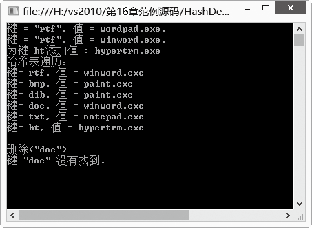
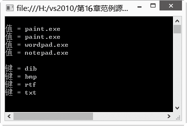

### 16.2.2　HashTable类

在ArrayList集合中，可以使用索引访问元素，如果不能确切知道索引的值，访问就比较困难。而本节介绍的HashTable能实现通过一个键来访问一个值，而不需要知道索引的值。

HashTable称为哈希表，和ArrayList不同的是它利用键/值来存储数据。在哈希表中，每个元素都是一个键/值对，并且是一一对应的，通过“键”就可以得到“值”。如果存储电话号码，通常是将姓名和电话号码存在一起，存储时把姓名当做键，号码作为值，通过姓名即可查到电话号码，这就是一个典型的哈希表存储方式。HashTable是System.Collections命名空间中的一个重要的类，如果把哈希表当做字典，那么“键”就是字典中查的单词，“值”就是关于单词的解释内容。正因为有这个特点，所以也有人把哈希表称做“字典”(对应泛型集合类Dictionary<T>)。

在HashTable对象内部维护着一个哈希表。内部哈希表为插入到其中的每个键进行哈希编码，在后续的检索操作中，通过哈希编码就可以遍历所有的元素。这种方法为检索操作提供了较佳的性能。在.NET中，键和值可以是任何一种对象，例如，字符串、自定义类等。在后台，当插入键值对到HashTable中时，HashTable使用每个键所引用对象的GetHashCode()方法获取一个哈希编码，存入HashTable中。哈希表常用的属性如下表所示。

| 属性名称 | 属性说明 |
| :-----  | :-----  | :-----  | :-----  |
| Count | 获取包含在 Hashtable 中的键/值对的数目 |
| Keys | 获取包含 Hashtable 中的所有键的集合 |
| Values | 获取包含Hashtable 中的所有值的集合 |

哈希表常用的方法如下表所示。

| 方法名称 | 方法说明 |
| :-----  | :-----  | :-----  | :-----  |
| Add | 将带有指定键和值的元素添加到 Hashtable 中 |
| Clear | 从 Hashtable 中移除所有元素 |
| Contains | 确定 Hashtable 是否包含特定键 |
| GetEnumerator | 返回 IDictionaryEnumerator，可以遍历Hashtable |
| Remove | 从 Hashtable 中移除带有指定键的元素 |

Hashtable类提供了15个重载的构造函数，常用的4个Hashtable构造函数声明如下。

（1）使用默认的初始容量、加载因子、哈希代码提供程序和比较器来初始化 Hashtable类的实例。

```c
public Hashtable();
```

（2）使用指定容量、默认加载因子、默认哈希代码提供程序和比较器来初始化Hashtable类的实例。

```c
public Hashtable(int capacity);
```

（3）使用指定的容量、加载因子来初始化Hashtable类的实例。

```c
public Hashtable(int capacity, float loadFactor);
```

（4）通过将指定字典中的元素复制到新的 Hashtable 对象中，初始化 Hashtable 类的一个新实例。新 Hashtable 对象的初始容量等于复制的元素数，并且使用默认的加载因子、哈希代码提供程序和比较器。

```c
public Hashtable(IDictionary d);
```

下面的例子演示如何使用这4种方法构造哈希表。

```c
01  static void Main(string[] args) 
02  {
03           Hashtable ht = new Hashtable();        //使用所有默认值构建哈希表实例
04           Hashtable ht1 = new Hashtable(20);     //指定哈希表实例的初始容量为20个元素
05           Hashtable ht2 = new Hashtable(20, 0.8f);   //初始容量为20个元素，加载因子为0.8
06           Hashtable ht3 = new Hashtable(sl);     //传入实现了IDictionary接口的参数创建哈希表
07  }
```

创建好哈希表后，可以使用Hashtable提供的方法和属性来操作哈希表对象。下面的示例程序将演示操作哈希表的基本方法。

**【范例16-2】 Hashtable 的创建、初始化并执行各种函数以及打印其键和值的例子。**

新建控制台应用程序，项目名为“HashDemo”，在Program.cs的Main方法中输入以下代码（拓展代码16-2-1.txt）。

```c
01  Hashtable openWith = new Hashtable();    //创建一个哈希表openWith
02  openWith.Add("txt", "notepad.exe");      //添加键/值对到哈希表中，键不能重复
03  openWith.Add("bmp", "paint.exe");        //添加键/值对到哈希表中
04  openWith.Add("dib","paint.exe");         //添加键/值对到哈希表中
05  openWith.Add("rtf", "wordpad.exe");      //添加键/值对到哈希表中
06  Console.WriteLine("键 = \"rtf\", 值 = {0}.", openWith["rtf"]);        // 通过键名来获取具体值
07  openWith["rtf"] ="winword.exe";          //哈希表中的键不可修改，只能修改键对应的值
08  Console.WriteLine("键 = \"rtf\", 值 = {0}.", openWith["rtf"]); 
09  openWith["doc"] = "winword.exe";         //如果对不存在的键设置值，将添加新的键值对
10  // 通常添加之前用ContainsKey来判断某个键是否存在  
11  if (!openWith.ContainsKey("ht"))         //如果键ht不存在，则添加ht键值对
12  {
13       openWith.Add("ht", "hypertrm.exe");  //添加ht键值对
14       Console.WriteLine("为键 ht添加值 : {0}", openWith["ht"]);  
15  } 
16  Console.WriteLine("哈希表遍历：");
17  foreach( DictionaryEntry de in openWith )//Hashtable 键/值是 DictionaryEntry 类型
18  {
19       Console.WriteLine("键= {0}, 值 = {1}", de.Key, de.Value); 
20  }
21  Console.WriteLine("\n删除(\"doc\")");
22  openWith.Remove("doc");        //使用Remove方法删除键/值对
23  if (!openWith.ContainsKey("doc"))                //判断键doc是否存在
24  {
25       Console.WriteLine("键 \"doc\" 没有找到.");   //如不存在给出提示信息
26  }
```

**【运行结果】**

单击工具栏中的
按钮，即可在控制台中输出如下图所示的结果。


**【范例分析】**

在【范例16-2】中，第1行创建了一个新哈希表openWith，把文件扩展名和打开软件作为键/值对；第2~5行是使用Add方法向哈希表中添加键值对；第6~9行是哈希表键值对的使用举例；第11行是使用ContainsKey方法判断指定的键是否存在；第17~20行是遍历哈希表；第22行是使用Remove删除指定的键值对。

> 
> **注意**
> 遍历时应注意，Hashtable的每个元素都是一个键/值对，因此元素类型既不是键的类型，也不是值的类型，而是 DictionaryEntry 类型。

**【拓展训练】 通过键集和值集遍历哈希表中的键或值的方法使用举例。**

（1）新建控制台应用程序，项目名为“HashDemoExt”。

（2）在Program.cs中的Main方法中添加以下代码（拓展代码16-2-2.txt）。

```c
01  Hashtable openWith = new Hashtable();    //创建一个哈希表openWith 
02  openWith.Add("txt", "notepad.exe");      //添加键/值对到哈希表中，键不能重复
03  openWith.Add("bmp", "paint.exe");        //添加键/值对到哈希表中，键不能重复
04  openWith.Add("dib", "paint.exe");        //添加键/值对到哈希表中，键不能重复
05  openWith.Add("rtf", "wordpad.exe");      //添加键/值对到哈希表中，键不能重复 
06  //使用Values属性操作哈希表中的值的集合
07  ICollection valueColl = openWith.Values; //得到哈希表值的集合
08  Console.WriteLine();
09  foreach (string s in valueColl)          //对值的集合进行遍历
10  {
11      Console.WriteLine("值 = {0}", s);    //输出哈希表中的值
12  }
13          // 使用Keys属性操作哈希表中的键的集合
14  ICollection keyColl = openWith.Keys;     //得到哈希表键的集合
15  Console.WriteLine();
16  foreach (string s in keyColl)            //对键的集合进行遍历
17  {
18      Console.WriteLine("键 = {0}", s);    //输出哈希表中的键
19  }
```

**【运行结果】**

运行结果如下图所示。


