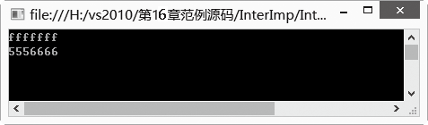

### 16.4.3　自定义泛型接口

程序员也可以使用泛型自定义泛型接口、泛型类、泛型方法等。和普通接口一样，一个泛型接口通常也是与某些对象相关的约定规程。例如，约定“飞”的功能，可能是鸟，或者飞机，或者子弹，那么定义它们的规程时，会有些区别。但泛型接口只负责约定功能“飞”，不同对象的规程定义交给具体实现者。

泛型接口的声明形式如下。

```c
interface 【接口名】<T>
{
　【接口体】
}
```

在C#中，通过尖括号“< >”将类型参数括起来，表示泛型。上述约定功能“飞”可以定义泛型接口“Interface Fly<T>{}”。声明泛型接口时，与声明一般接口的唯一区别是增加了一个<T>。一般来说，声明泛型接口与声明非泛型接口遵循相同的规则。

泛型接口定义完成之后，就要定义此接口的子类。定义泛型接口的子类有两种方法。

+ 直接在子类后声明泛型。
+ 在子类实现的接口中明确地给出泛型类型。

**【范例16-5】 泛型接口的定义与使用。**

（1）新建控制台程序，项目名为“InterImp”，然后在Program中添加泛型接口Inter和子类InterImpA、InterImpB，代码如下（代码16-5-1.txt）。

```c
01  interface Inter<T>                   //定义泛型接口Inter
02  {        
03          void show(T t);              //约定功能show
04  }        
05  class InterImpA : Inter<String>     //定义接口Inter的子类InterImpA，明确泛型类型为String
06  {        
07           public void show(String t)  //子类InterImpA重写方法show，指明参数类型为String
08           {        
09                   Console.WriteLine(t);
10           }
11           address = myaddress;
12  }
13  class InterImpB<T> : Inter<T>     //定义接口Inter的子类InterImpB，直接声明泛型
14  {
15           public void show(T t)    //子类InterImpB重写方法show，参数类型为泛型
16           {
17                  Console.WriteLine(t);
18           }        
19  }
```

（2）在Program的Main方法中添加以下测试代码（代码16-5-2.txt）并测试。

```c
01  //实例化InterImpA
02   InterImpA i=new InterImpA();             
03   i.show("fff");            
04  //实例化InterImpB 
05  InterImpB<Int32> j = new InterImpB<Int32>();
06   j.show(5556666); 
07   Console.Read();
```

**【运行结果】**

单击工具栏中的
按钮，输出结果如下图所示。


