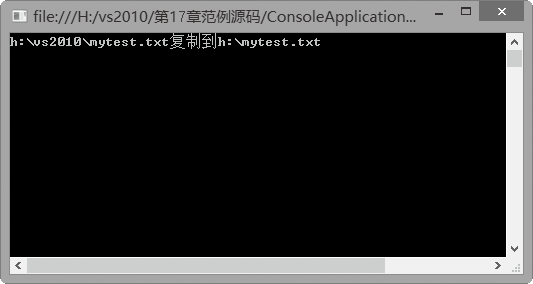
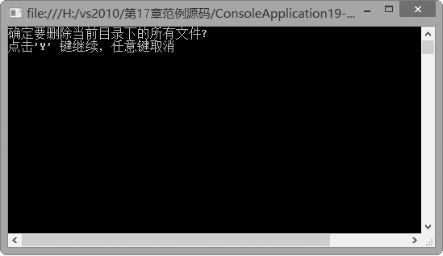
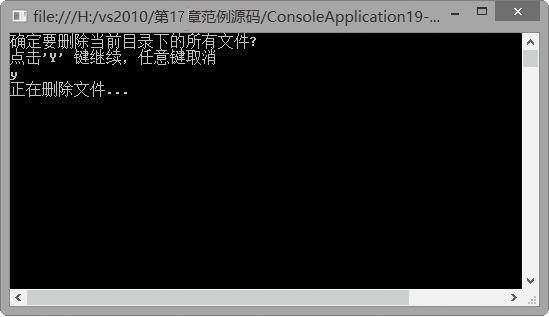

### 17.1.2　文件的复制、移动和删除

File类和FileInfo类为FileStream对象的创建和文件的创建、复制、移动、删除、打开等提供了支持。使用这两个类对文件进行操作时必须具备相应的权限，否则将产生异常。

File类和FileInfo类都能完成对文件的操作，但FileInfo类必须实例化，并且每个FileInfo的实例必须对应于系统中一个实际存在的文件。如果多次重用某个对象，可考虑使用FileInfo的实例方法，而不是File类的相应静态方法。默认情况下，FileInfo类将向所有用户授予对新文件的完全读/写访问权限。

下表列出了File类的常用成员及其说明。

| 成员名称 | 类别 | 说明 |
| :-----  | :-----  | :-----  | :-----  | :-----  |
| Copy | 方法 | 将现有文件复制到新文件 |
| Create | 方法 | 在指定路径中创建文件 |
| Delete | 方法 | 删除指定的文件。如果指定文件不存在，则不引发异常 |
| Move | 方法 | 将指定文件移到新位置，并提供指定新文件名的选项 |
| Open | 方法 | 打开指定路径上的FileStream |

Create()方法返回值为一个FileStream，它提供对参数path中指定的文件的读/写访问。Open()方法和参数path指要打开的文件；参数mode指Filemode值，用于指定在文件不存在时是否创建该文件，并确定是保留还是改写现有文件的内容。Open()方法的返回值指以指定模式打开的指定路径上的FileStream，具有读/写访问权限并且不共享。

#### 1．文件的复制和移动

File类的Copy方法用于将现有文件复制到新文件。方法原型为：

```c
 public static void Copy (string sourceFileName, string destFileName)
```

参数sourceFileName为要复制的文件名称，destFileName为目标文件的名称，它不能是一个目录或现有文件。

File类的Move方法用于将指定文件移到新位置，并提供指定新文件名的选项。方法原型为：

```c
 public static void Move (string sourceFileName, string destFileName)
```

参数 sourceFileName为要移动的文件的名称，destFileName为文件的新路径。

**【范例17-1】 将文件复制到指定路径。**

（1）启动Visual Studio 2013，新建一个C#控制台应用程序，项目名称为“ConsoleApplication17-1”。

（2）切换到代码窗口，在主程序的Main方法中输入以下代码（代码17-1-1.txt）。

```c
01  static void Main(string[] args)        
02  {
03          string path = @"h:\vs2010\mytest.txt";     //源文件路径
04          string path2 = @"h:\mytest.txt";           //目标文件路径
05          try        
06          {
07                  File.Delete(path2);                //确定目标不存在        
08                  File.Copy(path, path2);            //复制文件
09                  Console.WriteLine("{0}复制到{1}", path, path2);
10          }        
11          catch (Exception e)
12  { 
13                  Console.WriteLine("复制失败");
14                  Console.WriteLine(e.ToString());          
15          }   
16                  Console.ReadLine();          
17  };
```

程序运行后，将出现如下图所示的界面，表示文件复制成功。此时，文件mytest.txt将在“h:\”目标下出现一个副本。


**【范例分析】**

在这个程序中，因为使用了File类，所以要添加对System.IO命名空间的引用。File类的Delete方法用于删除指定的文件。如果指定的文件不存在，则不引发异常。因此，如果目标文件已经存在，上例中的语句：

```c
File.Delete(path2);
```

将删除已经存在的目标文件。

**【拓展训练】**

将主程序的Main方法中的代码：

```c
File.Copy(path, path2);
```

改为如下代码：

```c
File.Move(path, path2);
```

上述代码将实现文件的移动，把源文件移动到指定路径。

> 
> **技巧**
> 在C#中使用路径指明文件名时，要使用转义字符“\\”，或者在路径的前面加符号“@”。using用于处理非托管对象，以保证自动释放资源。

#### 2．文件的删除

除了File类的Delete方法可以用于删除指定的文件外，FileInfo类的Delete方法也可以完成删除文件的操作。FileInfo类的Delete方法原型为：

```c
public override void Delete()
```

如果指定的文件不存在，则不引发异常。

**【范例17-2】 删除指定目标中的所有文件。**

（1）启动Visual Studio 2013，新建一个C#控制台应用程序，项目名称为“ConsoleApplication17-2”。

（2）切换到代码窗口，在主程序的Main方法中输入以下代码（代码17-2-1.txt）。

```c
01  static void Main(string[] args)        
02  {
03          Console.WriteLine("确定要删除当前目录下的所有文件?");
04          Console.WriteLine("点击'Y' 键继续，任意键取消");
05          int a = Console.Read();        
06          if (a == 'Y' || a == 'y') 
07          {        
08                  Console.WriteLine("正在删除文件...");
09          }
10          else        
11          {
12                  Console.WriteLine("操作被取消");
13                  return;
14          }
15          DirectoryInfo dir = new DirectoryInfo(@"h:\vs2010\");          
16          foreach (FileInfo f in dir.GetFiles())   
17                  f.Delete();          
18  };
```

程序运行后，将出现如下图所示的界面，单击“Y”键。


出现如下图所示的界面，提示正在删除文件。


此时回到指定目标，将发现mytest.txt和temp.txt已不存在。

**【范例分析】**

在这个程序中，因为使用了FileInfo类，所以要添加对System.IO命名空间的引用。上例中的语句：

```c
DirectoryInfo dir = new DirectoryInfo(@"h:\vs2010\");
```

用于创建指定目标的DirectoryInfo对象，上例中的语句：

```c
dir.GetFiles()
```

用于获取指定目标的文件列表。

