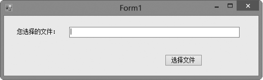
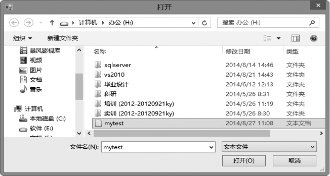
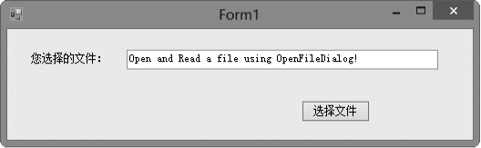
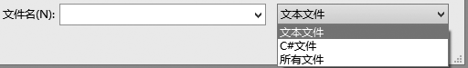

### 17.1.3　OpenFileDialog控件

Windows 窗体的 OpenFileDialog（打开文件对话框）组件是一个预先配置的对话框，它与 Windows 操作系统的“打开文件”对话框相同。在基于 Windows 的应用程序中，可利用该组件实现简单的文件选择。

可以把OpenFileDialog用做一个.NET类，也可以把它用在一个控件上。无论采用哪种方式，得到的对象都拥有相同的方法、属性和事件。OpenFileDialog类属于System.Windows.Forms命名空间，可以在代码中声明一个OpenFileDialog对象。OpenFileDialog控件位于工具箱的Dialogs类别下，可以将它从工具箱拖放到窗体中，设置其属性并执行适当的方法。

OpenFileDialog组件常用的两个方法为ShowDialog方法和OpenFile方法。

+ ShowDialog方法：在运行时显示对话框。
+ OpenFile方法：打开用户选定的具有只读权限的文件，该文件由FileName属性指定。使用该方法可通过对话框以只读方式快速打开文件。

下面的实例简单介绍了如何使用OpenFileDialog组件来选择文件的编程技术。

OpenFileDialog组件常用的属性如下表所示。

| 属性名称 | 说明 |
| :-----  | :-----  | :-----  | :-----  |
| CheckFileExists | 如果用户指定一个不存在的文件名，该属性指定对话框是否显示警告 |
| CheckPathExists | 如果用户指定一个不存在的路径，该属性指定对话框是否显示警告 |
| DefaultExt | 表明默认的文件扩展名 |
| FileName | 表明对话框中所选文件的路径和文件名 |
| FileNames | 表明对话框中所有所选文件的路径和文件名，这是一个只读属性 |
| Filter | 表明文件类型的过滤字符串，确定显示在对话框“Files of type”组合框中的选项 |
| FilterIndex | 表明对话框中当前所选过滤器的索引 |
| InitialDirectory | 表明显示在对话框中的初始目录 |
| MultiSelect | 表明对话框是否允许选择多个文件 |
| Title | 表明是否在对话框的标题栏中显示标题 |

**【范例17-3】 使用OpenFileDialog组件打开和读取文件。**

（1）启动Visual Studio 2013，新建一个Windows窗体应用程序，项目名称为“WindowsApplication17-3”。

（2）在程序设计窗体中添加一个Label控件，设置其Text属性为“您选择的文件：”；再添加一个TextBox控件，保留其默认属性即可；再添加一个Button控件，设置其Text属性为“选择文件”。调整窗体和控件的大小以适合窗口。

（3）切换到代码窗口，为Button控件（button1）的Click事件添加如下代码（代码17-3-1.txt）。

```c
01  private void button1_Click(object sender, EventArgs e)        
02  {
03          openFileDialog openFileDialog=new OpenFileDialog();
04          openFileDialog.InitialDirectory="h:\\";
05          openFileDialog.Filter="文本文件|*.*|C#文件|*.cs|所有文件|*.*";        
06          openFileDialog.FilterIndex=1;
07          if (openFileDialog.ShowDialog()==DialogResult.OK)        
08          { 
09                  textBox1.Text = File.ReadAllText(openFileDialog.FileName);
10          }        
11  }
```

程序运行后，将出现如下图所示的界面，单击“选择文件”按钮。


此时出现如下图所示的界面，选择文件“mytest”，单击“打开”按钮。


此时出现如下图所示的界面，文件“mytest”中的内容显示到TextBox控件中。


**【范例分析】**

在这个程序中，因为使用了File类，所以要添加对System.IO命名空间的引用。上例中的语句：

```c
OpenFileDialog openFileDialog=new OpenFileDialog();
```

用于创建一个OpenFileDialog对象，上例中的语句：

```c
openFileDialog.InitialDirectory="h:\\";
```

用于指定打开文件对话框的初始目录，上例中的语句：

```c
openFileDialog.Filter="文本文件|*.*|C#文件|*.cs|所有文件|*.*"; 
openFileDialog.FilterIndex=1;
```

用于指定要打开的文件类型为文本文件、C#文件或所有文件，默认打开的文件类型为文本文件，显示在打开文件对话框的效果如下图所示。


上例中的语句：

```c
openFileDialog.ShowDialog()==DialogResult.OK
```

表明选择了要打开的文件并单击文件对话框的“打开”按钮。DialogResult是用来表示用户打开窗口后返回值的枚举：None表明从对话框返回了nothing，通常表示关闭了对话框；OK表明对话框的返回值是“OK”，通常表示单击了对话框的“确定”按钮；Cancel表明对话框的返回值是“Cancel”,通常表示单击了对话框的“取消”按钮；Abort表明对话框的返回值是“Abort”，通常表示单击了对话框的“中止”按钮；Retry表明对话框的返回值是“Retry”，通常表示单击了对话框的“重试”按钮；Ignore表明对话框的返回值是“Ignore”,通常表示单击了对话框的“忽略”按钮；Yes表明对话框的返回值是“Yes”，通常表示单击了对话框的“是”按钮；No表明对话框的返回值是“No”,通常表示单击了对话框的“否”按钮。

上例中的语句：

```c
textBox1.Text = File.ReadAllText(openFileDialog.FileName);
```

调用File类的ReadAllText 方法读取文件内容， OpenFileDialog对象的FileName属性作为参数传递要打开的文件名称。

