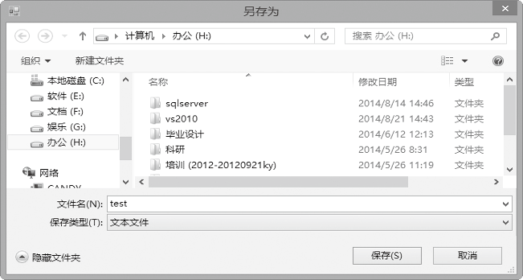
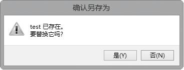

### 17.1.4　SaveFileDialog控件

打开一个文件后，需要对它进行一些修改并保存它。使用OpenFileDialog控件可以打开文件，使用SaveFileDialog控件可以保存文件。和OpenFileDialog一样，SaveFileDialog也可以用做控件或类。

SaveFileDialog控件提供的功能和OpenFileDialog相同，但操作顺序相反。在保存文件时，该控件允许选择文件保存的位置和文件名。重点需要注意的是，SaveFileDialog控件实际上不会保存文件，它只是提供一个对话框，让用户指定文件的保存位置和文件名。

SaveFileDialog组件拥有与OpenFileDialog组件相同的方法，而且SaveFileDialog组件与OpenFileDialog组件的属性很多都相同。下面的实例简单介绍了如何使用保存文件对话框（SaveFileDialog）组件来保存文件的编程技术。

**【范例17-4】 使用SaveFileDialog组件保存文件。**

（1）启动Visual Studio 2013，打开名称为“WindowsApplication17-4”的项目。

（2）添加一个新的窗体，并在新窗体中添加一个Label控件，设置其Text属性为“要保存的文件内容”；再添加一个TextBox控件，保留其默认属性即可；再添加一个Button控件，设置其Text属性为“保存文件”。调整窗体和控件的大小以适合窗口。

（3）切换到代码窗口，为Button控件（button1）的Click事件添加如下代码（代码17-4-1.txt）。

```c
01  private void button1_Click(object sender, EventArgs e)        
02  {
03          saveFileDialog saveFileDialog=new SaveFileDialog();
04          saveFileDialog.InitialDirectory="h:\\";
05          saveFileDialog.Filter="文本文件|*.*|C#文件|*.cs|所有文件|*.*";        
06          saveFileDialog.FilterIndex=1;
07          if (saveFileDialog.ShowDialog()==DialogResult.OK)        
08          { 
09                  File.WriteAllText(saveFileDialog.FileName, textBox1.Text);
10          }        
11  }
```

程序运行后，将出现如下图所示的界面，在TextBox控件中输入要保存的文件内容，单击“保存文件”按钮。


此时出现如下图所示的界面，输入文件名“test”，单击“保存”按钮。


此时，如果“test”文件原来不存在，则保存成功；如果“test”文件原来已经存在，则提示如下图所示的对话框，单击“是”按钮将替换原来的文件“test”。


> 
> **提示**
> 读数据时可以用转义字符“\r\n”换行。

