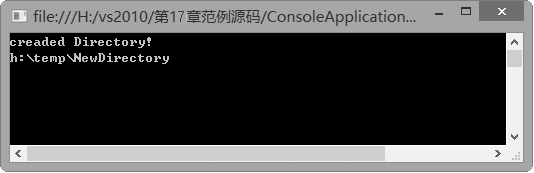
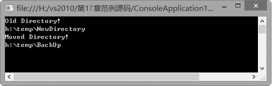

### 17.2.1　目录的创建、删除与移动

Directory类的CreateDirectory方法用于创建目录。方法原型为：

```c
public static DirectoryInfo CreateDirectory(string path);
```

参数path表示目录所在的路径。

Directory类的Delete方法用于删除目录。方法原型为：

```c
public static void Delete(string path,bool recursive);
```

参数path表示目录所在的路径，参数recursive决定是否删除非空目录。如果参数recursive值为true，将删除整个目录，即使该目录下有文件或子目录；若为false，则仅当目录为空时才可删除。

Directory类的Move方法用于移动目录。方法原型为：

```c
public static void Move(string sourceDirName,string destDirName);
```

参数sourceDirName表示目录所在的原路径，参数destDirName表示目录所在的目标路径。

**【范例17-5】 目录的创建、移动和删除。**

（1）启动Visual Studio 2013，新建一个C#控制台应用程序，项目名称为“ConsoleApplication17-5”。

（2）切换到代码窗口，在主程序的Main方法中输入以下代码（代码17-5-1.txt）。

```c
01  static void Main(string[] args)        
02  {
03          if (Directory.Exists(@"h:\temp\NewDirectory"))         
04          {          
05                  string[] Directorys1= Directory.GetDirectories(@"h:\temp");        
06                  Console.WriteLine("Old Directory!");
07                  Console.WriteLine(Directorys1[0].ToString());                
08                  Directory.Move(@"h:\temp\NewDirectory", @"h:\temp\BackUp");      
09                  string[] Directorys2 = Directory.GetDirectories(@"h:\temp");
10                  Console.WriteLine("Moved Directory!");        
11                  Console.WriteLine(Directorys2[0].ToString());
12                  Console.Read();
13          }
14          else         
15          {   
16                  Directory.CreateDirectory(@"h:\temp\NewDirectory");
17                  string[] Directorys2 = Directory.GetDirectories(@"h:\temp");
18                  Console.WriteLine("creaded Directory!");
19                  Console.WriteLine(Directorys2[0].ToString());
20                  Console.Read();        
21          } 
22  }
```

程序运行后，将出现如下图所示的界面，表示目录“h:\temp\NewDirectory”不存在，成功创建目录“h:\temp\NewDirectory”。


再次运行程序，将出现如下图所示的界面。这是因为目录“h:\temp\NewDirectoty”已经存在，完成移动目录“h:\temp\NewDirectory”到目录“h:\temp\BackUp”的操作。


**【范例分析】**

在这个程序中，因为使用了Directory类，所以要添加对System.IO命名空间的引用。上例中的语句：

```c
if (Directory.Exists(@"h:\temp\NewDirectory"))
```

判断目录“h:\temp\NewDirectory”是否已经存在，如果已经存在，则移动目录，并显示移动前和移动后的目录；如果不存在，则创建该目录，并显示该创建目录。

**【拓展训练】**

将主程序的Main方法中的代码：

```c
Directory.Move(@"h:\temp\NewDirectory", @"h:\temp\BackUp");
```

改为如下代码：

```c
Directory.Delete(@"h:\temp\BackUp", true);
```

将实现当目录“h:\temp\NewDirectory”已经存在时删除该目录。

另外，主程序的Main方法中的代码：

```c
Directory.CreateDirectory(@"h:\temp\NewDirectory");
```

与下面这段代码的作用一样，都是根据指定路径创建新目录。

```c
DirectoryInfo NewDirInfo = new DirectoryInfo(@"h:\temp\NewDirectory");
```

