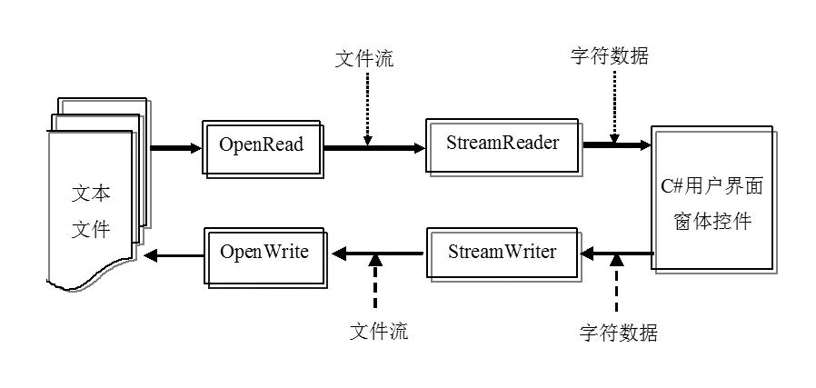
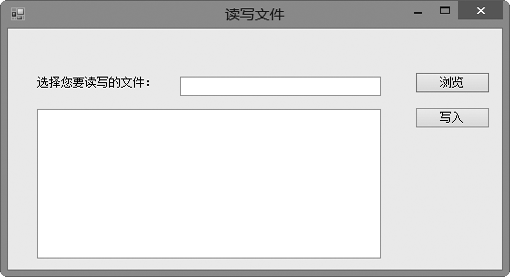
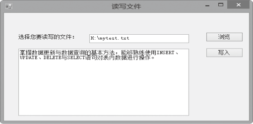

### 17.3.2　读/写文本文件

使用FileStream类时，其数据量是字节流，只能进行字节的读/写，使用它对文本文件进行处理就很不方便。为此，.NET还提供了StreamWriter类和StreamReader类专门处理文本文件，这两个类从底层封装了文件流，读/写时不需要重新进行编码。

#### 1．StreamReader类

StreamReader类用于读取标准文本文件的各行信息，StreamReader类的构造函数有多个重载，其常用的构造函数如下。

（1）StreamReader(Stream)：为指定的流初始化StreamReader类的新实例。

（2）StreamReader(String)：为指定的文件名初始化StreamReader类的新实例。

（3）StreamReader(Stream,Encoding)：用指定的字符编码为指定的流初始化StreamReader类的一个新实例。

（4）StreamReader(String,Encoding)：用指定的字符编码为指定的文件名初始化StreamReader类的一个新实例。

下面列出比较常用的两种方式，演示如何创建一个StreamReader类的实例。

```c
01  //指定文件路径作为参数
02  string strFilePath = @"c:\test.txt";
03  StreamReader Reader = new StreamReader(strFilePath);
04  //指定文件路径和编码作为参数
05  string strFilePath = @"c:\test.txt";
06  StreamReader Reader = new StreamReader(strFilePath, Encoding.Default);
```

StreamReader类常用的方法及其说明如下表所示。

| 成员名称 | 类别 | 说明 |
| :-----  | :-----  | :-----  | :-----  | :-----  |
| Close | 方法 | 关闭 StreamReader 对象和基础流，并释放与读取器关联的所有系统资源 |
| Equals | 方法 | 确定两个Object实例是否相等 |
| Read | 方法 | 读取输入字符串中的下一个字符或下一组字符 |
| ReadLine | 方法 | 从基础字符中读取一行。如果到达了输入流的末尾，则为空引用 |
| ReadToEnd | 方法 | 从文件流的当前位置一直读取到末尾 |
| ToString | 方法 | 返回表示当前Object的String |

使用StreamReader类读取文本文件中数据的过程如下图所示。首先通过File的OpenRead方法打开文件，并建立一个文件读取文件流，然后通过StreamReader类的方法将文件流中的数据读到C#文本框等用户界面窗体控件中。


#### 2．StreamWriter类

StreamWriter类用于把数据写入文本文件，如果指定的文件不存在，可以先创建一个新文件。StreamWriter类的构造函数有多个重载，其常用的构造函数如下。

+ StreamWriter(Stream)：用UTF-8编码及默认缓冲区大小，为指定的流初始化StreamWriter类的一个新实例。
+ StreamWriter(String)：使用默认编码和缓冲区大小，为指定路径上的指定文件初始化StreamWriter类的新实例。
+ StreamWriter(Stream,Encoding)：用指定的编码及默认缓冲区大小，为指定的流初始化StreamWriter类的新实例。
+ StreamWriter(string path,bool append)：path表示要写入的完整文件路径。append表示确定是否将数据追加到文件。如果该文件存在，并且append为false，则该文件被改写；如果该文件存在，并且append为true，则数据被追加到该文件中。否则，将创建新文件。

下面列出比较常用的两种方式，演示如何创建一个 StreamWriter类的实例。

```c
01  //指定文件路径作为参数
02  string strFilePath = @"c:\test.txt";
03  StreamWriter Writer = new StreamWriter(strFilePath);
04  //指定文件路径和Boolean作为参数
05  string strFilePath = @"c:\test.txt";
06  StreamWriter Writer = new StreamWriter(strFilePath,true);
```

> 
> **注意**
> 在第2种情况下，如果该文件存在，并且Boolean值为false，则该文件被改写；如果该文件存在，并且Boolean值为true，则数据追加到该文件中。否则，将创建新文件。

StreamWriter类常用的方法及其说明如下表所示。

| 成员名称 | 类别 | 说明 |
| :-----  | :-----  | :-----  | :-----  | :-----  |
| Close | 方法 | 关闭 StreamWriter 对象和基础流 |
| Equals | 方法 | 确定两个Object实例是否相等 |
| Write | 方法 | 写入流 |
| WriteLine | 方法 | 写入重载参数指定的某些数据，后跟行结束符 |
| ToString | 方法 | 返回表示当前Object的String |

StreamWriter类的WriteLine()和Write()方法写文本文件的方式有所区别。WriteLine()方法的默认返回值是行结束符（“\r\n”），但使用NewLine属性可以更改此值。WriteLine()只用于写入字符串，并且会自动追加一个换行符。Write()方法不追加换行符，可以向文本流写入字符串，也可以写成任何基本数据类型（int32、Single等）的文本形式。

使用StreamWriter类将数据写入文本文件的过程为：首先通过File类的OpenWrite建立一个写入文件流，然后通过StreamWriter的Write/WriteLine方法将C#文本框等用户界面窗体控件中的数据写入到该文件流中。

**【范例17-6】 使用StreamReader和StreamWriter类读写文本文件。**

（1）启动Visual Studio 2013，新建一个C# Windows窗体应用程序，项目名称为“WindowsForms Application17-6”。

（2）从工具栏上向窗体添加控件，设计如下图所示的界面。


（3）切换到代码窗口，在【浏览】按钮的Click事件中输入以下代码（代码17-6-1.txt）。

```c
01  private void button1_Click(object sender, EventArgs e)//浏览按钮单击事件处理程序
02    {
03       openFileDialog1.ShowDialog();                     //显示打开文件对话框
04       textBox1.Text = openFileDialog1.FileName;
05       if (textBox1.Text != "")                          //判断是否选择了文件
06       {
07           string pathString = textBox1.Text;            //设置文件名
08            if (File.Exists(pathString))                 //如果指定的文件存在，执行如下代码
09                   {
10                           FileStream fileStream = File.OpenRead(pathString);    //创建文件流
11                           try
12                         {
13                        StreamReader reader = new StreamReader(fileStream, System.Text.Encoding.Default);while (!reader.EndOfStream)       //读取文件内容
14                                          {
15                                                    textBox2.Text += reader.ReadLine() + "\r\n";        //显示文件内容到文本框中
16                                          }
17                                          reader.Close(); //关闭流
18                      }
19                              catch (Exception ex)        //异常处理
20                             {
21                                        MessageBox.Show(ex.Message);                //显示出现异常的原因
22                             }
23            }
24            else
25            {
26                 MessageBox.Show("你要读取的文件不存在");   //显示文件不存在
27           }
28       }
29  }
```

（4）在【写入】按钮的Click事件中输入以下代码（17-6-2.txt）。

```c
01  private void button2_Click(object sender, EventArgs e)
02  {
03          string pathString = @"H:\\MyNewText.txt";
04          if (System.IO.File.Exists(pathString))    //判断要写入的文件是否存在
05          {
06                  StreamWriter writer = new StreamWriter(pathString, false, System.Text.Encoding.Default);
07                  writer.WriteLine(textBox2.Text);  //将文本框中的内容写入文件
08                  writer.Close();     //关闭流
09          }
10  }
```

**【运行结果】**

单击【浏览】按钮，选择要读取的文件，如果文件存在，则会将文件内容显示在文本框中，如下图所示。


单击【写入】按钮，则会把文本框中的内容写入到“C:\MyNewText.txt”文件中。

**【范例分析】**

在这个程序中，因为使用了StreamWriter和StreamReader类，所以要添加对System.IO命名空间的引用。在读取文件的时候需要判断文件是否存在，若存在，则用ReadLine()方法读取文件内容到文本框中。写入的时候是将文本框中的内容直接写入到指定目录的指定文件中，这样会覆盖原文件的内容。

**【拓展训练】**

将button2_Click事件中的代码改为如下代码（拓展代码17-6-3.txt）。

```c
01  StreamWriter sw;
02  sw = File.AppendText(pathString );    //用AppendText而不是CreateText
03  sw.WriteLine(textBox2.Text);
04  sw.Close();
```

这样就不会覆盖原文件内容，而是追加到文本文件中。

