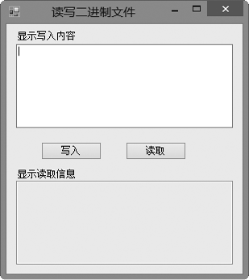
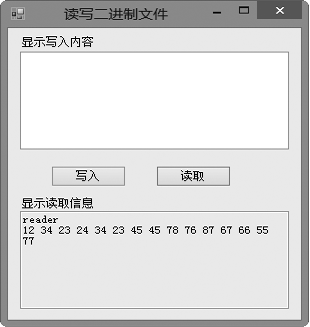

### 17.3.3　读/写二进制文件

前面已经介绍了如何读/写文本文件，本节介绍如何读/写二进制文件。读/写二进制文件的类主要有BinaryWriter和BinaryReader。这两个类的使用方式、操作方法同操作文本文件的StreamReader和StreamWriter类非常相似，只是处理的文件数据格式不同。

#### 1．BinaryReader类

BinaryReader类执行对当前输入流进行指定字节数的二进制读取，其读取数据的方法很多。BinaryReader类创建对象时必须基于所提供的流文件，其数据读取过程与StreamReader类似。BinaryReader常用的构造函数有以下两种。

（1）BinaryReader(Stream)：基于所提供的流，用UTF-8编码初始化BinaryReader类的实例。

（2）BinaryReader(Stream, Encoding)：基于所提供的流和特定的字符编码，初始化BinaryReader类的实例。

下表列出了BinaryReader类常用的成员及其说明。

| 成员名称 | 类别 | 说明 |
| :-----  | :-----  | :-----  | :-----  | :-----  |
| Read | 方法 | 从指定流读取字符，并将指针迁移，指向下一个字符 |
| ReadByte() | 方法 | 从指定流读取一个字节值，并将其在流中的位置向前移一个字节 |
| ReadInt16() | 方法 | 从指定流读取两个字节带符号的整数值，并将其在流中的位置向前移两个字节 |
| ReadInt32() | 方法 | 从指定流读取4个字节带符号的整数值，并将其在流中的位置向前移4个字节 |
| ReadString() | 方法 | 从指定流读取字符串，该字符串的前缀为字符串长度，编码为整数，每次7比特 |
| ReadDecimal() | 方法 | 从指定流读取一个十进制数值，并将其在流中的位置向前移动16个字节 |

#### 2．BinaryWriter类

BinaryWriter类以二进制形式将基元类型写入流，并支持用特定的编码写入字符串，它提供的一些方法和BinaryReader是对称的。BinaryWriter类的数据写入过程与StreamWriter类似，只是数据格式不同。BinaryWriter常用的构造函数有以下3种。

（1）BinaryWriter()：初始化一个BinaryWriter类的实例。

（2）BinaryWriter(Stream)：基于所提供的流，用UTF-8作为字符串编码初始化BinaryWriter类的实例。

（3）BinaryWriter(Stream, Encoding)：基于所提供的流和特定的字符编码，初始化BinaryWriter类的实例。

下表列出了BinaryWriter类的常用成员及其说明。

| 成员名称 | 类别 | 说明 |
| :-----  | :-----  | :-----  | :-----  | :-----  |
| Write | 方法 | 将值写入流，有很多重载，适用于不同的数据类型 |
| Flush() | 方法 | 清除缓存区 |
| Close() | 方法 | 关闭当前流 |

> 
> **技巧**
> BinaryReader类和BinaryWriter类用来完成读/写二进制数据的操作，但是这两个类本身并不执行流，而是提供其他流对象的包装。

**【范例17-7】 利用BinaryReader和BinaryWriter读写二进制文件。**

（1）启动Visual Studio 2013，新建一个C# Windows窗体应用程序，项目名称为“WindowsFormsApplication17-7”。

（2）从工具栏中向窗体添加控件，设计如下图所示的窗体界面。


（3）在【写入】按钮的Click事件中输入以下代码（代码17-7-1.txt）。

```c
01  string fileName = "H:\\MyNew.data";        //定义字符串变量存储文件名字符串
02  if (File.Exists(fileName))                 //判断文件是否存在
03  {
04          MessageBox.Show("当前文件已经存在");
05  }
06  else
07  {
08          FileStream fs = new FileStream(fileName, FileMode.Create);
        //使用FileStream类创建文件
09          BinaryWriter writer = new BinaryWriter(fs);   //将BinaryWriter类实例化
10          writer.Write(textBox1.Text);
        //调用BinaryWriter类的Write()方法，将文本框中的数据写入
11          MessageBox.Show("写入文件成功");
12          textBox1.Text = "";
13          writer.Close();                              //关闭BinaryWriter流
14          fs.Close();                                  //关闭FileStream流
15  }
```

（4）在【读取】按钮的Click事件中输入以下代码（代码17-7-2.txt）。

```c
01  string fileName = "H:\\MyNew.data";                 //定义字符串变量存储文件名字符串
02  if (!(File.Exists(fileName)))                       //判断要读取的文件是否存在
03  {
04          MessageBox.Show("当前文件不存在");
05          return;
06  }
07  string strData = "";
08  FileStream fs = new FileStream(fileName, FileMode.Open, FileAccess.Read);
        //以读取已有文件的方式创建FileStream的实例对象
09  BinaryReader reader = new BinaryReader(fs);        //实例化BinaryReader类
10  try                                                //调用BinaryReader的ReadString方法
11  {                                                  //循环读取文件内容
12          strData = reader.ReadString();
13          while (true)
14          {
15                  strData += "  ||  " + reader.ReadInt32().ToString();
        //每次读取4个字节带符号的整数值，并转换为字符串类型
16          }
17  }       
18  catch (EndOfStreamException es)
19  {            
20  }
21  textBox2.Text = strData;                           //读取的文件内容显示在textBox2中
22  fs.Close();                                        //关闭文件流对象
23  reader.Close();                                    //关闭二进制文件读对象存储文件名字符串
```

**【运行结果】**

单击【写入】按钮，如果文件存在，则提示“当前文件已经存在”；如果文件不存在，则创建该文件，并将文本框中的信息写入MyNew.data中。单击【读取】按钮，则将MyNew.data文件中的数据读取到文本框中，如下图所示；若要读取的文件不存在，则提示“当前文件不存在”。


> 
> **注意**
> 在程序中需要添加对System.IO命名空间的引用。

**【范例分析】**

本范例实现了读/写二进制文件，在【写入】按钮的Click事件中，代码第8～10行创建了FileStream和BinaryWriter的实例，然后将文本框中的内容写入到第1行代码中指定的文件中。在【读取】按钮的Click事件中，代码第8～10行创建了FileStream和BinaryReader的实例，然后读取特定文件中的数据；第13～16行实现了循环读取数据，并在每个数据之间加上符号“||”；第21行实现了将数据输出到下面的文本框中。

