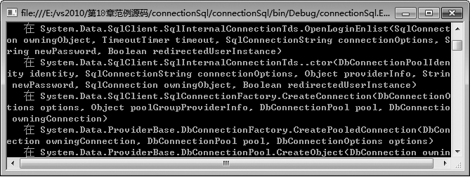
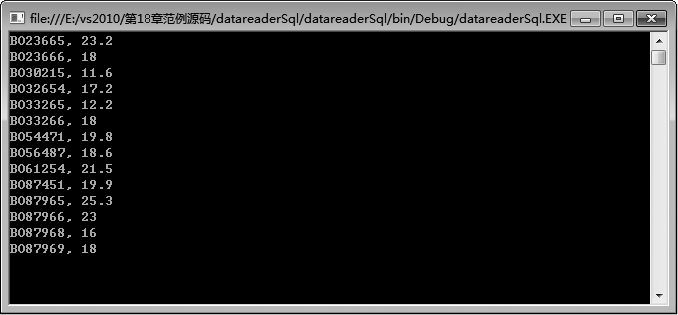

### 18.2.1　.NET Framework 数据提供程序

.NET Framework 数据提供程序是专门为数据操作以及快速、只进、只读访问数据而设计的组件，用于连接数据库、执行命令和检索结果。.NET Framework 数据提供程序是轻量的，它在数据源和代码之间创建最小的分层，并在不降低功能性的情况下提高性能。

从ADO.NET 2.0版本开始，Microsoft提供了SQL Server、Oracle、ODBC系列等众多的数据提供程序。下表列举了.NET Framework 中包含的数据提供程序。

| 数据提供程序 | 说明 |
| :-----  | :-----  | :-----  | :-----  |
| SQL Server .NET数据提供程序 | 提供对 Microsoft SQL Server 7.0 或更高版本中数据的访问，使用 System.Data.SqlClient 命名空间 |
| OLE DB .NET数据提供程序 | 提供对使用 OLE DB 公开的数据源中数据的访问，使用 System.Data.OleDb 命名空间 |
| ODBC .NET数据提供程序 | 提供对使用 ODBC 公开的数据源中数据的访问，使用 System.Data.Odbc 命名空间 |
| Oracle .NET数据提供程序 | 适用于 Oracle 数据源，支持 Oracle 客户端软件 8.1.7 和更高版本，并使用 System.Data.OracleClient 命名空间 |
| EntityClient .NET数据提供程序 | 提供对实体数据模型 (EDM) 应用程序的数据访问，使用 System.Data.EntityClient 命名空间 |

其中，最常使用的是SQL Server .NET Framework数据提供程序和OLE DB .NET Framework数据提供程序。SQL Server .NET Framework数据提供程序使用其自身的协议与SQL Server通信。由于经过了优化，SQL Server .NET Framework数据提供程序可以直接访问SQL Server，而不用添加OLE DB或开放式数据库连接（ODBC）层，因此实现数据库连接更加简单，并具有良好的性能。OLE DB.NET Framework数据提供程序支持基于传统COM的OLE DB协议的数据库。由于OLE DB.NET Framework数据提供程序在后台调用各种COM对象来实现数据交互，因此可能会影响程序性能。

本章的所有例子都会使用SQL Server .NET Framework数据提供程序。

.NET Framework数据提供程序包含4个核心对象，分别为Connection对象、Command对象、DataReader对象和DataAdapter对象，这些对象及其功能如下表所示。

| 对象 | 说明 |
| :-----  | :-----  | :-----  | :-----  |
| Connection | 建立与特定数据源（数据库）的连接，所有Connection对象的基类均为DbConnection类 |
| Command | 通过Connection对象对数据源执行命令操作。所有Command对象的基类均为Db Command |
| DataReader | 从数据源中读取只进且只读的数据流，所有DataReader 对象的基类均为DbDataReader 类 |
| DataAdapter | 用数据源填充DataSet并解析更新，所有DataAdapter 对象的基类均为DbDataAdapter 类 |

.NET Framework数据提供程序的4个核心对象负责建立连接和执行数据操作，DataSet是在内存中建立的类似数据库的结构。.NET Framework数据提供程序的主要功能是作为DataSet与数据源之间的桥梁，负责将数据源中的数据取出后放入DataSet中，或是将DataSet中的数据存放回数据源。

#### 1．Connection对象

在ADO.NET中，Connection对象主要用于建立与数据源的活动连接。一旦建立了连接，其他独立于连接细节的对象,如Command对象，就可以使用连接在数据源上执行命令。

每个.NET Framework数据提供程序都有自己特定的连接对象（如SqlConnection、OracleConnection、OdbcConnection等），但它们都继承自相同的基类DbConnection。若要连接到Microsoft SQL Server数据库，则使用数据提供程序的SqlConnection对象。下表列出了SqlConnection类和对象的常用成员，其中，ConnectionString、State、DataSource和Database是SqlConnection的成员属性，SqlConnection()和SqlConnection(String)是SqlConnection的构造函数，其余都是SqlConnection的成员方法。

| 成员名称 | 说明 |
| :-----  | :-----  | :-----  | :-----  |
| ConnectionString | 获取或设置用于打开SQL Server数据库的字符串 |
| State | 指示SqlConnection的状态 |
| DataSource | 获取要连接的SQL Server实例的名称 |
| Database | 获取当前数据库或连接打开后要使用的数据库的名称 |
| SqlConnection() | 初始化 SqlConnection 类的新实例 |
| SqlConnection(String) | 如果给定包含连接字符串的字符串，则初始化 SqlConnection 类的新实例 |
| BeginDbTransaction() | 开始数据库事务 |
| BeginTransaction() | 开始数据库事务 |
| ChangeDatabase() | 为打开的 SqlConnection 更改当前数据库 |
| ChangePassword() | 将连接字符串中指示的用户的 SQL Server 密码更改为提供的新密码 |
| Close() | 关闭与数据库的连接。这是关闭任何打开连接的首选方法 |
| CreateCommand() | 创建并返回一个与 SqlConnection 关联的 SqlCommand 对象 |
| GetSchema() | 已重载。返回此SqlConnection的数据源的架构信息 |
| Open() | 使用ConnectionString所指定的属性设置打开数据库连接 |

通常，通过调用Open()方法建立连接。一旦在打开的连接上完成了数据操作任务，就可以显式调用Close()方法关闭该连接。不使用连接时，最好确保始终显式关闭连接，以减少对服务器资源的任何不必要浪费。

**【范例18-1】 C#中的数据库连接程序。**

连接在本地服务器上的SQL Server数据库，数据库的名称是CustomerAndBoat，SQL Server的登录验证方式是Windows验证。

（1）在SQL Server中附加数据库CustomerAndBoat。在Visual Studio 2013中新建一个控制台应用程序，项目名称为“connectionSql”。 在自动生成的“Program.cs”程序中添加导入“System.Data.SqlClient;”命名空间语句“using System.Data.SqlClient;”。

（2）在Program.cs的Main方法中添加以下代码进行测试（代码18-1-1.txt）。

```c
01    static void Main(string[] args)
02    {                                //声明SqlConnection对象 myConnection
03      SqlConnection myConnection;   
04                                     //创建连接数据库的字符串
05      string connStr ="Server = localhost;database = CustomerAndBoat; Integrated Security=True";
06                                     //构造myConnection对象
07      myConnection = new SqlConnection(connStr);
08      try
09      {
10            myConnection.Open();     //连接数据库
11       }
12      catch (Exception e)
13      {
14            //发生错误后，抛出出错原因
15            Console.WriteLine("{0} Second exception caught.", e);
16            Console.ReadLine();
17       }
18       Console.WriteLine("连接成功！"); //显示连接成功
19       myConnection.Close();        //关闭数据库连接
20       Console.ReadLine();
21   }
```

程序运行后，如果出现如下图所示的界面，则表示数据库可以正常连接，一切正常。


**【范例分析】**

使用SqlConnection类连接数据库分如下四步。

① 第一步：加入命名空间。

```c
using System.Data.SqlClient;
```

② 第二步：建立连接字符串。

声明一个字符串对象，指定如下的连接属性。

```c
string connection_str="Data Source = 服务器名称; Initial Catalog = 数据库名称; User Id = 用户名; Password = 密码";
```

其中，Data Source属性指定要连接的SQL Server数据库所在的服务器名称，Initial Catalog属性指定要连接的数据库名称，User Id为SQL Server的登录账号，Password为SQL Server的登录密码。若要使用Windows验证方式登录数据库服务器，则“User Id = 用户名; Password = 密码”部分应该修改为“Integrated Security=True”。上例中就是使用的Windows验证方式登录数据库服务器。

③ 第三步：创建SqlConnection连接对象。

SqlConnection类提供两种构造函数，其中带参数的构造函数使用给定的连接字符串初始化SqlConnection类的新实例，创建一个SqlConnection对象，如：

```c
SqlConnection myConnection = new SqlConnection(connection_str);
```

也可以使用无参数构造函数创建SqlConnection类的对象，然后设置该对象的ConnectionString属性为上述连接字符串，其效果和第二个构造函数相同。

④ 第四步：连接SQL Server。

调用SqlConnection对象的Open方法连接数据库：

```c
myConnection.Open();
```

由于在数据库的连接中涉及的环节非常多，比如说数据库的服务没有启动，网络故障，或者是连接参数写错，都会造成连接过程中的错误，所以在这段程序中增加了错误处理机制，一旦和数据库的连接出现了问题，程序就会抛出错误，然后进入错误处理的语句段中。比如将程序中的下面这条语句：

```c
string connStr ="Server = localhost;database = CustomerAndBoat; Integrated Security=True";
```

改为：

```c
string connStr = "Server = localhost;database = CustomerAndBoat; uid = sa;pwd =sa123";
```

这样在程序运行的时候，就会出现不能正常连接数据库服务器的错误，如下图所示。


**【范例18-2】 使用SqlCommand对象删除Boat表中的记录。**

连接在本地服务器上的SQL Server数据库，数据库的名称是CustomerAndBoat，SQL Server的登录验证方式是Windows验证。

（1）在SQL Server中附加数据库CustomerAndBoat。在Visual Studio 2013中新建一个控制台应用程序，项目名称为“commandSql”。 在自动生成的“Program.cs”程序中添加导入“System.Data.SqlClient;”命名空间语句“using System.Data.SqlClient;”。

（2）在Program.cs的Program类中创建一个最简单的方法来说明SqlCommand的用法。这个方法里接受两个参数，一个是查询语句“delete from CheckTime where Id = 11”，一个是数据库的连接字符串“Server = localhost;database = CustomerAndBoat; Integrated Security=True”，随后在主程序中调用该静态方法，具体代码如下（代码18-2-1.txt）。

```c
01  using System;
02  using System.Collections.Generic;
03  using System.Linq;
04  using System.Text;
05  using System.Data;
06  using System.Data.SqlClient;
07  //定义自己的命名空间
08  namespace SqlCommandExample
09  {
10          
11      class Program                                  //Program类
12      {
13          private static void CreateCommand(string queryString, string connectionString)
14          {
15          //建立SqlConnection，和指定的数据库进行连接
16              using (SqlConnection connection = new SqlConnection(connectionString))
17              {
18              SqlCommand command = new SqlCommand(queryString, connection);
19              command.Connection.Open();            //对指定的数据库进行连接操作
20              int result = command.ExecuteNonQuery();   //执行sql语句，返回受影响的行数
21              Console.WriteLine(result.ToString());     //显示受影响的行数
22              Console.Read();
23             }
24       }
25          static void Main(string[] args)
26          {
27          //调用CreateCommand方法完成sql语句的操作
28              CreateCommand("delete from Boat where length > 30 ", "Server = localhost;database = CustomerAndBoat; Integrated Security=True");
29          }
30      }
31  }
```

程序运行后，如果出现如下图所示的界面，则表示数据库表中没有符合条件的记录，因此没有记录被删除。


**【范例分析】**

使用SqlCommand对象执行SQL命令分如下三步。

① 第一步：加入命名空间

```c
using System.Data.SqlClient;
```

② 第二步： 创建SqlCommand命令对象。

一般来说，创建SqlCommand命令对象时需要指定命令操作的SQL语句和所属的连接对象。SqlCommand类提供四种构造函数，如果使用无参数的构造函数创建一个空的SqlCommand对象，还需指定SqlCommand的CommandText属性和Connection属性，如上例中的command对象也可以采用下面的语句块生成。

```c
01  SqlCommand command = new SqlCommand();
02  string sql_str = " delete from Boat where length > 30";
03  myCommand.CommandText = sql_str;
04  string con_str ="Server = localhost;database = CustomerAndBoat; Integrated Security=True";
05  SqlConnection connection = new SqlConnection(con_str)
06  myCommand.Connection = connection;
```

③ 第三步：打开连接对象，执行SqlCommand命令。

如果SqlCommand对象执行更新或删除记录操作，调用SqlCommand对象的ExecuteNonQuery()方法；如果执行数据统计或汇总操作，调用SqlCommand对象的ExecuteScalar()方法；如果执行数据查询操作，调用SqlCommand对象的ExecuteReader()方法。上例中SqlCommand对象使用下述语句执行的是删除记录操作。

```c
01  command.Connection.Open();
02  int result = command.ExecuteNonQuery();
```

#### 2．DataReader

DataReader对象是从数据库中检索只读的数据流。使用DataReader时，首先建立与数据库的连接，然后建立要在数据库上执行的命令对象，例如，一个查询SQL语句，然后调用命令对象的ExecuteReader方法创建一个 DataReader。

连接对象打开后，可以使用DataReader的Read方法来通过关联的Connection对象从数据源获得一个或多个结果集。第一次使用该方法时，ADO.NET会将隐含的记录指针指向第一个结果集的第一条记录。然后，调用一次Read方法来获取一行数据记录，并将隐含的记录指针向后移一步。Read方法返回一个布尔值，程序员根据这个值来判断指针是否已移到结果集的最后一条记录。

DataReader对象提供一种向前的、只读数据的访问方式，它有以下两个特点。

+ 只能读取数据，不能对数据库的记录进行创建、修改和删除等操作。
+ 它是一种向前的读取数据的方式，不能再次回头读取上一回的记录。

查询结果在查询执行时返回，并存储在客户端的缓冲区中，直到使用 DataReader 的 Read 方法对它们发出请求。使用 DataReader 可以提高应用程序的性能，并且在默认的情况下一次只在内存中存储一行，从而减小了系统的开销。当我们只需要循序地读取数据而不需要其他操作时，可以使用DataReader对象。

在使用DataReader的时候，根据.NET的设计，如果需要操作的是SQL Server数据库，则推荐使用SqlDataReader对象。但是如果在前面使用了OleDb的方式，那么不论连接任何数据库， 则必须使用OleDbReader与之相匹配。

针对SQL Server数据库的SqlDataReader类没有显示的构造函数，SqlDataReader对象的常用属性如下表所示。

| 属性名称 | 说明 |
| :-----  | :-----  | :-----  | :-----  |
| Depth | 获取一个值，用于指示当前行的嵌套深度 |
| FieldCount | 获取当前行中的列数 |
| HasRows | 获取一个值，该值指示SqlDataReader是否包含一行或多行数据 |
| IsClosed | 检索一个布尔值，该值指示是否已关闭指定的SqlDataReader实例 |
| Item | 获取以本机格式表示的列的值 |
| RecordsAffected | 获取执行Transact-SQL语句所更改、插入或删除的行数 |
| VisibleFieldCount | 获取SqlDataReader中未隐藏的字段的数目 |

**【范例18-3】 使用SqlDataReader对象查询Boat表中的记录信息。**

连接在本地服务器上的SQL Server数据库，数据库的名称是CustomerAndBoat，SQL Server的登录验证方式是Windows验证。

（1）在SQL Server中附加数据库CustomerAndBoat。在Visual Studio 2013中新建一个控制台应用程序，项目名称为“datareaderSql”。在自动生成的“Program.cs”程序中添加导入“System.Data.SqlClient;”命名空间语句“using System.Data.SqlClient;”。

（2）在Program.cs的Main方法中添加以下代码进行测试（代码18-3-1.txt）。

```c
01  //引用需要的命名空间
02  using System;
03  using System.Collections.Generic;
04  using System.Linq;
05  using System.Text;
06  using System.Data.SqlClient;
07  //定义自己的命名空间sqlDataReadExample 
08  namespace sqlDataReadExample
09  {
10  class Program
11      {
12            static void Main(string[] args)
13            {
14              //定义数据库连接字符串，定义存放sql语句的字符串
15              string ConnStr, SelectCmd;
16              //赋值数据库连接字符串
17               ConnStr = "Server = localhost;database = CustomerAndBoat; Integrated Security=True";
18              //赋值sql语句的字符串
19              SelectCmd = "select * from Boat";
20              //声明SqlConnection对象myConnection
21              SqlConnection myConnection;
22              //声明SqlCommand对象myCommand
23              SqlCommand myCommand;
24              //声明SqlDataReader对象myDataReader
25              SqlDataReader myDataReader;
26              //构造myConnection对象
27              myConnection = new SqlConnection(ConnStr);
28              //构造myCommand对象
29              myCommand = new SqlCommand(SelectCmd, myConnection);
30              //打开myConnection
31              myConnection.Open();
32              //执行指定的sql语句
33              myDataReader = myCommand.ExecuteReader();
34              //关闭myDataReader对象
35              while (myDataReader.Read())
36              {
37              Console.WriteLine(String.Format("{0}, {1}",
38              myDataReader [0], myDataReader [1])); //输出只读数据
39              }
40              Console.Read();
41              myDataReader.Close();//关闭myConnection对象
42              myConnection.Close();
43         }
44      }
45  }
```

程序运行后，出现如下图所示的界面，界面中显示的数据是Boat表中的前两列信息。


**【范例分析】**

使用SqlDataReader对象执行SQL命令分如下三步。

① 第一步：加入命名空间。

```c
using System.Data.SqlClient;
```

② 第二步：创建SqlDataReader对象。

SqlDataReader对象没有显示的构造函数，可以利用SqlCommand对象的ExecuteReader方法返回一个SqlDataReader对象，如上例中的语句：

```c
SqlDataReader myDataReader;
…
myDataReader = myCommand.ExecuteReader();
```

③ 第三步：调用SqlDataReader的Read()方法，读取查询到的数据表内容 。

因为SqlDataReader对象中存储有多条数据记录，通常使用while循环逐条读取查询到的数据记录。如上例中语句：

```c
while (myDataReader.Read()) {
        Console.WriteLine(String.Format("{0}, {1}", myDataReader [0], myDataReader [1]));
}
```

#### 3．DataAdapter

DataAdapter对象用于在数据源以及DataSet之间传输数据，它可以通过Command对象下达命令后，将取得的数据放入DataSet对象中，并使DataSet中的数据与数据源保持一致。

根据所用的.NET Framework数据提供程序的不同，有不同的DataAdapter对象与之对应。这些DataAdapter对象分别是SqlDataAdapter对象、OleDataAdapter对象、OdbcDataAdapter对象和OracleDataAdapter对象。应根据访问数据源的不同选择相应的DataAdapter对象。

针对SQL Server数据库的SqlDataAdapter类构造函数如下表所示。

| 构造函数名称 | 说明 |
| :-----  | :-----  | :-----  | :-----  |
| SqlDataAdapter() | 初始化SqlDataAdapter类的新实例 |
| SqlDataAdapter(SqlCommand) | 用指定的SqlCommand初始化SqlDataAdapter的新实例 |
| SqlDataAdapter(String, SqlConnection) | 用指定的SelectCommand和SqlConnection初始化SqlDataAdapter类的新实例 |
| SqlDataAdapter(String,String) | 用指定的SelectCommand和连接字符串初始化SqlDataAdapter类的新实例 |

SqlDataAdapter对象的常用属性如下表所示。

| 属性名称 | 说明 |
| :-----  | :-----  | :-----  | :-----  |
| InsertCommand | 获取或设置一个Transact-SQL语句，以在数据源中插入新记录 |
| SelectCommand | 获取或设置一个Transact-SQL语句，用于在数据源中选择记录 |
| UpdateCommand | 获取或设置一个Transact-SQL语句，用于更新数据源中的记录 |
| DeleteCommand | 获取或设置一个Transact-SQL语句或存储过程，以从数据集删除记录 |
| TableMappings | 获取一个集合，它提供源表和DataTable之间的主映射 |
| AcceptChanges-DuringFill | 获取或设置一个值，该值指示在执行Fill操作过程中，将AcceptChanges添加到DataTable之后是否在DataRow上调用它 |
| AcceptChanges-DuringUpdate | 获取或设置在Update期间是否调用AcceptChanges |
| FillLoadOption | 获取或设置LoadOption，以确定适配器如何从SqlDataReader中填充DataTable |

SqlDataAdapter对象的常用方法如下表所示。

| 方法名称 | 说明 |
| :-----  | :-----  | :-----  | :-----  |
| Fill() | 填充DataSet或DataTable |
| Update() | 为DataSet中每个已插入、已更新或已删除的行调用相应的insert、update或delete语句 |
| GetFillParameters() | 获取当执行SQL SELECT语句时由用户设置的参数 |
| ResetFillLoadOption() | 将FillLoadOption重置为默认状态，并使Fill接受AcceptChangesDuringFill |
| ShouldSerializeAccept ChangesDuringFill() | 确定是否应保持AcceptChangesDuringFill属性 |

SqlDataAdapter是DataSet和SQL Server之间的桥接器，用于检索和保存数据。SqlDataAdapter的Fill方法可更改DataSet 中的数据以匹配数据源中的数据，Update方法可更改数据源中的数据以匹配DataSet中的数据。

如果要刷新DataSet中的数据，最简单的解决方法就是清空DataSet(或DataTable)，然后再次调用DataAdapter对象的Fill方法。如果调用了一个SqlDataAdapter对象的Fill方法，而SqlCommand对象的SqlConnection对象关闭了，那么SqlDataAdapter就会开放一个连接，然后提交查询，获取结果，最后关闭连接。如果在调用Fill方法前开放了SqlConnection，那么操作之后仍然保持开放。

