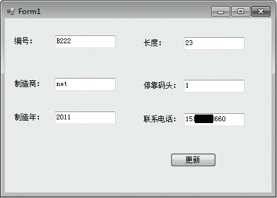

### 18.2.2　DataSet

数据集DataSet是ADO.NET的重要组件。可以把DataSet当成内存中的数据库，DataSet是不依赖于数据库的独立数据集合。所谓独立，就是说即使断开数据链路或者关闭数据库，DataSet依然是可用的。

DataSet对象具有以下3个特性。

（1）独立性。DataSet独立于各种数据源。

（2）离线（断开）和连接。

（3）DataSet对象是一个可以用XML形式表示的数据视图，是一种数据关系视图。

正是由于DataSet，才使得程序员在编程时可以屏蔽数据库之间的差异，从而获得一致的编程模型。DataSet从数据源中检索到的数据在内存中缓存。DataSet 可以将数据和架构作为 XML 文档进行读/写。数据和架构可通过 HTTP 传输，并在支持 XML 的任何一个平台上被任何一个应用程序使用。可以使用 WriteXmlSchema方法将架构保存为 XML 架构，并且可以使用WriteXml方法保存架构和数据。若要读取既包含架构也包含数据的XML文档，可以使用ReadXml方法。

在实际应用中，DataSet的使用方法一般有以下3种。

（1）把数据库中的数据通过DataAdapter对象填充到DataSet。

（2）通过DataAdapter对象操作DataSet，实现数据库的更新。

（3）把XML数据流或文本加载到DataSet。

需要注意的是，DataSet所有的数据都是加载在内存上执行的，这样可以提高数据的访问速度，提高硬盘数据的安全性，能极大地改善程序运行的速度和稳定性。因为可以将DataSet看做是内存中的数据库，因此可以说DataSet是数据表的集合，它可以包含任意多个数据表（DataTable），而且每一个DataSet中的数据表对应一个数据源中的数据表（Table）或数据视图（View）。数据表实质上是由行（DataRow）和 列（DataColumn）组成的集合。为了保护内存中数据记录的正确性，避免并发访问时的读/写冲突，DataSet对象中的DataTable担负着维护每一条记录，分别保存记录的初始状态和当前状态的任务。

DataSet对象结构是非常复杂的，每一个DataSet对象是由若干个 DataTable对象组成的。DataTableCollection对象就是管理DataSet中的所有DataTable对象的。表示DataSet中两个 DataTable对象之间的父/子关系的是DataRelation对象，它使一个DataTable 中的行与另一个DataTable中的行相关联，这种关联类似于关系数据库中数据表之间的主键列和外键列之间的关联。 DataRelationCollection对象就是管理DataSet中所有DataTable之间的DataRelation关系的。在 DataSet中，DataSet、DataTable和DataColumn等都具有ExtendedProperties属性。 ExtendedProperties是一个属性集（PropertyCollection），用以存放各种自定义数据，如生成数据集的SELECT 语句等。DataSet层次结构中的类如下表所示。

| 类名称 | 说明 |
| :-----  | :-----  | :-----  | :-----  |
| DataTableCollection | 包含特定数据集的所有DataTable对象 |
| DataTable | 表示数据集中的一个表 |
| DataColumnCollection | 表示DataTable对象的结构 |
| DataRowCollection | 表示DataTable对象中的实际数据行 |
| DataColumn | 表示DataTable对象中列的结构 |
| DataRow | 表示DataTable对象中的一个数据行 |

DataSet对象的常用方法如下表所示。

| 方法名称 | 说明 |
| :-----  | :-----  | :-----  | :-----  |
| AcceptChanges | 提交自加载此DataSet或上次调用AcceptChanges以来对其进行的所有更改 |
| GetChanges() | 获取DataSet的副本，该副本包含自加载以来或自上次调用AcceptChanges以来对该数据集进行的所有更改 |
| GetObjectData | 用序列化DataSet所需的数据填充序列化信息对象 |
| Reset | 清除所有表，并从DataSet中移除任何关系和约束 |
| ShouldSerializeTables | 获取一个值，该值指示是否应该保持Tables属性 |
| ShouldSerializeRelations | 获取一个值，该值指示是否应该保持Relations属性 |
| Merge(DataRow[]) | 将DataRow对象数组合并到当前的DataSet中 |
| Merge(DataSet) | 将指定的DataSet及其架构合并到当前DataSet中 |
| Merge(DataTable) | 将指定的DataTable及其架构合并到当前DataSet中 |
| HasChanges() | 获取一个值，该值指示DataSet是否更改，包括新增行、已删除或已修改的行 |
| RejectChanges | 回滚自创建DataSet以来或上次调用AcceptChanges以来对其进行所有更改 |

DataSet类的构造函数如下表所示。

| 构造函数名称 | 说明 |
| :-----  | :-----  | :-----  | :-----  |
| DataSet() | 初始化DataSet类的新实例 |
| DataSet(String) | 用给定名称初始化DataSet类的新实例 |
| DataSet(SerializationInfo, StreamingContext) | 初始化具有给定序列化信息和上下文的DataSet类的新实例 |
| DataSet(SerializationInfo, StreamingContext, Boolean) | 初始化DataSet类的新实例 |

DataSet对象的常用属性如下表所示。

| 属性名称 | 说明 |
| :-----  | :-----  | :-----  | :-----  |
| DataSetName | 获取或设置当前DataSet的名称 |
| Tables | 获取包含在DataSet中的表的集合 |
| HasErrors | 获取一个值，指示在此DataSet中的DataTable对象是否存在错误 |
| Relations | 获取用于将表链接起来并允许从父表浏览到子表的关系的集合 |
| SchemaSerializationMode | 获取或设置DataSet的SchemaSerializationMode |
| Container | 获取组件的容器 |

**【范例18-4】 使用DataSet和DataAdapter对象更新游艇码头数据库Boat表。**

连接在本地服务器上的SQL Server数据库，数据库的名称是CustomerAndBoat，SQL Server的登录验证方式是Windows验证。

（1）在SQL Server中附加数据库CustomerAndBoat。在Visual Studio 2013中新建一个Windows应用程序，项目名称为“datasetUpdate”。

（2）添加一个窗体，并在窗体上添加六个Label控件、六个TextBox控件和一个按钮。在自动生成的“Form1.cs”程序中添加导入“System.Data.SqlClient;”命名空间语句“using System.Data.SqlClient;”，并在按钮Click事件中添加如下代码进行测试（代码18-4-1.txt）。

```c
01  private void Form1_Load(object sender, EventArgs e)
02  {                //声明SqlConnection对象 myConnection
03      string sql_str;   
04    //创建连接数据库的字符串
05      string conStr = "Server = localhost;database = CustomerAndBoat; Integrated Security=True";
06     //构造myConnection对象
07      SqlConnection myConnection = new SqlConnection(conStr);
08      try
09      {
10              myConnection.Open();        //连接数据库
11              sql_str = "select stateRegistrationNo, length,year,slipwayNo from Boat";
12              SqlDataAdapter myDataAdapter = new SqlDataAdapter(sql_str, myConnection);
13              DataSet myDataSet = new DataSet();
14              myDataAdapter.Fill(myDataSet, " Boat ");        
15              DataRow dr = myDataSet.Tables[0].NewRow();
16              dr["stateRegistrationNo"] = textBox1.Text;
17              dr["length"] = textBox4.Text;
18              dr["manufacturer"] = textBox2.Text;
19              dr["slipwayNo"] = textBox3.Text;
20              dr["year"] = textBox5.Text;
21              dr["customerPhoneNo"] = textBox6.Text;
22              SqlCommandBuilder scb = new SqlCommandBuilder(myDataAdapter);
23              myDataSet.Tables[0].Rows.Add(dr);
24              myDataAdapter.Update(myDataSet,"Boat");
25              catch (Exception ex) {        //发生错误后，抛出出错原因
26              MessageBox.Show(ex.Message.ToString());   } 
27              finally {  myConnection.Close();   }
28  }
```

程序运行结果如下图所示。


**【范例分析】**

使用DataSet和SqlDataAdapter更新数据分如下四步。

① 第一步：加入命名空间。

```c
using System.Data.SqlClient;
```

② 第二步：创建SqlDataAdapter对象。

SqlDataAdapter类提供了四种构造函数，可以根据情况灵活选择任何一种创建SqlDataAdapter对象。上例中SqlDataAdapter对象的创建方式为：

```c
sql_str = "select stateRegistrationNo, length,year,slipwayNo from Boat";   
SqlDataAdapter myDataAdapter = new SqlDataAdapter(sql_str, myConnection);
```

③ 第三步：创建DataSet对象，并调用myDataAdapter的Fill()方法，将数据表中的内容填入到DataSet对象中。

如上例中的语句：

```c
DataSet myDataSet = new DataSet();
myDataAdapter.Fill(myDataSet, " Boat ");
```

用于将Boat表中的内容填入到DataSet对象myDataSet中。

④ 第四步：调用myDataAdapter的Update ()方法将DataSet的新内容更新到数据源中。

如上例中的语句：

```c
DataRow dr = myDataSet.Tables[0].NewRow();
dr["stateRegistrationNo"] = textBox1.Text;
dr["length"] = textBox4.Text;
dr["manufacturer"] = textBox2.Text;
dr["slipwayNo"] = textBox3.Text;
dr["year"] = textBox5.Text;
dr["customerPhoneNo"] = textBox6.Text;
SqlCommandBuilder scb = new SqlCommandBuilder(myDataAdapter);
myDataSet.Tables[0].Rows.Add(dr);
myDataAdapter.Update(myDataSet,"Boat");
```

把TextBox控件中输入的内容作为一条新记录添加到DataSet对象中，再通过myDataAdapter的Update ()方法将该条记录更新到数据源中。

