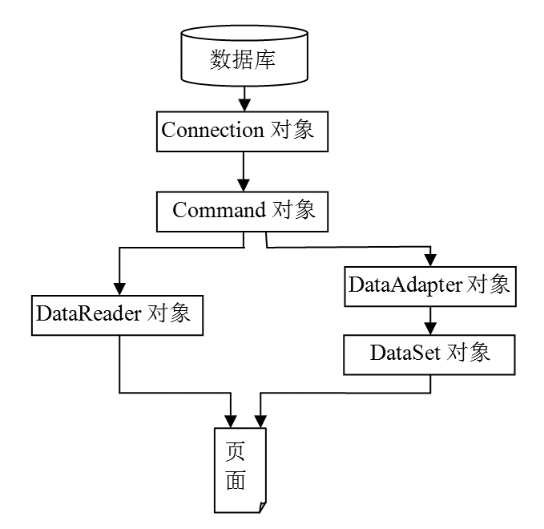

### 18.2.3　ADO.NET访问数据库的两种模式

ADO.NET通过两个主要组件.NET Framework数据提供程序和DataSet访问数据库。ADO.NET使用两种模式访问数据库。

+ 连接模式访问数据库：通常使用DataReader对象访问数据库。
+ 非连接模式访问数据库：使用DataSet对象访问数据库。

下图显示了连接模式和非连接模式的运行机制。左边的连接模式在Connection、Command对象的基础上使用DataReader对象访问数据库，右边的非连接模式在Connection、Command、DataAdapter对象的基础上使用DataSet对象访问数据库。设计应用程序时，应根据情况选择使用哪种模式访问数据库。

下列情况适合使用DataReader（连接模式访问数据库）。

（1）不需要缓存数据。

（2）要处理的结果集太大，内存中放不下。

（3）需要以仅向前、只读方式快速访问数据。

下列情况适合使用DataSet对象（非连接模式访问数据库）。

（1）重用同样的记录集合，以便通过缓存获得性能改善（例如，排序、搜索或筛选数据）。

（2）操作来自多个数据源（例如，来自多个数据库、一个XML文件和一个电子表格的混合数据）的数据。

（3）每条记录都需要执行大量处理。对使用DataReader返回的每一行进行扩展处理会延长服务于DataReader的连接的必要时间，这影响了性能。

