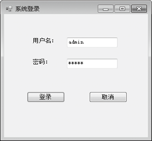

### 18.3.1　连接模式下读取数据

使用Connection对象建立与数据源的连接后，就可以调用Command对象的ExecuteScalar和ExecuteReader方法读取数据了。

#### 1．使用ExecuteScalar方法读取单值数据

Command对象的ExecuteScalar方法执行后返回的是一个单值数据，如统计符合条件的记录数目，求某列数据的总和、平均值等。

**【范例18-5】 使用ExecuteScalar方法读取单值数据。**

连接在本地服务器上的SQL Server数据库，数据库的名称是CustomerAndBoat，SQL Server的登录验证方式是Windows验证。

（1）在SQL Server中附加数据库CustomerAndBoat。在Visual Studio 2013中新建一个Windows应用程序，项目名称为“slipmanage”。

（2）添加登录窗体Login和主窗体MainFrm，并在登录窗体Login上添加两个Label控件、两个TextBox控件和两个按钮。在自动生成的“Form1.cs”程序中添加导入“System.Data.SqlClient;”命名空间语句“using System.Data.SqlClient;”，并在按钮一的Click事件中添加如下代码进行测试（代码18-5-1.txt）。

```c
01  private void button1_Click(object sender, EventArgs e)
02  {      //声明读取单值数据的SQL语句，统计用户表中符合条件的用户数目
03          string comm = string.Format("Select count(*) from Loginer where userName='{0}' and
                         pw='{1}'", textBox1.Text, textBox2.Text);
04          //声明SqlConnection对象, 通过Conn.conn引用Conn.类中声明的连接字符串conn
05          SqlConnection sqlcon = new SqlConnection(Conn.conn);
06          //声明SqlConnection对象
07          SqlCommand sql = new SqlCommand(comm, sqlcon);
08          int count = 0;
09          //打开连接对象
10          sqlcon.Open();
11          //执行查询命令，得到符合条件的用户计数赋值给整型变量count
12          count = (int)sql.ExecuteScalar();
13          if (count > 0)
14          {
15          //如果符合条件的用户存在，打开主窗体
16          Marina.GUI.MainFrm fm = new Marina.GUI.MainFrm();
17          fm.Show();
18          }
19  }
```

程序运行结果如下图所示。


**【代码详解】**

程序中的下面这条语句：

```c
string comm = string.Format("Select count(*) from Loginer where userName='{0}' and pw='{1}'", textBox1.Text, textBox2.Text);
```

是声明SQL语句的常用形式。当需要从用户界面中读取检索条件时（例如，上述语句中，需要从登录窗体中读取用户输入的用户名和密码），通过调用string类的Format方法格式化SQL语句不容易出错。

程序中的下面这条语句：

```c
Marina.GUI.MainFrm fm = new Marina.GUI.MainFrm();
```

使用Marina.GUI.MainFrm类声明主窗体对象。使用Marina.GUI.MainFrm引用MainFrm类表明该类位于Marina程序集GUI文件夹中。通常，为了使程序结构更清晰，会把不同类型的对象放在不同的文件夹下，如把所有窗体文件放置在GUI文件夹中，所有类文件放置在Entity文件夹中。

#### 2．使用ExecuteReader方法读取记录数据

Command对象的ExecuteReader方法执行后返回的是一个DataReader对象。DataReader对象存储读取的记录数据，如读取用户表中的所有用户年龄信息。

