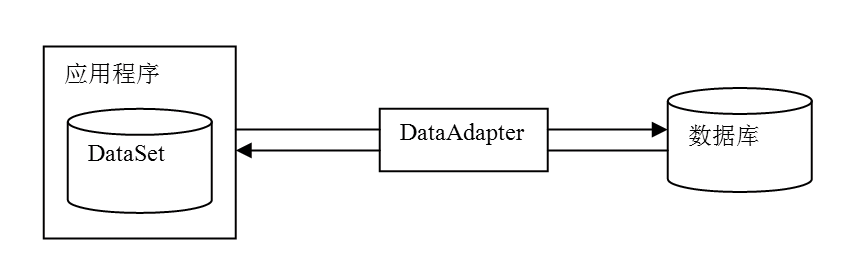

### 18.4　使用非连接模式访问数据库

**本节视频教学录像：5分钟**

非连接模式访问数据库是指应用程序客户端从数据源获取数据后，断开与数据源的连接，所有的数据操作都是针对本地数据缓存里的数据进行的，当需要从数据源获取新数据或者将处理后的数据回传至数据源时，客户端再与数据源相连接来完成相应的操作。非连接模式访问数据库的核心对象是DataSet，一旦通过DataAdapter对象将数据填充至DataSet对象后，随后的数据访问将直接针对DataSet对象展开。与连接模式下数据通过DataReader对象读取的方式不同，在非连接模式下，数据通过数据适配器DataAdapter对象在数据源与DataSet对象之间传递。一方面，它可以将数据库中的数据填充到DataSet对象中供客户端访问；另一方面，它也可以将客户端对DataSet所做的修改更新回数据库中。因此，DataAdapter对象也称为DataSet对象与数据库之间的“搬运工”，如下图所示。

使用非连接模式访问数据库时，由数据适配器DataAdapter对象自动处理数据库连接，为了提高数据库访问性能，DataAdapter对象会尽可能缩短连接打开的总时间。一旦应用程序中的DataSet对象被填充，它会立即关闭数据库连接，仅在本地留下一个远程数据的副本。应用程序可以对DataSet对象中的DataTable对象进行插入、修改、删除操作，但物理数据库不会随之被更新，直到显式提交DataSet对象到DataAdapter对象时，物理数据库才会被更新。简而言之，DataSet对象造成了应用程序总是连接着数据库的假相，其实所有的操作都是对一个内存中的局部数据库进行的。

使用非连接模式访问数据库的特点是数据以与数据源无关的XML形式存放，并可以被独立地复制与更改，适用于结构复杂、数据量大的数据访问。

使用非连接模式访问数据库的步骤如下。

（1）使用Connection对象建立与数据源的数据连接。

（2）DataAdapter对象使用Command对象从数据源获取所需数据。

（3）DataAdapter对象将数据填充到DataSet对象中，应用程序对DataSet对象中的数据执行各种操作（包括插入、更新、删除、显示）。

（4）利用DataAdapter对象把DataSet对象中的数据更新到数据库。

