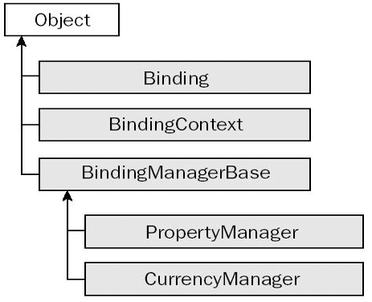

### 18.5.1　数据绑定技术概述

数据绑定技术就是把控件链接到数据源的过程，即把已经打开的数据集中某个或某些字段绑定到控件的某些属性上的一种技术。例如，可以把已经打开数据的某个或者某些字段绑定到Text控件、ListBox控件、ComBox等控件上的能够显示数据的属性上面。当对控件完成数据绑定后，其显示字段的内容将随着数据记录指针的变化而变化。这样程序员就可以定制数据显示方式和内容，从而为以后的数据处理作好准备。

下图显示了数据绑定中使用的对象的类层次结构，它们都位于System.Windows.Forms命名空间中。其中，带阴影的对象就是在绑定中使用的对象。下面讨论Binding、BindingContext和BindingManagerBase对象之间的关系，说明在把数据绑定到窗体上的一个或多个控件上时，它们是如何交互的。

（1）Binding对象负责将控件的属性和数据对象的属性关联起来。数据对象的属性值会被自动传递到控件的属性，而控件的属性值更改后也会直接传回数据对象的属性（双向绑定）。在一个包含多个控件的Windows窗体界面中，一般都会有一组Binding对象来管理不同控件中的属性和相同数据源中属性的关联关系。

（2）BindingManagerBase对象负责管理Binding对象组。BindingManagerBase为抽象类，它包含两个子类：PropertyManager和CurrencyManager。PropertyManager对象负责维护对象的属性与数据绑定控件属性之间的Binding对象；CurrencyManager负责管理 Binding对象的列表。

一个PropertyManager或CurrencyManager总是只和一个数据源对象相对应。也就是说，一个特定的数据源对象(无论是单一对象还是集合类对象）都会有一个对应的BindingManagerBase的子对象。对同一窗体而言，通常都会面对多个数据源而不是一个，也就会产生多个PropertyManager或CurrencyManager对象。

（3）BindingContext对象主要负责管理多个BindingManagerBase子对象。BindingContext对象可以通过窗体的BindingContext属性获得，它是一个字典的集合。

根据所绑定控件的不同，数据绑定可以分为两种类型：简单数据绑定和复杂数据绑定。简单数据绑定是在控件的属性（实现了IBindableComponent接口的组件属性）与数据项的属性之间做了映射，这些控件显示出来的字段只是单个记录，这种绑定方式一般使用在显示单个值的控件上（TextBox控件和Label控件等）。复杂数据绑定是基于列表的绑定，数据项的列表（实现了IList接口的集合对象）被绑定到控件上，这些控件显示出来的字段是多个记录，这种绑定一般使用在显示多个值的组件上（ComBox控件和ListBox控件等）。

数据绑定一般包含如下两步。

① 无论是简单型的数据绑定还是复杂型的数据绑定，要实现绑定的第一步就是要连接数据库，得到可以操作的数据集。

② 根据不同控件，采用不同的数据绑定方式实现数据绑定。对于简单数据绑定，一般是通过把数据集中的某个字段绑定到组件的显示属性上面来实现绑定的。对于复杂数据绑定，一般是通过设定数据集中某些属性值来实现绑定的。

一旦实现了数据绑定，数据集将作为Windows窗体程序控件的“数据源”，数据绑定控件中的数据与数据集中的数据始终保持一致。

