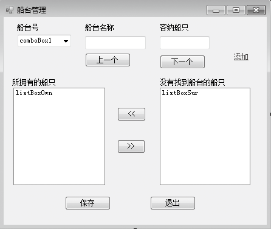
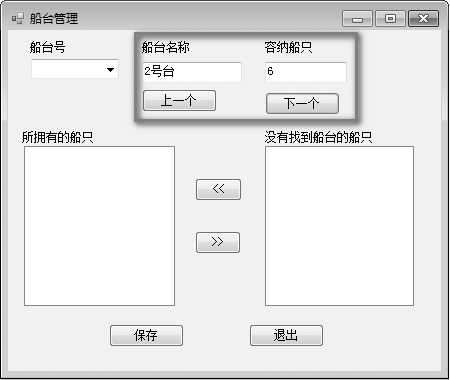

### 18.5.2　简单数据绑定

简单数据绑定是将一个用户界面元素（控件）的属性绑定到一个类型（对象）实例的某个属性上的方法。例如，可以把数据表Slipway的“Name”字段值绑定到一个TextBox的“Text”属性上。“绑定”了这2个属性之后，对TextBox的Text属性的更改将“传播”到Slipway的“Name”字段，而对Slipway的“Name”字段值的更改同样会“传播”到TextBox的Text属性。Windows窗体的简单数据绑定支持绑定到任何public或者internal级别的.NET Framework属性。

简单数据绑定的方法有两种。

（1）编码实现绑定。简单数据绑定的一般编码格式为控件名称.DataBindings.Add (“属性名”，数据集名，“字段名”)，例如，以下代码：

```c
textBox1.DataBindings.Add ("Text" , dataSet1 , "name" ) ;
```

把数据集dataSet1中的“name”字段值绑定到一个textBox1的“Text”属性上。

（2）通过绑定控件的属性窗口实现绑定。在绑定控件的属性窗口中打开DataBindings属性，从中选择要绑定的控件属性和绑定目标。

如果将TextBox控件添加到某个窗体并将其绑定到数据集中的表列，则该控件与此窗体的 BindingContext进行通信，而BindingContext与此数据关联的特定CurrencyManager进行通信，通过CurrencyManager的Position属性控制TextBox控件的当前绑定记录。在下面的代码示例中，通过TextBox控件所在的窗体的BindingContext对象，将此控件绑定到 splist数据集中Slipway表的“name”和“volume”列。

**【范例18-9】 编写代码实现简单数据绑定。**

（1）在Visual Studio 2013中打开Windows应用程序项目“slipmanage”。

（2）打开主窗体MainFrm的设计界面，并在主窗体中添加数据显示控件，添加控件后的主窗体如下图所示。


（3）在主窗体MainFrm类中分别添加窗体的Load事件、按钮“上一个”和按钮“下一个”的Click事件，代码如下（代码18-9-1.txt）。

```c
01  private void Main_Load(object sender, EventArgs e)      
02  {        
03          splist = slipwayB.getAllSlipway();    //获取所有slipway对象
04          Binding bind_name = new Binding("Text", splist, "name", true); //创建船台名称的绑定对象
05          textBox1.DataBindings.Add(bind_name);
06          Binding bind_volume = new Binding("Text", splist, "volume", true); //创建容纳船只的绑定对象
07          textBox2.DataBindings.Add(bind_volume);
08          bm = (CurrencyManager)this.BindingContext[splist];
09  }
10  private void button1_Click(object sender, EventArgs e)  
11  {    
12          bm.Position--;    //绑定记录向前移动
13  }     
14  private void button2_Click(object sender, EventArgs e)
15  {
16          bm.Position++;    //绑定记录向后移动
17  }
```

程序运行结果如下图所示。


**【代码详解】**

程序中的下面这条语句：

```c
splist = slipwayB.getAllSlipway();
```

调用slipway对象的getAllSlipway方法，获得所有船台记录，并存储到splist列表中。为此，要在窗体类中声明为全局splist列表：

```c
List<Slipway> splist = null;
```

程序中splist列表作为TextBox控件的绑定数据源，也可以从数据库中获取所有船台记录并存储到DataSet对象中作为绑定数据源。程序中的下面这条语句：

```c
Binding bind_name = new Binding("Text", splist, "name", true);
```

为textBox1控件创建Binding对象bind_name，构造函数Binding的参数“Text”是指把数据绑定到控件的Text属性上，参数splist是指绑定的数据源对象，参数“name”是指绑定数据源中的具体字段，参数true是指设置Binding对象的FormattingEnabled属性为true，即允许Binding对象自动在数据源类型和控件要求类型间进行转换。程序中的下面这条语句：

```c
textBox1.DataBindings.Add(bind_name);
```

通过textBox1控件的DataBindings属性赋值，把Binding对象bind_name和textBox1控件绑定起来。这样，程序运行时，textBox1控件将显示splist列表中第一个对象的name字段值（即船台名称）。程序中的下面这条语句：

```c
bm = (CurrencyManager)this.BindingContext[splist];
```

通过窗体的BindingContext对象获得与上述绑定数据源对象splist对应的“管理者”（CurrencyManager对象bm），以便在窗体显示时对绑定数据进行操控。为此，要在窗体类中声明为全局CurrencyManager类型变量bm：

```c
private CurrencyManager bm;
```

“上一个”按钮的Click事件中的下面这条语句：

```c
bm.Position--;
```

通过CurrencyManager对象bm操控textBox1和textBox2控件中的显示数据，使其显示当前记录的上一条记录数据。CurrencyManager对象的关键属性是Position和Current。Position是一个从0开始的整数值，它指示当前记录在数据源中的序号位置，Current则返回在当前位置发现的数据对象。当应用程序（或数据绑定控件）修改当前位置或更改当前数据对象中的任何字段时，CurrencyManager对象激发PositionChanged 和CurrentChanged两个相关事件，通知绑定控件该数据源上的当前位置已更改。

