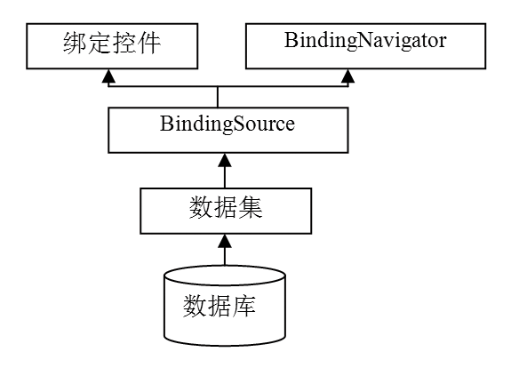
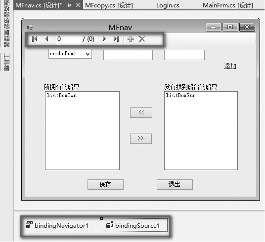
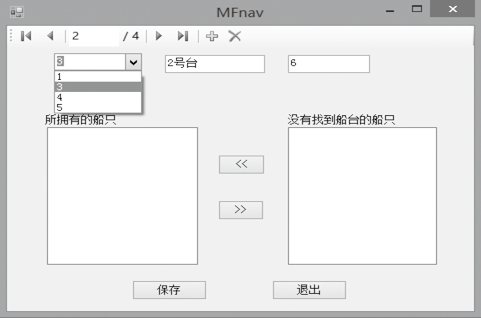

### 18.5.3　BindingSource与BindingNavigator数据绑定组件

BindingSource组件是.Net在Windows Forms数据绑定方面最重要的创举之一，它能够为窗体封装数据源，让控件的数据绑定操作更加简便。通过将 BindingSource 组件绑定到数据源，然后将窗体上的控件绑定到 BindingSource 组件，BindingSource组件提供一个将窗体上的控件绑定到数据的间接层。通过BindingSource组件，我们可以控制对数据的修改。与数据的所有进一步交互（包括导航、排序、筛选和更新）都可以通过调用 BindingSource 组件来完成。

使用BindingSource组件时，一般先在窗体上加入一个BindingSource组件，接着将BindingSource组件绑定至数据源，最后将窗体上的控件绑定至BindingSource组件。通常将BindingNavigator控件与BindingSource组件搭配使用，以便浏览BindingSource组件的数据源。使用BindingSource组件的数据绑定示意图如下图所示。


BindingSource组件是数据源和控件间的一座桥，是数据源的“看门人”，同时提供了大量的API和Event供我们使用。BindingSource控件没有运行时的界面，无法在用户界面上看到该控件。BindingSource组件的常用属性如下表所示。

| 属性名称 | 说明 |
| :-----  | :-----  | :-----  | :-----  |
| AllowEdit | 指示是否可以编辑BindingSource控件中的记录 |
| AllowNew | 指示是否可以使用 AddNew 方法向BindingSource控件添加记录 |
| AllowRemove | 指示是否可从BindingSource控件中删除记录 |
| Count | 获取BindingSource控件中的记录数 |
| CurrencyManager | 获取与BindingSource控件关联的当前记录管理器 |
| Current | 获取BindingSource控件中的当前记录 |
| DataMember | 获取或设置连接器当前绑定到的数据源中的特定数据列表或数据库表 |
| DataSource | 获取或设置连接器绑定到的数据源 |
| Filter | 获取或设置用于筛选的表达式 |
| Sort | 获取或设置用于排序的列名来指定排序 |
| Item | 获取或设置指定索引的记录 |

BindingNavigator组件表示在窗体上定位和操作数据的标准化方法，为用户提供简单的数据导航和用户界面操作。BindingNavigator组件的用户界面（UI）由一系列 ToolStrip 按钮、文本框和静态文本元素组成，能完成大多数常见的与数据相关的操作-添加数据、删除数据和定位数据。默认情况下，BindingNavigator组件的用户界面如下图所示，图中的按钮分别用来定位到数据集中第一条、最后一条、下一条和上一条记录及添加、删除记录。用户也可以将按钮添加到BindingNavigator组件中，例如，向Windows窗体的BindingNavigator控件添加“加载”、“保存”和“取消”按钮。


通常将BindingNavigator与BindingSource组件一起使用，这样用户可以在窗体的数据记录之间移动并与这些记录进行交互。对于BindingNavigator控件上的每个按钮，都有一个对应的有相同功能的BindingSource组件成员。例如，MoveFirstItem按钮对应于BindingSource组件的MoveFirst方法，DeleteItem按钮对应于RemoveCurrent方法等。这样，启用BindingNavigator控件定位数据记录时，就只需在窗体上将其BindingSource属性设置为适当的BindingSource组件。BindingSource和BindingNavigator组件成员的对应关系如下表所示。

| BindingNavigator 成员 | BindingSource 成员 | 说明 |
| :-----  | :-----  | :-----  | :-----  | :-----  |
| MoveFirstItem方法 | MoveFirst方法 | 移到最前 |
| MovePreviousItem方法 | MovePrevious方法 | 移到上一条记录 |
| PositionItem属性 | Current属性 | 当前位置 |
| CountItem属性 | Count属性 | 计数 |
| MoveNextItem方法 | MoveNext方法 | 移到下一条记录 |
| MoveLastItem方法 | MoveLast方法 | 移到最后 |
| AddNewItem方法 | AddNew方法 | 新添 |
| DeleteItem方法 | RemoveCurrent方法 | 删除 |

**【范例18-10】 基于BindingSource和BindingNavigator组件的数据绑定。**

（1）在Visual Studio 2013中打开Windows应用程序项目“slipmanage”。添加主窗体的复制窗体MFnav，删除窗体MFnav中的“上一个”和“下一个”按钮，并从工具箱中为MFnav窗体添加BindingSource和BindingNavigator控件，如下图所示。


（2）在窗体MFnav类中添加以下声明。

```c
01  List<Slipway> splist = null;
02  Slipway slipwayB = new Slipway();
```

（3）在窗体MFnav类的Load事件中添加代码如下。

```c
01  private void MFnav_Load(object sender, EventArgs e)      
02  {        
03           splist = slipwayB.getAllSlipway();
04           this.bindingNavigator1.BindingSource = this.bindingSource1;
05          this.bindingSource1.DataSource = splist;
06          textBox1.DataBindings.Add(new Binding("Text", bindingSource1, "name", true));
07          textBox2.DataBindings.Add(new Binding("Text", bindingSource1, "volume", true));
08          comboBox1.DataSource = this.bindingSource1;
09          comboBox1.DisplayMember = "id";
10  }
```

程序运行结果如下图所示。


**【代码详解】**

程序中的数据源splist列表由下面这条语句获得：

```c
splist = slipwayB.getAllSlipway();
```

程序中的下面这条语句：

```c
this.bindingNavigator1.BindingSource = this.bindingSource1;
```

将bindingNavigator1的BindingSource属性设置为bindingSource1。

程序中的下面这条语句：

```c
this.bindingSource1.DataSource = splist;
```

将bindingSource1的DataSource属性设置为splist 数据源。

程序中的下面这两条语句：

```c
textBox1.DataBindings.Add(new Binding("Text", bindingSource1, "name", true));
textBox2.DataBindings.Add(new Binding("Text", bindingSource1, "volume", true));
```

通过textBox1和textBox2控件的DataBindings属性设置实现数据绑定，将控件的“Text”属性绑定到bindingSource1。

程序中的下面这条语句：

```c
comboBox1.DataSource = this.bindingSource1;
```

与下面这条语句作用相同，都是设置comboBox1控件的绑定数据源。

```c
comboBox1.DataSource = splist;
```

