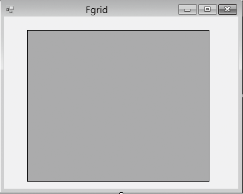
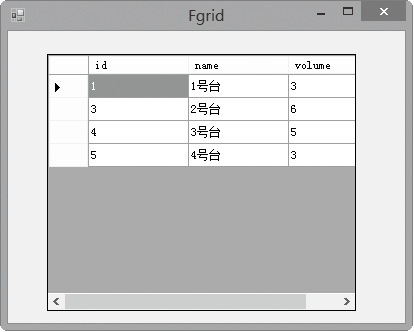

### 18.5.4　DataGridView数据绑定控件

DataGridView控件支持标准Windows窗体数据绑定模型，因此可绑定到各种数据源。但在多数情况下，DataGridView控件都将绑定到一个BindingSource组件，由该组件来管理与数据源交互的详细信息。DataGridView设计过程中始终考虑了扩展性，因此用户可以集成所需的专用功能，而不必采用低级别的复杂编程。

DataGridView控件是在Windows应用程序中显示数据最好的方式，它只需要几行简短的代码就可以把数据显示给用户，同时又支持增、删、改操作。DataGridView在程序中显示数据源中的数据，将数据源中的一行数据，也就是一条记录，显示为在程序中输出表格中的一行。

DataGridView控件的主要功能如下。

（1）多种列类型。DataGridView控件提供了更多的内置列类型。

（2）多种数据显示方式。DataGridView控件可显示存储在控件中的未绑定数据、来自绑定数据源的数据或者同时显示绑定数据和未绑定数据，也可以在DataGridView控件中实现虚拟模式以提供自定义数据管理。

（3）用于自定义数据显示的多种方式。DataGridView控件提供了许多属性和事件，可以使用它们指定数据的格式设置方式和显示方式。例如，可以根据单元格、行和列中包含的数据更改其外观，或者将一种数据类型的数据替换为另一种类型的等效数据。

（4）用于更改单元格、行、列、表头外观和行为的多个选项。利用DataGridView控件能够以多种方式使用各个网格组件。例如，可以冻结行和列以阻止其滚动，隐藏行、列和表头，更改调整行、列和表头大小的方式，更改用户进行选择的方式，以及为各个单元格、行和列提供工具提示和快捷菜单。

使用DataGridView控件实现数据绑定的方式有两种。

（1）表数据直接绑定模式。通过设置DataGridView控件的DataSource属性直接实现表数据绑定。这种方式简单易实现，但不够灵活。

（2）表数据自定义绑定模式。DataGridView控件显示的数据不是来自于绑定的数据源，而是可以通过代码手动将数据填充到DataGridView控件中，这样就为DataGridView控件增加了很大的灵活性。

**【范例18-11】 基于DataGridView控件的直接数据绑定。**

（1）在Visual Studio 2013中打开Windows应用程序项目“slipmanage”。添加窗体Fgrid，并从工具箱中为Fgrid窗体添加DataGridView控件，如下图所示。


（2）在窗体MFnav类中添加以下声明。

```c
01  List<Slipway> splist = null;     
02  Slipway slipwayB = new Slipway();
```

（3）在窗体MFnav类的Load事件中添加代码如下。

```c
01  private void MFnav_Load(object sender, EventArgs e)      
02  {        
03          splist = slipwayB.getAllSlipway();
04          dataGridView1.DataSource = splist;
05  }
```

程序运行结果如下图所示。


**【代码详解】**

程序中的数据源splist列表由下面这条语句获得：

```c
splist = slipwayB.getAllSlipway();
```

程序中的下面这条语句：

```c
dataGridView1.DataSource = splist;
```

将dataGridView1控件的绑定数据源设置为splist列表。

**【知识扩展】**

单击dataGridView1控件右上角的三角图标，在弹出的 “选择数据源”中单击其下拉菜单的三角箭头，在显示的菜单中选择“添加项目数据源”，可以利用向导为DataGridView控件添加绑定数据源，此时程序员无需编写代码，.NET会自动在窗体上添加一个BindingSource对象。

从“工具箱”中找到bindingNavigator控件，并将其放置到MFnav窗体上。系统会自动为MFnav窗体添加bindingNavigator1控件，在bindingNavigator1控件的属性窗口中的“BindingSource”属性上单击，选择相应的BindingSource对象，可以实现为dataGridView1添加导航栏。

