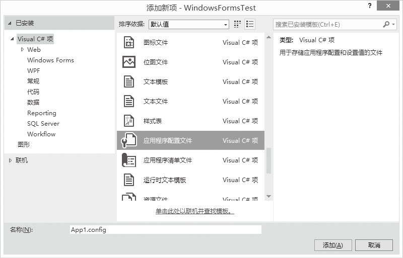
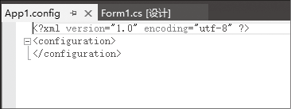

### 19.1.1　配置文件的设置

在Visual Studio 2013集成开发环境中，默认的情况下已经生成了配置文件“App.config”，如果我们想添加其他配置文件，需要通过集成开发环境的“项目”
“添加新项”菜单项打开如下图所示的添加新项对话框，从列表中找到应用程序配置文件项，配置文件名默认是“App1.config”，单击“添加”按钮，打开应用程序配置文件的文本编辑界面。


如下图所示，此时会在项目源码的根目录下生成设定的配置文件。


在配置文件编辑窗口中，我们可以看到<configuration>配置节，<configuration>是所有其他配置节的根，也就是其他所有的配置信息都应该放在</configuration>配置节之间。下面将对常用的配置节进行说明。

#### （1）<appSettings>配置节。

<appSettings>配置节用于配置应用于整个应用程序的配置信息。在程序初始化时，经常需要加载一些运行必要的参数，比如需要连接的串口端口号、用于程序登录的用户名称等，一般对这些参数的处理方法就是给用户一个配置文件，在打开程序前先在配置文件中填写对应的参数，然后程序打开时可以调用这些参数，实现程序的正常功能。

下面是串口通信的参数配置信息，<appSettings>配置节的<add>元素用来向应用程序中添加名称/值对形式的自定义应用程序设置。<add>元素的Key属性指定应用程序设置的名称，Value属性指定应用程序设置的值。下面是计算机串口连接的配置信息。

```c
01  <?xml version="1.0" encoding="utf-8" ?> 
02          <configuration>
03          <appSettings>
04                  <add key="PortName" value=" COM1" />
05                  <add key="BaudRate" value="9600" />
06                  <add key=" DataBits" value="8" />
07                  <add key="Parity" value="" />
08                  <add key=" StopBits" value="1" />
09          </appSettings>
10．</configuration>
```

#### （2）<connectionStrings>配置节。

<connectionStrings>配置节专门用来存放数据库访问的连接字符串。下面是SQL Server和Oracle数据库连接字符串配置信息。

```c
01  <?xml version="1.0" encoding="utf-8"?>
02  <configuration>
03           <connectionStrings>
04           <!--SQL Server数据库连接字符串配置信息--> 
05           <add name="SqlServerStr" connectionString="server=localhost;Database=xtchaobiao;Persist Security Info=True;User ID=sa;Password=sa1234;Connect Timeout=600;" />
06           <!--Oracle数据库连接字符串配置信息-->
07           <add name="OracleStr" connectionString="Data Source=(DESCRIPTION =(ADDRESS_LIST =(ADDRESS=(PROTOCOL = TCP)(HOST =127.0.0.1) (PORT = 1521)))(CONNECT_DATA =(SERVICE_NAME=MYMIS)));Persist Security Info=True;User Id=orcl; Password=orcl"/>
08           </connectionStrings>
09  </configuration>
```

#### （3）<configSections>配置节。

<configSections>配置节用于用户自定义一个配置节，要在<configSections></configSections>配置节中先声明配置节，然后在<configSections></configSections>之后设置配置节，有点类似于一个变量先声明，后使用一样。

```c
01  <?xml version="1.0" encoding="utf-8"?> 
02  <configuration>
03  <configSections> 
04  <!--配置节声明-->
05         <section name="Fruit" type="System.Configuration.SingleTagSectionHandler"/> 
06         <section name="Bank" type="System.Configuration.NameValueSectionHandler"/> 
07         </configSections﹥
08  <!--配置节设置区域-->
09         <Fruit setting1="Apple" setting2="Orange"/> 
10         <Bank﹥ 
11         <add key="ICBC" value="中国工商银行" /> 
12         </Bank> 
13  </configuration>
```

① 在声明部分：

+ name：自定义配置节的名称。
+ type：自定义配置节的类型，主要包括System.Configuration.SingleTagSectionHandler、 System.Configuration.DictionarySectionHandler、 System.Configuration.NameValueSectionHandler。<section name="Fruit" type="System.Configuration.SingleTagSectionHandler"/﹥声明了一个配置节，它的名字叫Fruit，类型为SingleTagSectionHandler。

② 在配置节设置区域：

在声明部分，不同的type配置节设置区域的配置方式不一样。在配置节设置部分使用﹤MySettings1 setting1="Apple" setting2="Orange"/﹥设置了一个配置节，它对应的类型为System.Configuration.SingleTagSectionHandler，它的第一个设置的值是“Apple”，第二个值是“Orange”，还可以有更多个值。

配置文件设置好后，编译或运行应用程序，会在可执行应用程序的目录下生成“*.exe.config”格式的配置文件，“*”代表可执行程序的名字。如果在可执行程序的目录下没有生成相应的配置文件，则要修改App.config文件的属性，在解决方案资源管理器中选中App.config文件，在如下图所示的属性窗口中把“复制到输出目录”的属性值修改为“始终复制”。


