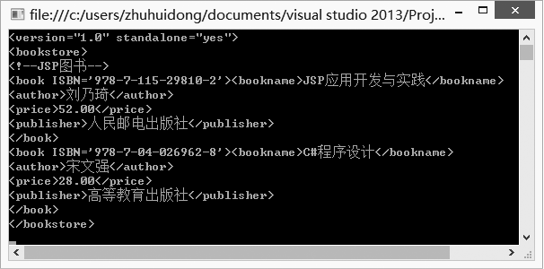

### 19.3.1　使用流式处理模型访问XML文件

C#采用流式处理模型访问XML文件，主要使用XmlReader和XmlWriter类，XmlReader和XmlWriter都是抽象类，XmlTextReader和XmlTextWriter这两个派生类常用来读/写XML文件。

#### 1．使用XmlReader读取XML文档

XmlReader是一个抽象类，它提供非缓存的、只进只读访问XML文档的功能。要想使用XMLReader阅读器，首先必须创建一个XmlReader派出类的实例对象，如：

```c
XmlTextReader reader = new XmlTextReader(file)
```

使用一个文件流创建XmlTextReader阅读器。创建完一个阅读器对象后，可以作为XmlDocument.Load方法的参数使用(其访问XML文档的方法在前面已介绍过)；也可以直接使用阅读器读取文档结构内容，如下代码演示了如何使用XmlTextReader阅读器读取XML文档。

```c
01  // 创建一个XmlTextReader类使它指向目标XML文档
02  XmlTextReader reader = new XmlTextReader(file); 
03  // 循环取出节点的文本并放入到StringWriter对象实例中 
04  StringWriter writer = new StringWriter(); 
05  string tabPrefix = ""; 
06  while (reader.Read()) 
07  { 
08          //输出开始标志,如果节点类型为元素 
09          if (reader.NodeType == XmlNodeType.Element) 
10          { 
11                  //根据元素所处节点的深度，加入reader.Depth个tab符,然后把元素名输出到＜＞中
12                  tabPrefix = new string('\t', reader.Depth); 
13                  writer.WriteLine("{0}＜{1}＞", tabPrefix, reader.Name); 
14          } 
15          else 
16          { 
17                  //输出结束标志,如果节点类型为元素 
18                  if (reader.NodeType == XmlNodeType.EndElement) 
19                  { 
20                  tabPrefix = new string('\t', reader.Depth); 
21                  writer.WriteLine("{0}＜/{1}＞", tabPrefix, reader.Name); 
22                  }
23          }
24  }
```

（1）XmlReader的属性。

+ XmlReader类具有一些可以在读取时修改的属性，以及一些在读取开始后被更改时并不会使新设置影响读取的其他属性。下面我们对XmlReader属性做一下简要介绍。
+ AttributeCount属性：当在派生类中被重写时，获取当前节点上的属性数。
+ BaseURI属性：当在派生类中被重写时，获取当前节点的基 URI。
+ CanResolveEntity属性：获取一个值，该值指示此读取器是否可以分析和解析实体。
+ Depth属性：当在派生类中被重写时，获取 XML 文档中当前节点的深度。
+ EOF属性：当在派生类中被重写时，获取一个值，该值指示此读取器是否定位在流的结尾。
+ HasAttributes属性：获取一个值，该值指示当前节点是否有任何属性。
+ HasValue属性：当在派生类中被重写时，获取一个值，该值指示当前节点是否可以具有Value。
+ IsDefault属性：当在派生类中被重写时，获取一个值，该值指示当前节点是否是从 DTD 或架构中定义的默认值生成的属性。
+ IsEmptyElement属性：当在派生类中被重写时，获取一个值，该值指示当前节点是否是一个空元素。
+ Item属性：已重载。当在派生类中被重写时，获取此属性的值。 在 C# 中，该属性为 XmlReader 类的索引器。

（2）XmlReader常用方法。

① ReadInnerXml和ReadOuterXml方法 。

XmlReader提供了ReadInnerXml和ReadOuterXml方法读取元素和属性内容。ReadInnerXml将所有内容(包括标记)当做字符串读取，而ReadOuterXml读取表示该节点和所有它的子级的内容(包括标记)。

假设XML文档：

```c
<node> 
this <child id="123"/> 
</node＞
```

ReadInnerXml调用将返回this <child id="123"/>，而ReadOuterXml调用将返回<node> this <child id="123"/></node>。

② Read方法。

表示从流中读取下一个节点，通常用在循环中。如：

```c
01  XmlTextReader rdr=new XmlTextReader("book.xml"); 
02  while(rdr.Read()) 
03  { 
04  …//依次读取各节点 
05  }
```

③ ReadAttributeValue方法。

将属性值解析为一个或多个 Text、EntityReference 或 EndEntity 节点 ，如：

```c
01  //创建reader类 
02  reader = new XmlTextReader(xmlFrag, XmlNodeType.Element, context); 
03  //属性解析
04  //为多个文本或实体引用节点 
05  reader.MoveToContent(); 
06  reader.MoveToAttribute("misc"); 
07  while (reader.ReadAttributeValue()){ 
08          if (reader.NodeType==XmlNodeType.EntityReference) 
09                  Console.WriteLine("{0} {1}", reader.NodeType, reader.Name); 
10          else 
11                  Console.WriteLine("{0} {1}", reader.NodeType, reader.Value); 
12  }
```

④ ReadString方法。

将元素或文本节点的内容当做字符串读取。如：

```c
01  //加载XML文件阅读器
02  reader = new XmlTextReader("elems.xml"); 
03  //解析XML并显示每个元素的文本内容 
04  while (reader.Read()){ 
05          if (reader.IsStartElement()){ 
06                    if (reader.IsEmptyElement) 
07                              Console.WriteLine("<{0}/>", reader.Name); 
08          else{ 
09                    Console.Write("<{0}> ", reader.Name); 
10                    reader.Read(); //Read the start tag. 
11                    if (reader.IsStartElement())　//处理嵌套的元素
12                              Console.Write("\r\n<{0}>", reader.Name); 
13                    Console.WriteLine(reader.ReadString());　//读取该元素的文本内容
14          } 
15  }
```

⑤ 其他方法。

+ MoveToElement：移动到包含当前属性节点的元素。
+ MoveToFirstAttribute：移动到第一个属性。
+ MoveToNextAttribute：移动到下一个属性。
+ Skip：跳过当前节点的子级。

#### 2．使用XmlWriter类写XML文档

XmlWriter 是定义用于编写 XML 的接口的抽象基类。XmlWriter 提供只进、只读、不缓存的 XML 流生成方法。更重要的是，XmlWriter在设计时就保证所有的XML数据都符合W3C XML 1.0推荐规范。

像XmlReader抽象类一样，必须使用XmlWriter的一个派出类来创建实例，用户可以自定义XmlWriter派出类，.Net类库中提供XmlTextWriter派出类。

使用XmlWrite之前，必须新建一个XmlWriter抽象类的派出类实例，再使用XmlWrite的WriteXXX方法写入元素、属性和内容，最后使用Close方法关闭XML文档。

下段代码演示如何使用XmlWriter编写XML文档。

```c
01  // Open the XML writer (用默认的字符集) 
02  XmlTextWriter xmlw = new XmlTextWriter(filename, null); 
03  xmlw.Formatting = Formatting.Indented; 
04  xmlw.WriteStartDocument(); 
05  xmlw.WriteStartElement("array"); 
06  foreach(string s in theArray) 
07  { 
08          xmlw.WriteStartElement("element"); 
09          xmlw.WriteAttributeString("value", s); 
10          xmlw.WriteEndElement(); 
11          } 
12          xmlw.WriteEndDocument(); 
13          // 停止输出 
14  xmlw.Close();
```

（1）XmlWriter类的属性。

XmlWriter类提供了如下属性。

+ WriteState属性：当在派生类中被重写时，获取编写器的状态。
+ XmlLang属性：当在派生类中被重写时，获取表示当前 xml:space 范围的 XmlSpace。
+ XmlSpace属性：当在派生类中被重写时，获取当前的 xml:lang 范围。

（2）XmlWriter类常用方法。

① WriteXXX方法。

这是一系列写操作的方法，主要有以下几种。

+ WriteBase64方法：将指定的二进制字节编码为 Base64 并写出结果文本。
+ WriteBinHex方法：将指定的二进制字节编码为 BinHex 并写出结果文本。
+ WriteCData方法：写出包含指定文本的 <![CDATA[...]]>块。
+ WriteCharEntity方法：为指定的 Unicode 字符值强制生成字符实体。
+ WriteChars方法：以每次一个缓冲区的方式写入文本。
+ WriteComment方法：写出包含指定文本的注释 <!--...-->。
+ WriteDocType方法：写出具有指定名称和可选属性的 DOCTYPE 声明。

下段代码演示了WriteChars方法的用法，其他方法的用法类似。

```c
01  //在处理代理对缓冲区的流
02  char [] charArray = new char[4]; 
03  char lowChar, highChar; 
04  Random random = new Random(); 
05  lowChar = Convert.ToChar(random.Next(0xDC01, 0xDFFF)); 
06  highChar = Convert.ToChar(random.Next(0xD801, 0xDBFF)); 
07  XmlTextWriter tw = new XmlTextWriter("test.xml", null); 
08  tw.WriteStartElement("Root"); 
09  charArray[0] = 'a'; 
10  charArray[1] = 'b'; 
11  charArray[2] = 'c'; 
12  charArray[3] = highChar; 
13  try 
14  { 
15          tw. WriteChars(charArray, 0, charArray.Length); 
16  } 
17          catch (Exception ex) { 
18  } 
19  Array[0] = highChar; 
20  Array[1] = lowChar; 
21  charArray[2] = 'd'; 
22  tw.WriteChars(charArray, 0, 3); 
23  tw.WriteEndElement();
```

② Flush方法。

该方法用于将缓冲区中的所有内容刷新到基础流，并同时刷新基础流。下段代码演示了Flush方法的使用。

```c
01  XmlTextWriter writer = new XmlTextWriter (Console.Out); 
02  //使用缩进输入
03  writer.Formatting = Formatting.Indented; 
04  //编写一个XML片段
05  writer.WriteStartElement("book"); 
06  writer.WriteElementString("title", "Pride And Prejudice"); 
07  writer.WriteEndElement(); 
08  writer.Flush(); 
09  //编写一个XML片段 
10  writer.WriteStartElement("cd"); 
11  writer.WriteElementString("title", "Americana"); 
12  writer.WriteEndElement(); 
13  writer.Flush();   
14  //停止输出
15  writer.Close();
```

③ Close方法。

该方法应用在XML文档的写操作完成后，关闭文档流和基础流。

#### 3．XML读写示例

下面的例子使用XmlTextWriter把图书信息写入一个XML文件，然后再通过XmlTextReader把XML读出来，并显示出来，如下图所示。


程序源代码如下。

```c
01  using System;
02  using System.Collections.Generic;
03  using System.Linq;
04  using System.Text;
05  using System.Threading.Tasks;
06  using System.Xml;
07  namespace ConsoleXml
08  {
09          class Program
10          {
11                  static void Main(string[] args)
12          {
13                  XmlTextWriter writer = new XmlTextWriter("d:\\bookinfo.xml", null);
14                  //使用自动缩进便于阅读
15                  writer.Formatting = Formatting.Indented;
16                  //写xml文件开始<?xml version="1.0" encoding="utf-8" ?>
17  writer.WriteStartDocument(true);
18                  //书写根元素
19  writer.WriteStartElement("bookstore");
20                  //书写注释
21  writer.WriteComment("JSP图书");
22                  //开始一个元素
23                  writer.WriteStartElement("book");
24                  //向先前创建的元素中添加一个属性
25                  writer.WriteAttributeString("ISBN", "978-7-115-29810-2");
26                  //添加子元素
27                  writer.WriteElementString("bookname", "JSP应用开发与实践");
28                  writer.WriteElementString("author", "刘乃琦");
29                  writer.WriteElementString("price", "52.00");
30                  writer.WriteElementString("publisher", "人民邮电出版社");
31                  //关闭book元素
32                  writer.WriteEndElement();  // 关闭元素
33                  //在节点间添加一些空格
34                  writer.WriteWhitespace("\n");
35                  //使用原始字符串书写第二个元素
36                  writer.WriteRaw("\r\n  <book ISBN='978-7-04-026962-8'>" +
37                  "\r\n     <bookname>C#程序设计</bookname>  " +
38                  "\r\n     <author>宋文强</author>  " +
39                  "\r\n     <price>28.00</price>  " +
40                  "\r\n     <publisher>高等教育出版社</publisher>" +
41                  "\r\n  </book>\r\n");
42．                // 关闭根元素
43                  writer.WriteFullEndElement();
44                  //将XML写入磁盘文件
45                  writer.Flush();
46                  //关闭writer
47                  writer.Close();
48                  //读取Xml文本，并显示出来
49          XmlTextReader reader=new XmlTextReader("d:\\bookinfo.xml");
50                  try
51                  {
52                          while (reader.Read())
53                          {
54                                  if (reader.NodeType == XmlNodeType.XmlDeclaration)
55                                  {
56                                  Console.WriteLine("<"+reader.Value+">");
57                          }
58                          //如果是元素节点
59                          else if (reader.NodeType == XmlNodeType.Element)
60                          {
61                                  Console.Write("<" + reader.Name);
62                                  while(reader.MoveToNextAttribute())//按照顺序读取下一属性
63                                  Console.Write(" " + reader.Name + "='" + reader.Value + "'");
64                                  Console.Write(">");
65                  }
66                          //如果是元素值
67                          else if (reader.NodeType == XmlNodeType.Text)
68                          {
69                                  Console.Write(reader.Value);
70                          }
71                          //如果是元素结束节点
72                          else if (reader.NodeType == XmlNodeType.EndElement)
73                          {
74                                  Console.WriteLine("</" + reader.Name+">");
75                          }
76                          //如果是注释
77                          else if (reader.NodeType == XmlNodeType.Comment)
78                          {
79                                  Console.WriteLine();
80                                  Console.WriteLine("<!--"+reader.Value+"-->");
81                           }
82                          } 
83                  }catch(Exception ex){
84                  Console.WriteLine(ex.Message);
85                          }
86                          Console.Read();
87                  }
88          }
89  }
```

