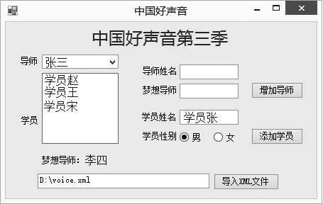

### 19.3.2　采用DOM处理模型访问XML文档

文档对象模型(DOM)类是XML文档的内存中的表示形式，XML数据在内存中的表示是结构化的，一般使用树结构表示DOM对象模型。为了对DOM内存结构有更直观的认识，先看下面XML数据在内存中的构造。

```c
01  <?xml version="1.0" standalone="yes" encoding=”UTF-8”?>
02  <!—中国好声音第三季-->
03   <voice>
04           <teacher name="张三">
05                   <student>
06                         <name>学员赵</name>
07                         <sex>女</sex>
08                   </student>
09           </teachert>
10 </voice>
```

下面使用文档对象模型类对XML文档进行各种操作。

#### 1．读取XML数据

XML DOM模式提供多种方式读取XML数据，如从流、URL、文本读取器或XmlReader中读取。Load方法将文档读入内存中，并包含可用于从每个不同的格式中获取数据的重载方法。如下段代码演示了如何从XmlReader读取器中读取XML数据。

```c
XmlDocument doc = new XmlDocument(); 
doc.Load(filename); 
Console.WriteLine(doc.OuterXml);
```

另外，还有一个简便的LoadXML方法，它直接从字符串中读取XML，如：

```c
//新建XmlDocument对象 
XmlDocument doc = new XmlDocument(); 
//读取XML数据 
doc.LoadXml("<book> <author>碧清</author> <price> 40 </price> </book>");
```

#### 2．访问DOM中的属性

在DOM模式中，如当前节点是元素时，可先使用HasAttribute方法检测是否存在属性，如存在，可使用XmlElement.Attributes属性获取包含该元素所有属性的集合。一般情况下，可按如下步骤访问元素的属性。

```c
//获取book节点元素的属性集合 
XmlAttributeCollection attrs = myxml.DocumentElement. SelectSingleNode(“//teacher”).Attributes; 
//从属性集合中提取属性ID 
XmlAttribute attr = attrs["name"]; 
//获取属性ID的值 
string id = attr.Value;
```

#### 3．在DOM中创建新节点

可以通过在DOM树中插入新的节点来为XML文档添加新的元素。XmlDocument类中提供了创建所有类型节点的方法，如CreateElement、CreateTextNode等。创建了新节点后，可使用几种方法将其插入到DOM树中。

如下段代码演示了如何新建一个元素节点。

```c
//新建一个Element节点，将插入到voice节点的子节点中 
XmlElement elem = doc.CreateElement("teacher"); 
//新建一个Text节点，将其作为teacher的值 
XmlText text = doc.CreateTextNode("杨坤");
```

插入节点到DOM树中的方法共有如下几种。

+ InsertBefore：表示插入到引用节点之前。如在位置1插入新节点。

```c
XmlNode refChild=node.ChildNodes[1]; 
Node.InsertBefore(newChild,refChild);
```

+ IInsertAfter：表示插入到引用节点之后。
+ IAppendChild：表示将节点添加到给定节点的子节点列表的末尾。
+ IPrependChild：表示将节点添加到给定节点的子节点列表的开头。
+ IAppend：表示将XmlAttribute节点追加到与元素关联的属性集合的末尾。

下段代码将把上面创建的两个节点插入到voice节点的子节点中。

```c
//将elem节点插入到voice节点的最后一个子节点处 
doc.DocumentElement.AppendChild(elem); 
//将text节点添加作为elem节点的值 
doc.DocumentElement.LastChild.AppendChild(text);
```

#### 4．在DOM中修改节点

在DOM中修改节点，首先找到要修改的节点，将name属性值为“张三”的节点的值改为“王五”，将该节点的子节点<friend>的文本修改为“李四”。

```c
01  XmlNodeList nodeList=xmlDoc.SelectSingleNode("voice").ChildNodes;//获取voice节点的所有子节点
02  foreach(XmlNode xn in nodeList)//遍历所有子节点
03  {
04          XmlElement xe=(XmlElement)xn;//将子节点类型转换为XmlElement类型
05          if(xe.GetAttribute("name")=="张三")//如果name属性值为"张三"
06          {
07                  xe.SetAttribute("name","王五");//则修改该属性为"王五"
08                  XmlNodeList nls=xe.ChildNodes;//继续获取xe子节点的所有子节点
09                  foreach(XmlNode xn1 in nls)//遍历
10                  {
11                          XmlElement xe2=(XmlElement)xn1;//转换类型
12                          if(xe2.Name=="friend")//如果找到
13                          {
14                                  xe2.InnerText="李四"; 
15                                  break; 
16                                  }
17                  }
18                  break;
19          }
20  }
```

#### 5．在DOM中删除节点

在DOM中删除节点，可使用RemoveChild方法，如从DOM中删除多个节点，可直接调用RemoveAll方法，它将删除当前节点的所有子级和属性。

如：

```c
XmlNode root = doc.DocumentElement; 
//删除第一个子元素节点 
root.RemoveChild(root.FirstChild);
```

如果仅仅删除元素节点的属性，可使用以下三种方法

+ XmlAttributeCollection.Remove：删除特定属性。
+ XmlAttributeCollection.RemoveAll：删除集合中的所有属性。
+ XmlAttributeCollection.RemoveAt：通过索引号来删除集合中的某属性。

如：

```c
XmlAttributeCollection attrColl = doc.DocumentElement.Attributes; 
//删除属性name 
attrColl.Remove(attrColl["name"]);
```

#### 6．保存XML文档

当应用程序对XML文档进行了有效的修改后，需要将内存中的内容保存到磁盘的XML文件中。保存XML文档很简单，调用Save方法即可。

#### 7．综合示例

下面的程序实现从XML文件中导入“中国好声音”第三季的导师学员信息，在下拉列表中选择导师，在列表框中显示出导师的学员信息，可以增加导师和学员，可以修改梦想导师。界面如下图所示。


主要程序代码如下。

```c
01  using System;
02  using System.Collections.Generic;
03  using System.ComponentModel;
04  using System.Data;
05  using System.Drawing;
06  using System.Linq;
07  using System.Text;
08  using System.Threading.Tasks;
09  using System.Windows.Forms;
10  using System.Xml;
11  namespace XmlApp
12．{
13          public partial class Form1 : Form
14          {
15                  public XmlDocument xmlDoc = new XmlDocument();
16                  public String fileName;
17                  public Form1()
18          {
19                          InitializeComponent();
20                  }
21                  private void btnOpenXml_Click(object sender, EventArgs e)
22                  {
23                          OpenFileDialog ofd = new OpenFileDialog();
24                          ofd.InitialDirectory = Environment.GetFolderPath(Environment.SpecialFolder.MyComputer);
//指定默认打开的窗口指向的文件
25                  ofd.ShowDialog();
26                  txtPath.Text = ofd.FileName; //把路径复制给txtPath文本框
27                  fileName = ofd.FileName;
28                  importXml(fileName);
29          }
30          private void importXml(String fileName)
31          {
32                  xmlDoc.Load(fileName);
33                  XmlNodeList nodeList = xmlDoc.SelectSingleNode("voice").ChildNodes;
34                  foreach (XmlNode xn in nodeList)//遍历所有子节点
35                  {
36                          XmlElement xe = (XmlElement)xn;//转换类型
37                  if (xe.Name == "teacher")
38                  {
39                          cmbTeacher.Items.Add(xe.GetAttribute("name"));
40                  }
41                  }
42          }
43          private void cmbTeacher_SelectedIndexChanged(object sender, EventArgs e)
44          {
45                  XmlNodeList nodeList = xmlDoc.SelectSingleNode("voice").ChildNodes;
46                  listBoxStudent.Items.Clear();
47                  foreach (XmlNode xn in nodeList)//遍历所有子节点
48                  {
49                  XmlElement xe = (XmlElement)xn;
50                  if (xe.Name == "teacher" && xe.GetAttribute("name")==cmbTeacher.Text)
51                  {
52                  XmlNodeList subNodeList =xe.ChildNodes;
53                  foreach(XmlNode subxn in subNodeList)
54                  {
55                          XmlElement subxe = (XmlElement)subxn;
56                          if (subxe.Name == "student")
57                          {
58                          listBoxStudent.Items.Add(subxe.FirstChild.InnerText);
59                          }
60                          else if(subxe.Name=="friend")
61                          {
62                          lblFriend.Text = "梦想导师：" + subxe.InnerText;
63                  }
64          }
65          }
66          }
67          }
68          private void btnAddTeacher_Click(object sender, EventArgs e)
69          {
70          XmlElement xe1 = xmlDoc.CreateElement("teacher");//创建一个<teacher>节点
71          xe1.SetAttribute("name", txtTeacher.Text);//设置该节点name属性 
72          XmlElement xesub1 = xmlDoc.CreateElement("friend");
73          xesub1.InnerText =txtFriend.Text;//设置文本节点
74          xe1.AppendChild(xesub1);//添加到<teacher>节点中
75          xmlDoc.DocumentElement.AppendChild(xe1);
76          xmlDoc.Save(fileName);
77          cmbTeacher.Items.Clear();
78          importXml(fileName);
79          }
80          private void btnAddStudent_Click(object sender, EventArgs e)
81          {
82          XmlNodeList nodeList = xmlDoc.SelectSingleNode("voice").ChildNodes;
83          foreach (XmlNode xn in nodeList)//遍历所有子节点
84          {
85          XmlElement xe = (XmlElement)xn;
86          if (xe.Name == "teacher" && xe.GetAttribute("name") == cmbTeacher.Text)
87          {
88                  XmlElement xe1 = xmlDoc.CreateElement("student");//创建<student>节点 
89                  XmlElement xesub1 = xmlDoc.CreateElement("name");
90                  xesub1.InnerText = txtStudent.Text;
91                  XmlElement xesub2 = xmlDoc.CreateElement("sex");
92                  if (radioBoy.Checked)
93                  {
94                          xesub2.InnerText = "男";
95                  }
96                  else
97                  {
98                          xesub2.InnerText = "女";
99                  }
100                  xe1.AppendChild(xesub1); //添加学员姓名节点到学员节点
101                  xe1.AppendChild(xesub2); //添加学员性别节点到学员节点
102                  xe.InsertBefore(xe1,xe.LastChild);//插入学员节点到导师节点中梦想导师前
103                  xmlDoc.Save(fileName);
104                  cmbTeacher.Items.Clear();
105                  importXml(fileName);
106          }
107                          }
108                  }
109          }
110  }
```

