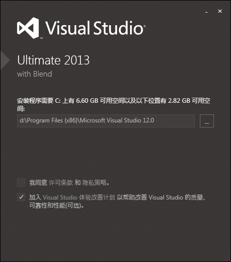
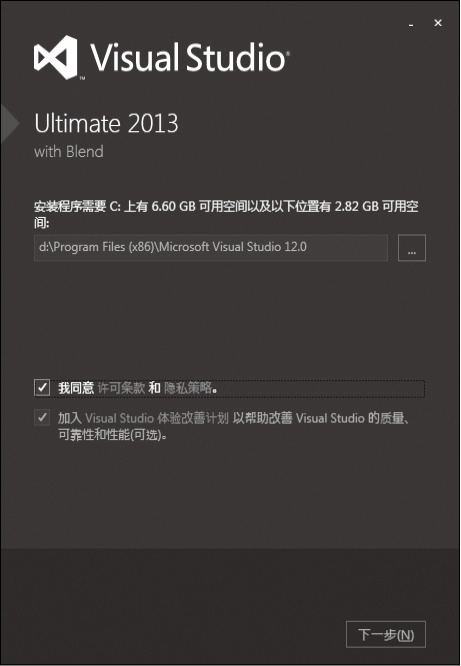
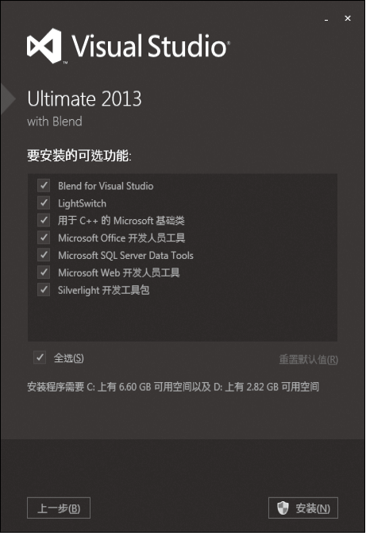
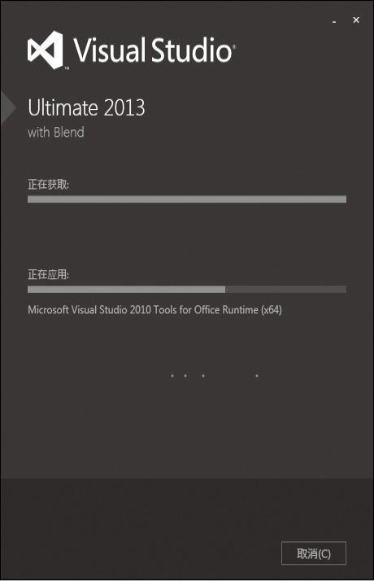
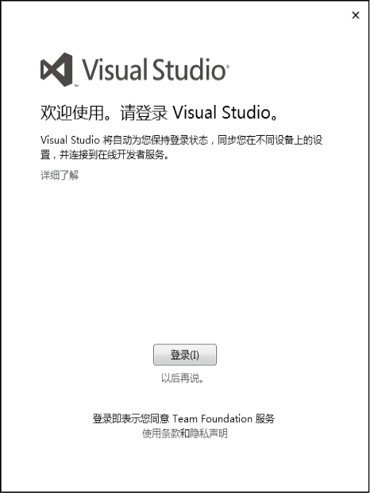
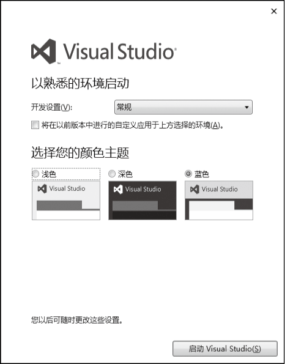
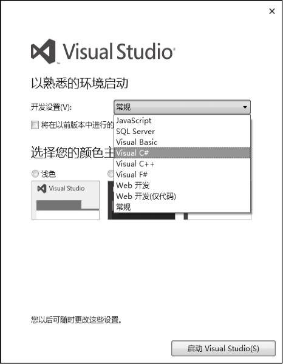

### 1.3.1　Visual Studio 2013的安装

VS 2013使得开发人员编写程序更容易、更灵活。它提供了高级开发工具、调试功能、数据库功能和创新功能，用于在各种平台上快速开发应用程序。 任何规模的组织都可以使用 VS 2013 快速创建更安全、更易于管理且更可靠的应用程序。

要想使用VS 2013，首先要在计算机上进行安装。如果有安装光盘，直接安装即可，也可以到微软公司的网站下载后安装（<a class="my_markdown" href="['http://www.visualstudio.com/downloads/download-visual-studio-vs']">http://www.visualstudio.com/downloads/download-visual-studio-vs</a>）。Visual Studio 2013安装文件所占的存储空间很大，大概有2.86GB，下载时间会比较长。下载下来的是光盘镜像ISO文件，需要安装虚拟光驱软件（如Daemon Tools等）。

> 
> **技巧**
> VS 2013 安装要求：支持Windows 8.1（x86 和 x64）、Windows 8（x86 和 x64）、Windows 7 SP1（x86 和 x64）、Windows Server 2012 R2 (x64)等操作系统；
> 硬件最低要求：1.6 GHz 或更快的处理器、10 GB 可用硬盘空间、1 GB RAM（如果在虚拟机上运行，则为 1.5 GB）、5400 RPM 硬盘、与 DirectX 9 兼容的视频卡，其显示分辨率为 1024 x 768 或更高。

> 
> **提示**
> 建议配置：2.2 GHz 或速度更快的 CPU、2048 MB 或更大容量的 RAM、1280×1024 显示器、7200 RPM或更高转速的硬盘 ；
> 在 Windows 7 上安装硬件的最低要求为：2.4 GHz CPU、1024 MB RAM。

下面以专业版为例，介绍安装Visual Studio 2013的过程。

（1）将Visual Studio 2013安装盘放入光驱，将出现安装画面。

（2）勾选“我同意许可条款和隐私策略”选项，单击“下一步”按钮和“安装”按钮。

（3）等待安装完成，此过程可能会需要半小时。具体时间当然要根据你的电脑配置情况而定。

（4）安装成功后，单击“启动”按钮，出现登录界面，询问是否需要注册登录Visual Studio，不登录的话，选择“以后再说”进入下一步。

（5）选择开发环境，这里选择C#，颜色主题有三种选择，依自己喜好选择。

> 
> **技巧**
> 安装VS 2013时建议关闭杀毒软件，因为杀毒软件可能会阻止向计算机安装部分文件而导致安装失败。

