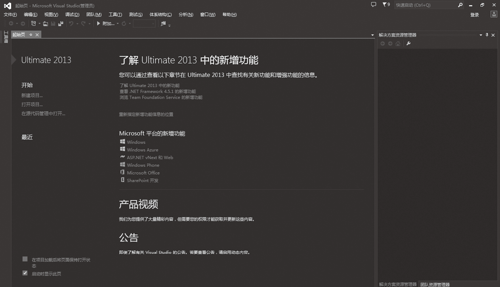
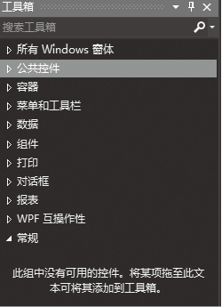
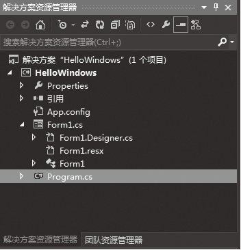
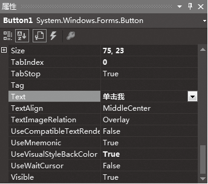
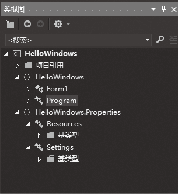
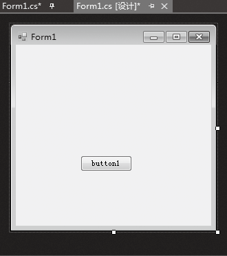
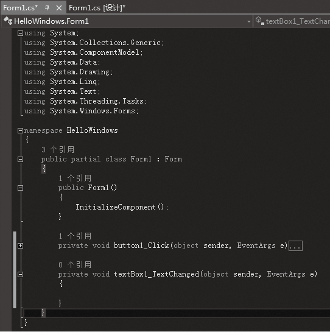
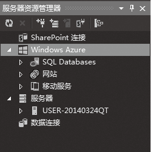

### 1.3.2　Visual Studio 2013集成开发环境

Visual Studio 2013为开发人员提供了许多开发工具，可以显著地提高开发人员的工作效率。Visual Studio 2013集成开发环境 (IDE)由菜单栏、工具栏、编辑器，以及停靠或自动隐藏在左侧、右侧和底部的各种工具窗口组成。可用的工具窗口、菜单和工具栏根据所处理的项目或文件类型及随后执行的自定义配置，在IDE中的布局会有所不同。下面介绍Visual Studio 2013 IDE 的各个组成部分。

#### 1．起始页

起始页上面有开始、最近、Visual Studio 2013新增功能和Microsoft平台新增功能介绍等选项。

在“开始”区域可以新建项目和打开已有的项目。“最近”区域包含了最近打开过的项目的链接。Visual Studio 2013和Microsoft平台新增功能选项的下面有相关的链接，单击链接就可以查看新增功能的介绍。产品视频和公告选项是微软为最新产品发布的视频介绍和微软有关Visual Studio最新动态的公告。

#### 2．菜单栏

菜单栏和Office Word等程序的菜单栏类似，位于标题栏的下方，如下图所示。

Visual Studio 2013的菜单栏由【文件】、【编辑】、【视图】、【调试】、【团队】、【工具】、【测试】、【体系结构】、【分析】、【窗口】和【帮助】多个菜单组成，每个菜单都有一组命令，选择这些命令就可以完成相应的功能。

#### 3．工具栏

菜单栏下方是工具栏，用户除了通过使用菜单栏进行操作外，一些常规的操作还可以通过工具栏进行，工具栏比菜单栏更方便、快捷。熟悉常用工具栏的使用能提高开发的效率。

> 
> **提示**
> 将鼠标指针移动到工具栏的按钮上停留一会儿，将显示出该按钮功能的提示。单击菜单栏上的【视图】菜单中的【工具栏】，将出现工具栏的级联菜单，单击所需的命令，此工具栏立刻就会出现在屏幕上，同时在其名称的前面会出现一个【√】。

#### 4．工具箱

工具箱中列出了许多常用控件，用于设计程序的界面。所谓控件就是窗体中相对独立的部分，例如，常见的一些命令按钮、标签、文本框等都属于控件。Visual Studio 2013提供的控件分别放在【所有Windows窗体】、【公共控件】、【容器】、【菜单和工具栏】、【数据】、【组件】、【打印】、【对话框】、【WPF互操作性】、【报表】和【常规】选项卡里面。对这些选项卡也可以重命名或者删除，还可以添加选项卡。在任意一个选项卡中单击鼠标右键，将会弹出相应的快捷菜单，从中选择【全部显示】命令，会显示出所有的工具箱选项卡。需要注意的是，项目类型不一样，工具箱的选项卡显示也会有所不同。

#### 5．解决方案资源管理器

项目是一个独立的编程单位，通常包括一个或几个程序文件，若干个相关项目组成一个解决方案。解决方案资源管理器（Solution Explorer）以树状结构显示整个解决方案中所包括的项目及每个项目的组成部分等信息。双击解决方案中的文件，就可以在编辑环境中显示这个文件并且可以编辑它。

解决方案资源管理器在系统中被保存为一个完整的文档，默认扩展名是.sln。一个解决方案可以包含多个项目，便于组织和管理项目，项目类型可以不同，如Windows应用项目、Web项目等。每个项目的文件扩展名是.csproj。双击.sln或.csproj文件都可以自动打开Visual Studio 2013，并打开解决方案及其中的项目。

#### 6．属性窗口

属性窗口用来显示项目、窗体、控件、数据源等所有可视资源的属性，如控件的大小、颜色及位置等，在属性窗口底部有所选属性的简单说明。通过属性窗口能可视化地修改控件的属性，不必编写代码。属性窗口顶部是一个下拉列表，单击它可显示所用控件的名称。这个下拉列表称为“组件选择框”，它显示的名字就是当前控件的名称，列表里的内容就是当前控件的属性。

#### 7．类视图

类视图按照树状结构列出了解决方案所包含项目中的每个类及类中包含的成员，以便于在大型项目中快速定位某个类。

#### 8．设计视图和代码视图

设计视图（也称窗体窗口）是用来设计程序界面的场所，可以从工具箱中拖放一些控件到设计视图中，然后根据设计需要进行控件的布局。

代码视图（也称代码窗口、编辑窗口）是输入程序代码的窗口。可通过多种方法打开代码视图：双击设计视图中的控件或窗体；选择【视图】菜单中的【代码】命令；在【解决方案资源管理器】中双击扩展名为.cs的文件。

#### 9．服务器资源管理器

服务器资源管理器用于开发人员对有权限操作的计算机上的资源进行访问和操作，可用来创建连接服务器对象，操纵服务器上的数据库。

#### 10．动态帮助窗口

在编写程序的过程中，系统会根据当前的工作设置动态帮助窗口的内容。动态帮助窗口给编程提供了很大的方便，程序员不必在遇到问题时按【F1】键，只需要看一看动态帮助窗口，选择合适的链接并单击，就可以找到需要的内容。要使用动态帮助，需要安装MSDN，否则动态帮助为空。

