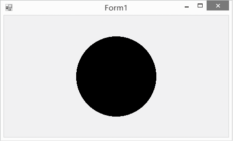

### 20.1.3　图形绘制中相关的类

图形绘制中相关的类主要有以下几种。

#### 1．Pen类

Pen用来绘制指定宽度和样式的直线、曲线和封闭的图形。可以使用各种填充样式来填充Pen绘制的图形，填充模式取决于画笔和用做填充对象的纹理。

创建Pen对象的构造方法有以下几种。

用指定的颜色实例化画笔的方法如下。

```c
public Pen(Color);
```

用指定的画刷实例化画笔的方法如下。

```c
public Pen(Brush);
```

用指定的画刷和宽度实例化画笔的方法如下。

```c
public Pen(Brush, float);
```

用指定的颜色和宽度实例化画笔的方法如下。

```c
public Pen(Color, float);
```

实例化画笔的语句格式如下。

```c
Pen pn=new Pen(Color.Blue);
```

或者：

```c
Pen pn=new Pen(Color.Blue,100);
```

Pen常用的属性如下表所示。

| 名称 | 说明 |
| :-----  | :-----  | :-----  | :-----  |
| Alignment | 获得或者设置画笔的对齐方式 |
| Brush | 获得或者设置画笔的属性 |
| Color | 获得或者设置画笔的颜色 |
| Width | 获得或者设置画笔的宽度 |

#### 2．Brush类

Brush用来填充封闭图形的内部，Brush是一个抽象的画刷概念，就像制定的画刷的技术标准一样，有了技术标准，多个生产厂家就可以在满足技术标准的前提下生产出各具特色的画刷。常用的画刷有SolidBrush、HatchBrush、LinearGradientBrush、PathGradientBrush和TextBrush。

下面的程序实现了绘制一个面表示圆圈，然后把它涂成黑色，窗体运行效果如下图所示。

```c
01  private void Form1_Paint(object sender, PaintEventArgs e)
02  {
03          Graphics g = this.CreateGraphics();            // 创建画布
04          Brush b = new SolidBrush(Color.Black);         //创建画刷
05          Rectangle rect = new Rectangle(this.ClientRectangle.Width / 2 - 80, this.ClientRectangle.Height / 2 - 80, 160, 160); //创建一个矩形区域
06          Pen p=new Pen(Color.Black);                    //创建画笔
07          g.DrawEllipse(p, rect);                        //画圆
08          g.FillEllipse(b, rect);                        //把圆填充成黑色
09  }
```


#### 3．Color结构

在自然界中，到底有多少种颜色呢？实际上颜色大都由透明度（A）和三基色（R，G，B）所组成。在GDI+中，通过Color结构封装对颜色的定义。Color结构中，除了提供A、R、G、B以外，还提供许多系统定义的颜色，如Pink（粉颜色）。另外，还提供了许多静态成员，用于对颜色进行操作。Color结构的基本属性如下表所示。

| 名称 | 说明 |
| :-----  | :-----  | :-----  | :-----  |
| A | 获取此Color结构的alpha分量值，取值为0～255 |
| B | 获取此Color结构的蓝色分量值，取值为0～255 |
| G | 获取此Color结构的绿色分量值，取值为0～255 |
| R | 获取此Color结构的红色分量值，取值为0～255 |
| Name | 获取此Color结构的名称，它将返回用户定义的颜色的名称或已知颜色的名称（如果该颜色是从某个名称创建的），对于自定义的颜色，将返回RGB值 |

Color结构的基本(静态)方法如下表所示。

| 名称 | 说明 |
| :-----  | :-----  | :-----  | :-----  |
| FromArgb | 通过四个8位ARGB分量（alpha、红色、绿色和蓝色）值创建Color结构 |
| FromKnowColor | 从指定的预定义颜色创建一个Color结构 |
| FromName | 通过预定义颜色的指定名称创建一个Color结构 |

Color结构变量可以通过已有颜色构造，也可以通过RGB建立，例如，

```c
Color clr1 = Color.FromArgb(122,25,255);
Color clr2 = Color.FromKnowColor(KnowColor.Brown);//KnownColor为枚举类型
Color clr3 = Color.FromName("SlateBlue");
```

在图像处理中一般需要获取或设置像素的颜色值，获取一幅图像的某个像素颜色值的具体步骤如下。

（1）定义Bitmap。

```c
Bitmap myBitmap = new Bitmap("c:\\MyImages\\TestImage.bmp");
```

（2）定义一个颜色变量，把在指定位置所取得的像素值存入颜色变量中。

```c
Color c = new Color();
c = myBitmap.GetPixel(10,10);//获取此Bitmap中指定像素的颜色
```

（3）将颜色值分解出单色分量值。

```c
int r,g,b;
r= c.R;
g=c.G;
b=c.B;
```

