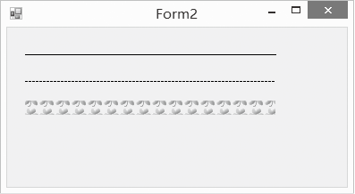

### 20.2.1　绘制直线

使用Graphics对象的DrawLine()方法和DrawLines()方法就可以绘制一条和多条直线。除了Graphics对象之外，我们还需要画笔，所以，在绘制直线之前，还要设置画笔及其样式、颜色和宽度。DrawLine方法的常用语法如下。

```c
public void DrawLine(Pen pen,int x1,int y1,int x2,int y2)
```

其中，pen对象是画线所用的画笔，它决定了线条的颜色、宽度和样式；x1和y1为线条的起点坐标，x2和y2为线条的终点坐标。

那就画几条直线试试吧，如下图所示。


程序源代码如下。

```c
01  private void Form2_Paint(object sender, PaintEventArgs e)
02  {
03          Graphics g = e.Graphics; 　            　//获取Graphics对象
04          Pen pen1 = new Pen(Color.Black);　     　//创建宽度为1的黑色画笔
05          Bitmap bmp = new Bitmap("d:\\\\leaf.gif"); 
06          TextureBrush tb = new TextureBrush(bmp); //创建纹理笔刷
07          Pen pen2 = new Pen(tb, 16);　          　//创建以纹理笔刷为笔尖的画笔
08          g.DrawLine(pen1, 20, 30, 300, 30);     　//画出一条直线 
09          pen1.DashStyle = DashStyle.Dash;       　//设置短虚线样式
10          g.DrawLine(pen1, 20, 60, 300, 60);     　//画出一条虚线
11          g.DrawLine(pen2, 20, 90, 300, 90);     　//画出一条用小图片组成的直线
12  }
```

怎么样，简单吧！漂亮吧！那我们就接着学习如何绘制矩形。

