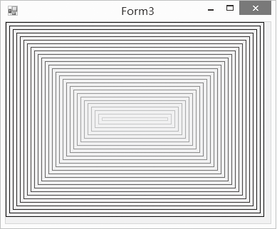

### 20.2.2　绘制矩形

矩形由四条直线段组成，我们能不能画四条直线段组成一个矩形？当然可以了，但是，Graphics提供了更简单的方法DrawRectangle()，同绘制直线类似，绘制矩形同样需要创建一个Graphics对象和一个Pen对象。DrawRectangle方法的常用语法为：

```c
public void DrawRectangle(Pen pen,Rectangle rect)
```

该方法根据指定的矩形结构rect来绘制图形。

```c
Public void DrawRectangle(Pen pen,int x,int y,int width,int height)
```

该方法通过矩形的左上角的坐标(x, y)、宽(width)和高(height)来绘制矩形。

```c
Public void DrawRectangles(Pen pen,Rectangle[] rects)
```

该方法根据指定的矩形数组rects来同时绘制多个矩形。

下面的程序实现了绘制一个颜色不断变化，多个矩形嵌套的图形，效果如下图所示。


```c
01  private void Form3_Paint(object sender, PaintEventArgs e)
02  {
03          Graphics g = e.Graphics;
04          Rectangle rect=this.ClientRectangle;
05          Color c = Color.FromArgb(0,0,0);                                //初始颜色设置成黑色
06          Pen pen = new Pen(c);
07          for (int i = 0; i < this.ClientRectangle.Width && i < this.ClientRectangle.Height; i = i + 5)
08          {
09                  rect = new Rectangle(i, i, rect.Width -10, rect.Height -10);//矩形不断缩小
10                  c = Color.FromArgb((c.R + 5)%256, (c.G+8)%256, (c.B + 15)%256);//颜色不断变化
11                  pen.Color = c;
12                  g.DrawRectangle(pen, rect);                         //画矩形
13          }
14  }
```

嗨！别太兴奋，接着我们来学习C#更强大的绘图功能。

