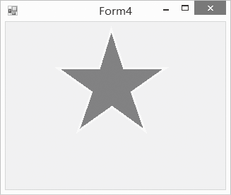

### 20.2.3　绘制多边形

多边形是由3条或3条以上的边组成的闭合图形，所以也可以通过绘制多边形的方法来绘制矩形。绘制多边形的方法为DrawPolygon()，DrawPolygon方法常用的语法结构为：

```c
Public void DrawPolygon(Pen pen,Point[] points)
```

该方法中通过依次连接points数组中所有的点来绘制一个多边形，最后一个点与第一个点相连。

下面在窗口中画一个五角星，边框为黄色，并把它填充成红色，如下图如示。


程序源代码如下。

```c
01  private void Form4_Paint(object sender, PaintEventArgs e)
02  {
03          Graphics g = e.Graphics;
04          Pen pen = new Pen(Color.Yellow, 3);
05          Brush brush = new SolidBrush(Color.Red);//定义单色画刷
06          Point[] star = new Point[10];
07          double angle = Math.PI / 180;
08          for (int i = 0; i < 10; i += 2)
09          {
10                  star[i].X = (int)(150 + 80 * Math.Cos(angle * 36 * (i + 3.5)));
11                  star[i].Y = (int)(90 + 80 * Math.Sin(angle * 36 * (i + 3.5)));
12．                star[i + 1].X = (int)(150 + 30 * Math.Cos(angle * 36 * (i + 4.5)));
13                  star[i + 1].Y = (int)(90 + 30 * Math.Sin(angle * 36 * (i + 4.5)));
14          }
15          g.FillPolygon(brush, star);
16          g.DrawPolygon(pen, star);
17  }
```

前面绘制的图形的线条都是直的，下面我们来学习绘制椭圆、曲线和扇形。

