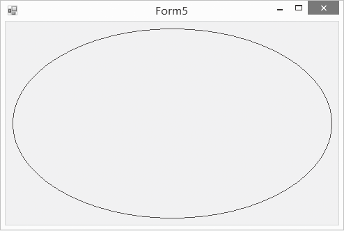

### 20.2.4　绘制椭圆

C#中通过Graphics类的DrawEllipse方法来绘制椭圆，椭圆一定要局限于某个矩形框中。DrawEllipse方法的语法格式如下。

```c
public  void DrawEllipse(Pen pen,int x,int y,int width,int height)
```

该方法参数中，pen表示画线所用的画笔，它决定了线条的颜色、宽度和样式；x和y表示椭圆外接矩形的左上角坐标，width和height是外接矩形的宽度和高度。实现上述方法后，四个参数也可以用一个Rectangle结构对象表示，方法的语法形式如下如示。

```c
public void DrawEllipse(Pen pen,Rectangle rect)
```

下面在窗体中绘制一个椭圆，椭圆距离窗口的边框为10个像素，边框颜色采用浪漫的紫色。绘图效果如下图所示。


程序源代码如下。

```c
01  protected override void OnPaint(PaintEventArgs e)
02  {
03          base.OnPaint(e);
04          Rectangle rect = new Rectangle();
05          rect.X=this.ClientRectangle.X+10;
06          rect.Y = this.ClientRectangle.Y + 10;
07          rect.Width = this.ClientRectangle.Width - 20;
08          rect.Height = this.ClientRectangle.Height - 20;
09          Pen pen = new Pen(Color.Purple);
10          Graphics g = e.Graphics;
11          g.SmoothingMode = SmoothingMode.AntiAlias;
12          g.DrawEllipse(pen,rect);
13  }
```

