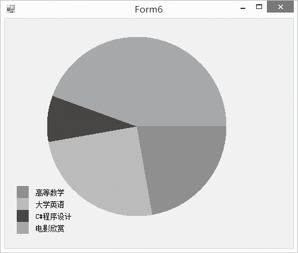

### 20.2.5　绘制扇形和弧线

怎么在C#中绘制扇形呢？就是用FillPie()方法。FillPie方法的语法格式如下。

```c
public void DrawPie(Pen pen,int x,int y,int width,int height,float startAngle,float sweepAngle);
```

该方法参数中，pen表示画线所用的画笔，它决定了线条的颜色、宽度和样式；x和y表示扇形所对应的椭圆外接矩形的左上角坐标，width和height是外接矩形的宽度和高度；startAngle为起始角度(以顺时针度数为单位)，sweepAngle为扇形所扫过的角度。同样，上面方法中的坐标、宽度和高度可以用一个Rectangle结构对象表示，方法的语法形式如下如示。

```c
public void DrawPie(Pen pen,Rectangle rect,float startAngle,float sweepAngle);
```

假如你这学期的课程有高等数学、大学英语、C#程序设计和电影欣赏四门课，如下图所示的饼图是你在这四门课上所花费的时间比例。


程序源代码如下。

```c
01  private void Form6_Paint(object sender, PaintEventArgs e)
02  {
03          Graphics g = e.Graphics;
04          Rectangle rect = new Rectangle(70, 30, 300, 300);
05          Rectangle r = new Rectangle(20, 280, 20, 20);
06          Point p = new Point(50,285);
07          String[] courses = { "高等数学","大学英语","C#程序设计","电影欣赏"};
08          float[] times = {80,90,30,160};
09          float start = 0;
10          Random rnd = new Random();
11          SolidBrush brush = new SolidBrush(Color.Black);
12          for (int i = 0; i < courses.Length; i++)
13          {
14                  Color c = Color.FromArgb(rnd.Next(256), rnd.Next(256), rnd.Next(256));
15                  SolidBrush brush1 = new SolidBrush(c);
16                  float sweep = times[i];
17                  g.FillPie(brush1, rect, start, sweep);
18                  g.FillRectangle(brush1, r);
19                  g.DrawString(courses[i], this.Font, brush, p);
20                  start += sweep;
21                  r.Y += 20;
22                  p.Y += 20;
23          }
24  }
```

绘制弧线相当于绘制扇形的外边界，绘制弧线的方法是DrawArc,这个方法的参数和绘制扇形的方法参数一致，该方法的语法如下。

```c
Graphics.DrawArc(Pen pen, int x, int y, int width, int height, int startAngle,int sweepAngle)
```

该方法参数中，pen表示画线所用的画笔，它决定了线条的颜色、宽度和样式；x和y表示弧线所对应椭圆外接矩形的左上角坐标，width和height是外接矩形的宽度和高度；startAngle为起始角度(以顺时针度数为单位)，sweepAngle为弧线所扫过的角度。同样，上面方法中的坐标、宽度和高度可以用一个Rectangle结构对象表示，方法的语法形式如下如示。

```c
public void DrawArc(Pen pen,Rectangle rect,float startAngle,float sweepAngle);
```

