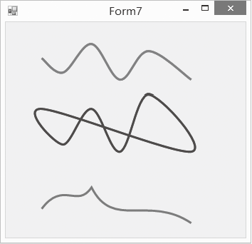

### 20.2.6　绘制曲线

曲线可以构造出很多美好的景色，那么我们就学习一下C#中绘制曲线的方法，绘制曲线的方法有DrawCurve方法、DrawClosedCurve方法、DrawBezier方法和DrawBeziers方法。

#### 1．DrawCurve方法

这个方法用光滑的曲线把给定的点连接起来，方法的语法如下。

```c
Public void DrawCurve(Pen pen,Point[] points)
```

该方法参数中，pen表示画线所用的画笔，它决定了线条的颜色、宽度和样式；points是依次连接的坐标点，至少要有3个点。如果我们想控制曲线的弯曲度，可以用如下的方法。

```c
public void DrawCurve(Pen pen,Point[] points,float tension)
```

参数pen和points的作用同上，tension是曲线的弯曲强度，该值的范围应该为0～0.6，值越大，越弯曲，值为零时，就变成了直线。如果超出这个范围，运行时会产生异常。

#### 2．DrawClosedCurve方法

该方法与上一个方法类似，也是用光滑的曲线把给定的点连接起来，只不过此方法会自动把首尾节点连接起来构成封闭曲线，方法语法如下。

```c
public void DrawClosedCurve(Pen pen,Point[] points)
```

该方法参数中，pen表示画线所用的画笔，它决定了线条的颜色、宽度和样式；points是依次连接的坐标点，至少要有3个点。如果我们想控制曲线的弯曲度和封闭区域的填充方式，可以用如下的方法。

```c
public void DrawClosedCurve(Pen pen,Point[] points,float tension,FillMode fillmode)
```

参数pen和points的作用同上，tension是指曲线的弯曲强度，Fillmode指明曲线封闭区域的填充方式。

#### 3．贝塞尔曲线

绘制贝塞尔曲线时，必须引用System.Drawing.Drawing2D命名空间。一段贝塞尔曲线由4个点组成，两个端点（p1，p2），两个控制点(c1，c2)，曲线起始于p1，结束于p2，曲线不经过控制点，控制点的作用像磁铁一样，吸引曲线朝指定的方向拉伸，影响曲线的弯曲程度。

（1）DrawBezier方法用来绘制一段贝塞尔曲线，方法语法如下。

```c
Public void DrawBezier(Pen pen,Point p1,Point p2,Point c1,Point c2)
```

参数中，pen表示画线所用的画笔，p1为曲线起点，p2为曲线终点，c1和c2为曲线控制点。如果要绘制多段贝塞尔曲线， 可以使用DrawBeziers方法。

（2）DrawBeziers方法用来绘制多段贝塞尔曲线，方法语法如下。

```c
Public void DrawBeziers(Pen pen,Point[] points)
```

方法参数中，pen表示画线所用的画笔，points数组中，下标为0~3的点用来绘制第一段贝塞尔曲线，前一段曲线的结束点作为后一段曲线的起始点，以后每段曲线对应三个点，即两个控制点和一个结束点。

下面分别绘制出以上介绍的三种类型的曲线，程序运行效果如下图所示。


程序源代码如下。

```c
01  private void Form7_Paint(object sender, PaintEventArgs e)
02  {
03          Graphics g = e.Graphics;
04          Pen pen1 = new Pen(Color.Red, 3);
05．        Pen pen2 = new Pen(Color.Blue, 3);
06          Pen pen3 = new Pen(Color.DarkCyan, 3);
07          g.SmoothingMode = SmoothingMode.AntiAlias;
08          Point[] points1 = new Point[] { new Point(50, 50), new Point(80, 70), new Point(120,
             30), new Point(160, 80), new Point(200, 40), new Point(260, 80) };
09          Point[] points2 = new Point[] { new Point(50, 120), new Point(80, 170), new Point(120, 
            120), new Point(160, 180), new Point(200, 100), new Point(260, 180) };
10          Point[] points3 = new Point[] { new Point(50, 260), new Point(80, 220), newPoint(100,
             260),new Point(120, 230), new Point(150, 290), new Point(200, 240), new
             Point(260, 280) };
11          g.DrawCurve(pen1, points1);
12          g.DrawClosedCurve(pen2, points2);
13          g.DrawBeziers(pen3, points3);
14  }
```

