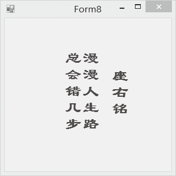

### 20.2.7　绘制文本

一般情况下，显示文字可以通过Label标签来实现，有时候文字的显示样式、位置有特殊的要求，这个时候标签就难以完成任务，实际上，我们可以像绘制图形一样，把文字绘制在画布上。

我们可以调用Graphics对象的DrawString()方法来实现绘制文字的任务。该方法的语法如下。

```c
Public void DrawString(String s,Font f,Brush b,Point p,StringFormat format)
```

这个方法的参数中，s表示绘制的文本内容，f表示文字的字体、字号和字型，b表示字符串的颜色和纹理，p表示绘制的字符串左上角的坐标位置，format是用来格式化字符串的属性。

方法中Font对象的声明方法如下。

```c
Font font=new Font(String family,float size,FontStyle style)
```

其中,参数family是字体名称，如“隶书”；size是字号，用浮点数表示；style是字形，如Bold (加 粗)、Italic（斜体）。

下面这个例子用来显示座右铭，文字竖向显示并且有阴影，显示效果如下图所示。


程序代码如下。

```c
01  private void Form8_Paint(object sender, PaintEventArgs e)
02  {
03          System.Drawing.Graphics formGraphics = this.CreateGraphics();
04          string drawString = "座右铭";
05          System.Drawing.Font drawFont = new System.Drawing.Font("隶书", 20,FontStyle.
            Bold);
06          System.Drawing.SolidBrush drawBrush = new System.Drawing.SolidBrush(System.
            Drawing.Color.Blue);
07          float x = 180.0f;
08          float y = 80.0f;
09          System.Drawing.StringFormat drawFormat = new System.Drawing.
            StringFormat(StringFormatFlags.DirectionVertical);
10          formGraphics.DrawString(drawString, drawFont, drawBrush, x, y, drawFormat);
11          drawString = "漫漫人生路";
12          x = 130f;
13          y = 50f;
14          formGraphics.DrawString(drawString, drawFont, drawBrush, x, y, drawFormat);
15          drawString = "总会错几步";
16          x = 100f;
17          y = 50f;
18          formGraphics.DrawString(drawString, drawFont, drawBrush, x, y, drawFormat);
19          drawFont.Dispose();
20          drawBrush.Dispose();
21          formGraphics.Dispose();
22  }
```

