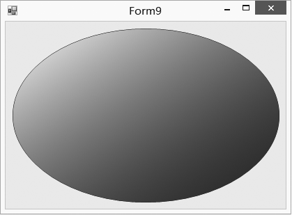
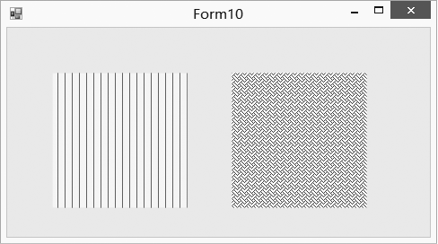
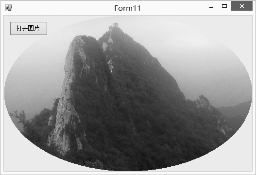
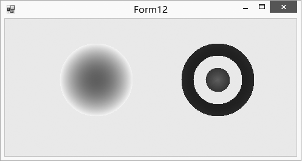

### 20.2.8　填充图形

对于封闭的图形，都可以通过Graphics对象的FillXXX方法来填充。基本上一个DrawXXX方法对应一个FillXXX方法。FillXXX方法参数中要指定填充的方式，也就是画刷对象，图形填充的颜色和样式是由画刷决定的。下面对常用的几种画刷类进行说明。

#### 1．SolidBrush类

SolidBrush类实现用纯色进行绘制，是一种最简单的画刷形式。其构造方法只需要指定画刷的颜色就可以了，语法如下。

```c
SolidBrush brush=new SolidBrush(Color color);
```

参数color指定画刷所采用的颜色。

SolidBrush类位于System.Drawing命名空间下。System.Drawing命名空间在Visual Studio 2013环境下会自动引用。前边已使用过单色画刷，这里就不再举例。

#### 2．LinearGradientBrush类

LinearGradientBrush类用于定义线性渐变画刷，可以是双色渐变，也可以是多色渐变。默认情况下，渐变由起始颜色沿着水平方向平均过渡到终止颜色。要定义多色渐变，需要使用InterpolationColors属性。LinearGradientBrush类有多个重载的构造函数。

（1）LinearGradientBrush(Point point1, Point point2, Color color1, Color color2)。

参数point1和point2分别指定渐变色的起点和终点坐标，参数color1和color2分别表示起始和终止颜色。

（2）LinearGradientBrush(Rectangle rect, Color color1, Color color2, LinearGradientMode lgm)。

参数rect用来指定渐变色所对应的矩形区域，参数color1和color2分别表示起始和终止颜色，lgm是一个 LinearGradientMode 枚举元素，它指定渐变方向。 渐变方向决定渐变的起点和终点。

（3）LinearGradientBrush(Rectangle rect,Color color1,Color color2,float angle)。

参数rect用来指定渐变色所对应的矩形区域，参数color1和color2分别表示起始和终止颜色，参数angle表示填充方向的角度。

下面的例子用LinearGradientBrush来填充20.2.4小节绘制的椭圆，颜色由白、蓝两种颜色组成，从左上向右下渐变。运行效果如下图所示。


程序源代码如下。

```c
01  private void Form9_Paint(object sender, PaintEventArgs e)
02  {
03          Rectangle rect = new Rectangle();
04          rect.X = this.ClientRectangle.X + 10;
05          rect.Y = this.ClientRectangle.Y + 10;
06          rect.Width = this.ClientRectangle.Width - 20;
07          rect.Height = this.ClientRectangle.Height - 20;          
08          Pen pen = new Pen(Color.Purple);
09          LinearGradientBrush brush = new LinearGradientBrush(rect, Color.White, Color.Blue,
             LinearGradientMode.ForwardDiagonal);
10          Graphics g = e.Graphics;
11          g.SmoothingMode = SmoothingMode.AntiAlias;   //消除锯齿
12          g.DrawEllipse(pen, rect);
13          g.FillEllipse(brush, rect);
14  }
```

#### 3．HatchBrush类

HatchBrush类用阴影样式、前景色和背景色定义矩形画刷。背景色为要填充图形背景的颜色，前景色为形成图案的颜色，阴影样式由HatchStyle枚举值决定。HatchBrush类的构造函数如下。

```c
HatchBrush(HatchStyle h,Color c)
```

参数h指定阴影的样式，参数c指定填充线条的颜色，背景色默认为黑色。

```c
HatchBrush(HatchStyle h,Color c1，Color c2)
```

参数h指定阴影的样式，参数c1和c2分别表示填充线条的颜色和填充图形背景色。

下面的例子填充两个正方形，第一个正方形的背景色设置为黄色，前景色设置为红色，图案的样式设为平等的垂直线填充的阴影。第二个正方形的背景色设置为白色，前景色设置为深绿色，图案的样式设置为织物的外观。运行效果如下图所示。


程序源代码如下。

```c
01  private void Form10_Paint(object sender, PaintEventArgs e)
02  {
03          Rectangle rect = new Rectangle(50,50,150,150);
04          HatchBrush brush1 = new HatchBrush(HatchStyle.Vertical, Color.Red, Color.Yellow);
05          HatchBrush brush2 = new HatchBrush(HatchStyle.Weave, Color.DarkGreen, Color.White);
06          Graphics g = e.Graphics;
07          g.SmoothingMode = SmoothingMode.AntiAlias; //消除锯齿
08          g.FillRectangle(brush1,rect);
09          rect.Offset(200, 0);
10          g.FillRectangle(brush2, rect);
11  }
```

#### 4．TextureBrush类

TextureBrush类可以使用一幅图像作为封闭图形的填充内容。填充的纹理有多种选择，图像的格式可以是.bmp、.jpg、.png等。该类常用的构造函数语法如下。

（1）Public TextureBrush(Image image,Rectangle rect)。

参数image指出要填充的图像对象，参数rect表示图像上用于画刷的矩形区域，其位置不能超越图像的范围。

（2）Public TextureBrush(Image image,WrapMode wrapMode,Rectangle rect)。

参数image指出要填充的图像对象，参数wrapMode枚举成员用于指定如何布局图像，可以从如下几种中选择。

+ Clamp：完全由绘制对象的边框决定。
+ Tile：平铺。
+ TileFlipX：水平方向翻转并平铺图像。
+ TileFlipY：垂直方向翻转并平铺图像。
+ TileFlipXY：水平和垂直方向翻转并平铺图像。

参数rect表示图像上用于画刷的矩形区域，其位置不能超越图像的范围。

下面的例子通过OpenFileDialog选择打开的图片文件，然后用选定的图片填充椭圆。运行效果如下图所示。


程序源代码如下。

```c
01  private void btnOpenImage_Click(object sender, EventArgs e)
02  {
03          String filename = "";
04          OpenFileDialog openFileDialog = new OpenFileDialog();
05          openFileDialog.Filter = "(*.jpg,*.bmp,*.png,*.jpeg)|*.JPG;*.BMP;*.PNG;*.JPEG";
06          if (openFileDialog.ShowDialog() == DialogResult.OK)
07          {
08                  filename = openFileDialog.Filename;
09                  try
10                  {
11                          Bitmap image = (Bitmap)Image.FromFile(filename);
12                          //TextureBrush类使用图像填充形状的内部
13                          TextureBrush brush = new TextureBrush(image);
14                          //当纹理和渐变小于填充区域时，Tile模式是平铺渐变或纹理
15                          brush.WrapMode = WrapMode.Tile;
16                          Rectangle rect = this.ClientRectangle;
17                          Graphics g = this.CreateGraphics();
18                          g.FillEllipse(brush, rect);
19                  }
20                  catch (System.IO.FileNotFoundException)
21                  {
22                          MessageBox.Show("图片格式不正确，请重新选择！");
23                  }
24          }
25  }
```

#### 5．PathGradientBrush类

在GDI+中，把一个或多个图形组成的形体称做路径。可以使用GraphicsPath类定义路径，使用PathGradientBrush类定义路径内部的渐变色画刷。渐变色从路径内部的中心点逐渐过渡到路径的外边界边缘。PathGradientBrush类常用的构造函数的语法如下。

```c
public PathGradientBrush(GraphicsPath path)
```

参数path定义画刷填充的区域，GraphicsPath对象表示一系列相互连接的直线和曲线。图形具有方向，其按照先后顺序加入的直线、曲线等就表明了次序。

PathGradientBrush类的主要属性如下。

+ CenterColor：路径渐变的中心处的颜色。
+ CenterPoint：路径渐变的中心点。
+ SurroundColors：与PathGradientBrush 填充的路径中的点相对应的颜色的数组。

下面的例子通过使用PathGradientBrush画刷来绘制一个中心红色，外围黄色，颜色渐变的圆和一个由多种颜色组成的圆环。显示效果如下图所示。


程序源代码如下。

```c
01  private void Form12_Paint(object sender, PaintEventArgs e)
02  {
03          Graphics g = e.Graphics;
04          Point centerPoint = new Point(150, 100);
05          int R = 60;
06          GraphicsPath path = new GraphicsPath();
07          path.AddEllipse(centerPoint.X - R, centerPoint.Y - R, 2 * R, 2 * R);
08          PathGradientBrush brush = new PathGradientBrush(path);
09          //指定路径中心点
10          brush.CenterPoint = centerPoint;
11          //指定路径中心的颜色
12          brush.CenterColor = Color.Red;
13          //Color类型的数组指定路径上每个顶点的颜色
14          brush.SurroundColors = new Color[] { Color.Yellow };
15          g.FillEllipse(brush, centerPoint.X - R, centerPoint.Y - R, 2 * R, 2 * R);
16          centerPoint = new Point(350, 100);
17          R = 20;
18          path = new GraphicsPath();
19          path.AddEllipse(centerPoint.X - R, centerPoint.Y - R, 2 * R, 2 * R);
20          path.AddEllipse(centerPoint.X - 2 * R, centerPoint.Y - 2 * R, 4 * R, 4 * R);
21          path.AddEllipse(centerPoint.X - 3 * R, centerPoint.Y - 3 * R, 6 * R, 6 * R);
22          brush = new PathGradientBrush(path);
23          brush.CenterPoint = centerPoint;
24          brush.CenterColor = Color.Red;
25          brush.SurroundColors = new Color[] { Color.Black, Color.Green, Color.Blue};
26          g.FillPath(brush, path);
27  }
```

