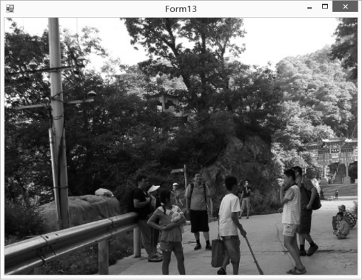
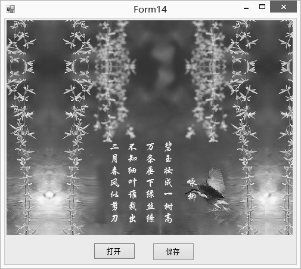

### 20.3.2　图像的显示和保存

#### 1．显示图像

显示图像有两种方式，一种是通过设置PictureBox控件的Image属性显示图像，另一种是通过Graphics对象的DrawImage方法在画布上画出图像。我们主要介绍第二种显示图像的方式，采用第二种显示图像的方式至少需要三个步骤。

① 创建或获取一个Graphics对象，指定绘图的画布。

② 创建一个Bitmap对象，给出要显示的图像文件。

③ 调用Graphics对象的DrawImage方法，在指定的画布上绘制图像。

下面通过双击窗体使用打开文件对话框选择要显示的图像文件，然后把选择的图像直接显示在窗体上。显示效果如下图所示。


程序源代码如下。

```c
01  String filename = "";
02  private void Form13_DoubleClick(object sender, EventArgs e)
03  {
04          OpenFileDialog openFileDialog = new OpenFileDialog();
05          openFileDialog.Filter="(*.jpg,*.gif,*.bmp,*.png,*.jpeg)|*.JPG;*.GIF;*.BMP;*.PNG;*.JPEG";
06          if (openFileDialog.ShowDialog() == DialogResult.OK)
07          {
08                  filename = openFileDialog.Filename;
09                  this.Refresh();
10          }
11  }
12  private void Form13_Paint(object sender, PaintEventArgs e)
13  {
14          if (filename != "")
15          {
16                  Bitmap bmp = new Bitmap(filename);
17                  Graphics pic = Graphics.FromImage(bmp);
18                  Graphics g = e.Graphics;
19                  g.DrawImage(bmp, 0, 0);
20          }
21  }
```

#### 2．保存图像

如果我们绘制了一个图像，或者对一个现有的图像进行了加工处理，如何进行保存呢？使用Bitmap类的Save方法可以将绘制的内容保存到文件中。Save方法的常用语法格式如下。

```c
public void Sava(String filename,ImageFormat format)
```

参数filename 表示要保存的文件名，format为保存的图像的类型。ImageFormat类的属性主要有Bmp(位图)、Jpeg （联合图像专家组图像格式）、Png（网络图像格式）和Gif(图形交换格式图像格式)等。

Imaging.ImageFormat支持的格式如下表所示。

| 格式名称 | 说明 |
| :-----  | :-----  | :-----  | :-----  |
| Bmp | 获取位图图像格式 |
| Emf | 获取增强型Windows图元文件图像格式 |
| Exif | 获取可交换图像文件格式 |
| Gif | 获取图形交换格式图像格式 |
| Guid | 获取表示此ImageFormat 对象的Guid结构 |
| Icon | 获取Windows图标图像格式 |
| Jpeg | 获取联合图像专家组图像格式 |
| MemoryBmp | 获取内存位图图像格式 |
| Png | 获取W3C可移植网络图形图像格式 |
| Tiff | 获取标签图像文件格式图像格式 |
| Wmf | 获取Windows图元文件图像格式 |

下面打开一个图像文件，给图像文件加上文字后，单击“保存”按钮，把图片文件保存到一个新文件中，程序运行效果如下图所示。


程序源代码如下。

```c
01  String fileName = "";
02  Bitmap bmp =null;
03  private void btnOpenFile_Click(object sender, EventArgs e)
04  {
05          OpenFileDialog openFileDialog = new OpenFileDialog();
06          openFileDialog.Filter="(*.jpg)|*.JPG|(*.gif)|*.GIF|(*.bmp)|*.BMP|(*.png)|*.PNG|(*.jpeg)|*.JPEG";
07          if (openFileDialog.ShowDialog() == DialogResult.OK)
08          {
09                  fileName = openFileDialog.FileName;
10                  panel1.Refresh();
11          }
12  }
13  private void panel1_Paint(object sender, PaintEventArgs e)
14  {
15          if (fileName != "")
16          {
17                  bmp = new Bitmap(fileName);
18                  Graphics pic = Graphics.FromImage(bmp);
19                  Font font = new Font("华文行楷", 18);
20                  SolidBrush brush = new SolidBrush(Color.Yellow);
21                  Point point = new Point(300, 260);
22                  StringFormat format = new StringFormat(StringFormatFlags.DirectionVertical);
23                  pic.DrawString("咏 柳", font, brush, point, format);
24                  point.Offset(-40, -60);
25                  pic.DrawString("碧玉妆成一树高", font, brush, point, format);
26                  point.Offset(-30, 0);
27                  pic.DrawString("万条垂下绿丝绦", font, brush, point, format);
28                  point.Offset(-30, 0);
29                  pic.DrawString("不知细叶谁裁出", font, brush, point, format);
30                  point.Offset(-30, 0);
31                  pic.DrawString("二月春风似剪刀", font, brush, point, format);
32                  Graphics g = e.Graphics;
33                  Image image = new Bitmap(bmp, panel1.Width, panel1.Height);
34                  g.DrawImage(image, 0, 0);
35          }
36  }
37  private void btnSave_Click(object sender, EventArgs e)
38  {
39          SaveFileDialog sfd = new SaveFileDialog();
40          sfd.Filter = "bmp文件(*.BMP)|*.BMP|All File(*.*)|*.*";
41          if (sfd.ShowDialog() == DialogResult.OK)
42          {
43                  .try
44                  {
45                          bmp.Save(sfd.FileName, System.Drawing.Imaging.ImageFormat.Jpeg);
46                          MessageBox.Show("保存图像成功");
47                  }
48                  catch (Exception ex)
49                  {
50                          MessageBox.Show("保存图像失败：" + ex.Message);
51                  }
52          }
53  }
```

