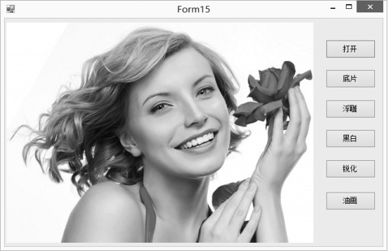
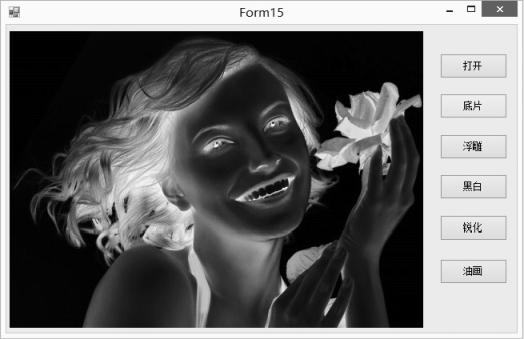
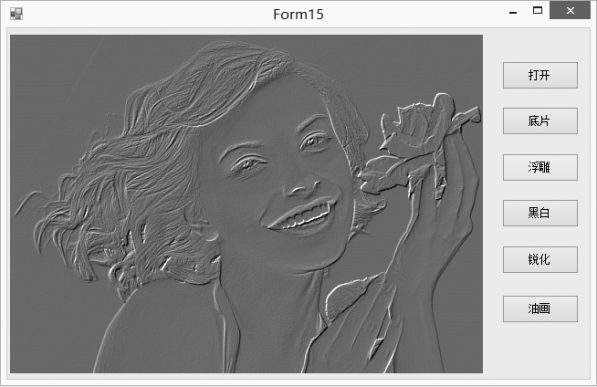
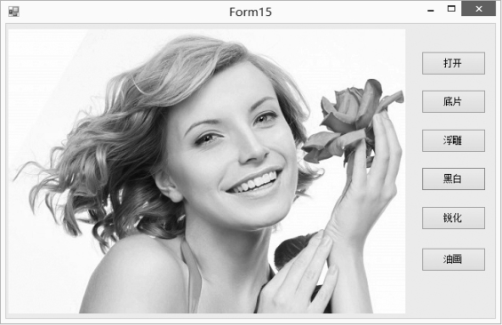
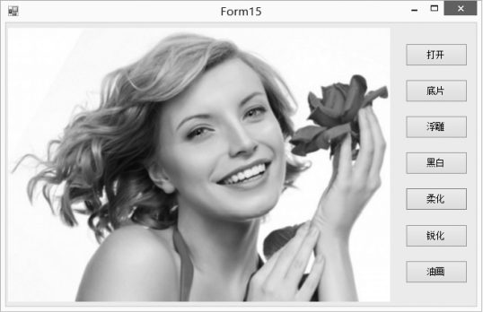
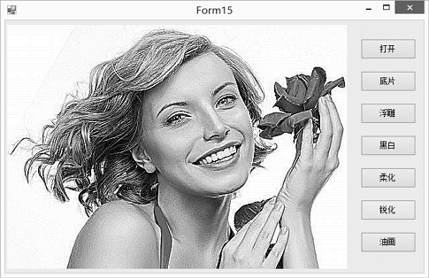
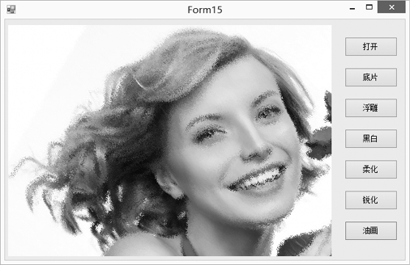

### 20.3.4　图像特效处理

对一幅彩色图像的各像素值进行变换并依变换后的新像素值重新显示，则可以实现不同的显示效果，这一点很像 Photoshop中对图片的处理。利用C#提供的图像处理方法，开发人员能够实现不同的图片特效，如呈现底片、浮雕、黑白和锐化等效果。本节介绍彩色图像变换和处理的一些基本方法与技巧。

原图片的显示效果如下图所示，我们分别采用不同的加工处理方法对图片进行处理。


#### 1．底片效果

底片效果是指把每一像素的值按二进制取反，通过GetPixel方法获得每一点像素的值，再使用SetPixel方法将取反后的颜色值设置到对应的点。对原图片经过底片处理之后的效果如下图所示。


程序源代码如下。

```c
01  private void btnOpenFile_Click(object sender, EventArgs e)
02  {
03          OpenFileDialog openFileDialog = new OpenFileDialog();
04          openFileDialog.Filter="(*.jpg)|*.JPG|(*.gif)|*.GIF|(*.bmp)|*.BMP|(*.png)|*.PNG|(*.jpeg)|*.JPEG";
05          if (openFileDialog.ShowDialog() == DialogResult.OK)
06          {
07                  try
08                  {
09                          bmp = new Bitmap(openFileDialog.FileName);       
10                          pictureBox1.Image = bmp;
11                  }
12                  catch (Exception ex)
13                  {
14                  MessageBox.Show("图片格式不正确！", "信息提示", MessageBoxButtons.OK, MessageBoxIcon.Information);
15                  }
16          }
17  }
18  private void btnDiPan_Click(object sender, EventArgs e)
19  {
20          int width = pictureBox1.Width;
21          int height = pictureBox1.Height;
22          try
23          {
24                  Bitmap newbitmap = new Bitmap(width, height);
25                  Bitmap oldbitmap = (Bitmap)this.pictureBox1.Image;
26                  Color pixel;
27                  for (int x = 1; x < width; x++)
28                  {
29                  for (int y = 1; y < height; y++)
30                          {
31                                  int r, g, b;
32                                  pixel = oldbitmap.GetPixel(x, y);
33                                  r = 255 - pixel.R;
34                                  g = 255 - pixel.G;
35                                  b = 255 - pixel.B;
36                                  newbitmap.SetPixel(x, y, Color.FromArgb(r, g, b));
37                          }
38                  }
39                  this.pictureBox1.Image = newbitmap;
40          }
41          catch (Exception ex)
42          {
43                  MessageBox.Show(ex.Message, "信息提示", MessageBoxButtons.OK, MessageBoxIcon.Information);
44          }
45  }
```

#### 2．浮雕效果

浮雕效果是对图像像素点的像素值分别与相邻像素点的像素值相减后加上128，然后将其作为新的像素点的值进行显示。对原图片经过浮雕处理之后的效果如下图所示。


程序源代码如下。

```c
01  private void btnFuDiao_Click(object sender, EventArgs e)
02  {
03          try
04          {
05                  int width = bmp.Width;
06                  int height = bmp.Height;
07                  Bitmap newBitmap = new Bitmap(width, height);
08                  Bitmap oldBitmap = (Bitmap)this.pictureBox1.Image;
09                  Color pixel1, pixel2;
10                  for (int x = 0; x < width - 1; x++)
11                  {
12                          for (int y = 0; y <height - 1; y++)
13                          {
14                                  int r = 0, g = 0, b = 0;
15                                  pixel1 = oldBitmap.GetPixel(x, y);
16                                  pixel2 = oldBitmap.GetPixel(x + 1, y + 1);
17                                  r = Math.Abs(pixel1.R - pixel2.R + 128);
18                                  g = Math.Abs(pixel1.G - pixel2.G + 128);
19                                  b = Math.Abs(pixel1.B - pixel2.B + 128);
20                                  if (r > 255)
21                                          r = 255;
22                                  if (r < 0)
23                                          r = 0;
24                                  if (g > 255)
25                                          g = 255;
26                                  if (g < 0)
27                                          g = 0;
28                                  if (b > 255)
29                                          b = 255;
30                                  if (b < 0)
31                                          b = 0;
32                                  newBitmap.SetPixel(x, y, Color.FromArgb(r, g, b));
33                          }
34                  }
35                  this.pictureBox1.Image = newBitmap;
36          }
37          catch (Exception ex)
38          {
39          MessageBox.Show("图片格式不正确！", "信息提示", MessageBoxButtons.OK, MessageBoxIcon.Information);
40          }
41  }
```

#### 3．黑白效果

黑白效果是指把彩色图像变成黑白的图像，处理成黑白效果通常有3种算法。

（1）最大值法：使每个像素点的 R，G，B 值等于原像素点的 RGB (颜色值) 中最大的一个。

（2）平均值法：使每个像素点的 R，G，B值等于原像素点的RGB值的平均值。

（3）加权平均值法：对每个像素点的 R，G，B值进行加权。

采用第③种算法处理后的图片效果如下图所示。


程序源代码如下。

```c
01  private void btnHeiBai_Click(object sender, EventArgs e)
02  {
03          try
04          {
05                  int width = bmp.Width;
06                  int height = bmp.Height;
07                  Bitmap newBitmap = new Bitmap(width, height);
08                  Bitmap oldBitmap = (Bitmap)this.pictureBox1.Image;
09                  Color pixel;
10                  for (int x = 0; x < width; x++)
11                  for (int y = 0; y < height; y++)
12                  {
13                          pixel = oldBitmap.GetPixel(x, y);
14                          int r, g, b, Result = 0;
15                          r = pixel.R;
16                          g = pixel.G;
17                          b = pixel.B;
18                          //实例程序以加权平均值法产生黑白图像
19                          int iType = 2;
20                          switch (iType)
21                          {
22                                  case 0://平均值法
23                                          Result = ((r + g + b) / 3);
24                          break;
25                                  case 1://最大值法
26                          Result = r > g ? r : g;
27                          Result = Result > b ? Result : b;
28                  break;
29                  case 2://加权平均值法
30                          Result = ((int)(0.7 * r) + (int)(0.2 * g) + (int)(0.1 * b));
31                  break;
32                  }
33                  newBitmap.SetPixel(x, y, Color.FromArgb(Result, Result, Result));
34          }
35          this.pictureBox1.Image = newBitmap;
36          }
37          catch (Exception ex)
38          {
39          MessageBox.Show("图片格式不正确！", "信息提示", MessageBoxButtons.OK, MessageBoxIcon.Information);
40          }
41  }
```

#### 4．柔化效果

柔化是指当前像素点与周围像素点的颜色差距较大时取其平均值。对原图片进行柔化后的效果如下图所示。


程序源代码如下。

```c
01  private void btnRouHua_Click(object sender, EventArgs e)
02  {
03          try
04          {
05                  int width = bmp.Width;
06                  int height = bmp.Height;
07                  Bitmap bitmap = new Bitmap(width, height);
08                  Bitmap MyBitmap = (Bitmap)this.pictureBox1.Image;
09                  Color pixel;
10                  //高斯模板
11                  int[] Gauss = { 1, 2, 1, 2, 4, 2, 1, 2, 1 };
12                  for (int x = 1; x < width - 1; x++)
13                  for (int y = 1; y < height - 1; y++)
14                          {
15                                  int r = 0, g = 0, b = 0;
16                                  int Index = 0;
17                                  for (int col = -1; col <= 1; col++)
18                                  for (int row = -1; row <= 1; row++)
19                                  {
20                                          pixel = MyBitmap.GetPixel(x + row, y + col);
21                                          r += pixel.R * Gauss[Index];
22                                          g += pixel.G * Gauss[Index];
23                                          b += pixel.B * Gauss[Index];
24                                          Index++;
25                                  }
26                                  r /= 16;
27                                  g /= 16;
28                                  b /= 16;
29                                  //处理颜色值溢出
30                                  r = r > 255 ? 255 : r;
31                                  r = r < 0 ? 0 : r;
32                                  g = g > 255 ? 255 : g;
33                                  g = g < 0 ? 0 : g;
34                                  b = b > 255 ? 255 : b;
35                                  b = b < 0 ? 0 : b;
36                                  bitmap.SetPixel(x - 1, y - 1, Color.FromArgb(r, g, b));
37                  }
38                          this.pictureBox1.Image = bitmap;
39                  }
40          catch (Exception ex)
41          {
42          MessageBox.Show("图片格式不正确！", "信息提示", MessageBoxButtons.OK, MessageBoxIcon.Information);
43          }
44  }
```

#### 5．锐化效果

锐化效果是指计算源图像像素的像素值和该像素与相邻像素的像素值并突出显示颜色值大的像素点。对原图片进行锐化后的效果如下图所示。


程序源代码如下。

```c
01  private void btnRuiHua_Click(object sender, EventArgs e)
02  {
03          try
04          {
05                  int width = bmp.Width;
06                  int height = bmp.Height;
07                  Bitmap newBitmap = new Bitmap(width, height);
08                  Bitmap oldBitmap = (Bitmap)this.pictureBox1.Image;
09                  Color pixel;
10                  //拉普拉斯模板
11                  int[] Laplacian = { -1, -1, -1, -1, 9, -1, -1, -1, -1 };
12                  for (int x = 1; x < width - 1; x++)
13                  for (int y = 1; y < height - 1; y++)
14                  {
15                          int r = 0, g = 0, b = 0;
16                          int Index = 0;
17                          for (int col = -1; col <= 1; col++)
18                          for (int row = -1; row <= 1; row++)
19                          {
20                                  pixel = oldBitmap.GetPixel(x + row, y + col); r += pixel.R * Laplacian[Index];
21                                  g += pixel.G * Laplacian[Index];
22                                  b += pixel.B * Laplacian[Index];
23                                  Index++;
24                          }
25                          //处理颜色值溢出
26                          r = r > 255 ? 255 : r;
27                          r = r < 0 ? 0 : r;
28                          g = g > 255 ? 255 : g;
29                          g = g < 0 ? 0 : g;
30                          b = b > 255 ? 255 : b;
31                          b = b < 0 ? 0 : b;
32                          newBitmap.SetPixel(x - 1, y - 1, Color.FromArgb(r, g, b));
33                  }
34                  this.pictureBox1.Image = newBitmap;
35          }
36          catch (Exception ex)
37          {
38                  MessageBox.Show("图片格式不正确！", "信息提示", MessageBoxButtons.OK, MessageBoxIcon.Information);
39          }
40  }
```

#### 6．油画效果

油画效果是指对图像中某一范围内的像素引入随机值。对原图片进行油画效果处理后的效果如下图所示。


程序源代码如下。

```c
01  private void btnYouHua_Click(object sender, EventArgs e)
02  {
03          try
04          {
05                  int width = bmp.Width;
06                  int height = bmp.Height;
07                  Bitmap newBitmap = new Bitmap(width, height);
08                  Bitmap oldBitmap = (Bitmap)this.pictureBox1.Image;
09                  Color pixel;
10                  Random rnd = new Random();
11                  for (int x = width; x >1; x--)
12                  for (int y =height; y >1; y--)
13                  {
14                          //取不同的值决定油画效果的不同程度
15                          int iModel =5;
16                          int i = x - iModel;
17                          if (i > 1)
18                                  {
19                                          int j = y - iModel;
20                                          if (j > 1)
21                                                  {
22                                                          int iPos = rnd.Next(100000) % iModel;
23                                                          //将该点的RGB值设置成附近iModel点之内的任一点
24                                          pixel = oldBitmap.GetPixel(i + iPos, j + iPos);
25                                          newBitmap.SetPixel(i, j, pixel);
26                                  }
27                          }
28                  }
29          this.pictureBox1.Image = newBitmap;
30          }
31          catch (Exception ex)
32          {
33          MessageBox.Show("图片格式不正确！", "信息提示", MessageBoxButtons.OK, MessageBoxIcon.Information);
34          }
35  }
```

