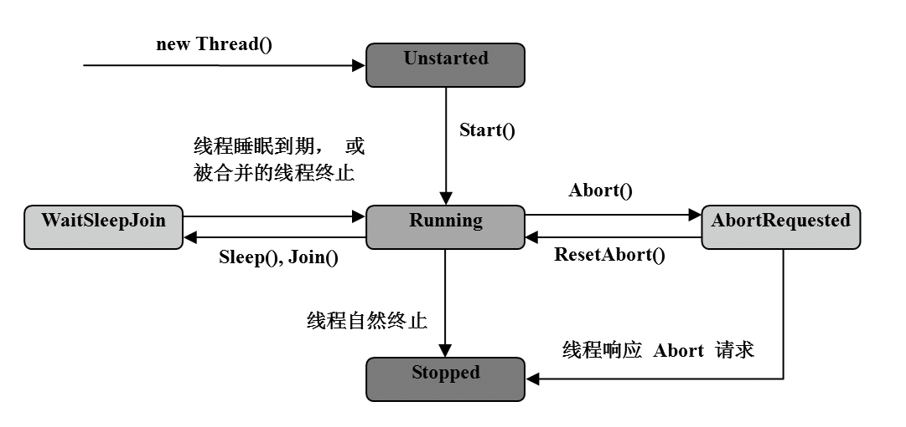

### 21.2　线程的基本操作

**本节视频教学录像：14分钟**

常见的线程实例状态有Unstarted、Running、WaitSleepJoin、AbortRequest和 Stopped。一旦线程被创建直至其消亡，它都处于一个或多个线程的状态中。下图描述了线程状态变迁过程。

当实例化一个Thread对象时，就创建一个新线程。新创建的线程最初处于Unstarted状态中。通过调用Start方法，可以将Unstarted线程转换为Running状态。通过调用Abort方法，可以将Running线程转换为AbortRequested状态。当AbortRequested线程捕获到System.Threading.ThreadAbortException异常后，可以调用ResetAbort方法。通过调用Thread.Sleep或者Thread.Join方法，可以将Running线程转换为WaitSleepJoin状态，线程被阻塞。

在System.Threading命名空间下有一个Thread类，用于对线程进行管理，如创建线程、启动线程、终止线程、合并线程、让线程休眠等。

