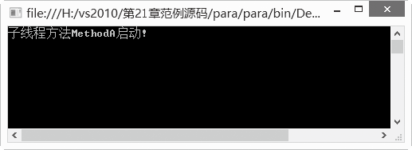
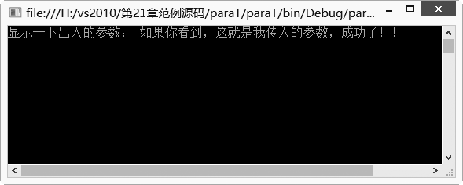
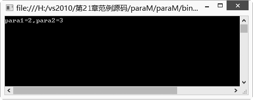
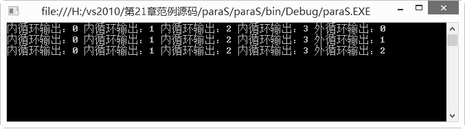

### 21.2.1　创建线程

.Net让我们可以很轻松地就创建一个线程，但是它提供的创建线程和启动线程的方法没有明显地提供参数，假如我们要用线程来启动类里面一个带参数的方法，该怎么办？在多线程或单线程任务中，让线程带传入参数一直是个麻烦的问题。本节介绍C#中线程的处理方法。

Thread类提供了创建并控制线程，设置其优先级并获取其状态的方法。该类包含在System.Threading命名空间中。如果想在应用程序中使用多线程，就必须包含Thread类。而在使用Thread类之前，程序一定要使用以下语句，把System.Threading命名空间包含进来。

```c
using System.Threading;
```

> 
> **提示**
> System.Threading 命名空间提供了一些可以进行多线程编程的类和接口。除了同步线程活动和访问数据的类（Mutex、Monitor、Interlocked、AutoResetEvent 等）外，此命名空间还包含一个 ThreadPool 类（它允许用户使用系统提供的线程池）和一个 Timer 类（它在线程池线程上执行回调方法）。

#### 1．线程处理函数

在不传递参数的情况下，可使用ThreadStart代理来连接执行函数。如果希望传递参数给执行函数，则可使用ParameterizedThreadStart代理来链接执行函数。使用Thread类，可给我们提供以下4个重载的构造函数。

+ Thread (ThreadStart)：初始化 Thread 类的新实例。
+ Thread (ParameterizedThreadStart)：初始化 Thread 类的新实例，指定允许对象在线程启动时传递给线程的委托。
+ Thread (ParameterizedThreadStart, Int32)：初始化 Thread 类的新实例，指定允许对象在线程启动时传递给线程的委托，并指定线程的最大堆栈大小。
+ Thread (ThreadStart, Int32)：初始化 Thread 类的新实例，指定线程的最大堆栈大小。

#### 2．线程使用

在线程使用的时候，不带参数的线程可以用ThreadStart创建，带一个参数的时候可以用ParameterizedThreadStart创建，带多个参数的则可用另外的方法创建。

**【范例21-1】 创建和使用不带参数的线程。**

（1）在Visual Studio 2013中新建一个控制台应用程序，项目名称为“para”。 在自动生成的“Program.cs”程序中添加导入Threading命名空间语句“using System.Threading;”。

（2）在Program.cs中添加以下代码进行测试（代码21-1-1.txt）。

```c
01  using System;        //引用需要使用的命名空间
02  using System.Collections.Generic;
03  using System.Linq;
04  using System.Text;
05  using System.Threading ;
06  
07  namespace para
08  {
09          class Program
10          {
11                  static void Main(string[] args)
12                  {
13                          Thread ThreadSample = new Thread(new ThreadStart(MethodA)); 
14                          ThreadSample.Start(); 
15                  } 
16
17                   private static void MethodA() 
18                  {
19                          Console.WriteLine("子线程方法MethodA启动!"); 
20                  } 
21                 }
22  }
```

**【运行结果】**

运行结果如下图所示。


**【范例21-2】 创建和使用带参数的线程。**

（1）在Visual Studio 2013中新建一个控制台应用程序，项目名称为“paraT”。 在自动生成的“Program.cs”程序中添加导入Threading命名空间语句“using System.Threading;”。

（2）在Program.cs中添加以下代码进行测试（代码21-2-1.txt）。

```c
01  class Program
02  {
03          static void Main(string[] args)
04          {
05                  Thread ThreadOne = new Thread(new ParameterizedThreadStart(MethodsOne));
06                  ThreadOne.Start("如果你看到，这就是我传入的参数，成功了！！");
07                  Console.Read(); 
08          }
09  
10          private static void MethodsOne(object obj)
11          {
12                  Console.WriteLine("显示一下出入的参数： {0}", obj.ToString());
13          } 
14  }
```

**【运行结果】**

运行结果如下图所示。


由于ParameterizedThreadStart要求参数类型必须为object，所以定义的方法MethodsOne形参类型必须为object。

由于Thread默认只提供了这两种构造函数，所以如果需要传递多个参数，就可以自己将参数作为类的属性。定义类的对象的时候实例化这个属性，然后再进行操作。

**【范例21-3】 创建和使用带多个参数的线程。**

（1）在Visual Studio 2013中新建一个控制台应用程序，项目名称为“paraM”。 在自动生成的“Program.cs”程序中添加导入Threading命名空间语句“using System.Threading;”。

（2）在Program.cs中添加以下代码进行测试（代码21-3-1.txt）。

```c
01  class Program
02  {
03          static void Main(string[] args)
04          {
05                  ThreadDemo ClassOne = new ThreadDemo();
06                  ClassOne.para1 = 2;
07                  ClassOne.para2 = 3;
08                  Thread ThreadOne = new Thread(new ThreadStart(ClassOne.MethodDemo));
09                  ThreadOne.Start();
10                  Console.Read(); 
11          }
12          class ThreadDemo
13          {
14                  public int para1, para2;
15                  public void MethodDemo()
16                  {
17                  Console.WriteLine("para1={0},para2={1}", this.para1, this.para2);
18                  }
19          } 
20  }
```

**【运行结果】**

运行结果如下图所示。


为多线程方法调用提供多个参数的最好办法是将目标方法包裹在结构中，这种方法的优点是无论需要传递任何参数，都可以在结构内方便地完成封装和传递。

**【范例21-4】 利用结构体给多线程方法参数传值。**

（1）在Visual Studio 2013中新建一个控制台应用程序，项目名称为“paraS”。 在自动生成的“Program.cs”程序中添加导入Threading命名空间语句“using System.Threading;”。

（2）在Program.cs中添加以下代码进行测试（代码21-4-1.txt）。

```c
01  namespace paraS
02  {
03          //定义结构体
04          public struct StructRow
05          {
06                  //定义两个公共的整型变量
07                  public int First;
08                  public int Two;
09          };
10          class Program
11          {
12                  static void Main(string[] args)
13                  {
14                          ClassDemo ClassOne = new ClassDemo();
15                          //创建rcM结构
16                          StructRow rcM;
17                          //结构变量赋值
18                          rcM.First = 3;
19                          rcM.Two = 4;
20                          Thread ThreadOne = new Thread(new ParameterizedThreadStart(ClassOne.Demo));
21                          //启动线程
22                          ThreadOne.Start( rcM );
23                          //延时输入
24                          Console.Read(); 
25                  }
26          }
27          class ClassDemo
28          {
29                  public void Demo(Object rcMIn)
30                  {
31                          //接受传入参数
32                          StructRow rowCol = (StructRow)rcMIn;
33                          for (int i = 0; i < rowCol.First; i++)
34                          {
35                                  for (int j = 0; j < rowCol.Two; j++)
36                                  //输出内循环变量i
37                                  Console.Write("内循环输出：{0} ", j) ;
38                                  //输出外循环变量i
39                                  Console.Write("外循环输出：{0} ", i);
40                                  //输出换行
41                                  Console.Write("\n");
42                          }
43                  }
44          }
45  }
```

**【运行结果】**

运行结果如下图所示。


C#线程传递参数的相关内容我们使用了不同的示例，从多个角度介绍了传递不同参数的方法，希望读者能够掌握使用线程传递参数的方法。

