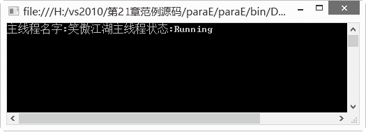

### 21.2.2　启动线程

现在我们有了一个线程，如何启动这个线程呢？在Thread中提供了Start方法，通过调用该方法就可以启动线程。

新建并启动一个线程的代码如下。

```c
ThreadSimple.Start();
```

在Thread这个类中以对象的方式提供了一些必要的实例成员，其中比较常用的有以下8个。

+ IsAlive：判断线程是否处于活动状态。
+ Name：线程的名称。
+ Priority：ThreadPriority枚举类型，代表线程的优先级。
+ ThreadState：ThreadState枚举类型，代表线程的状态。
+ Start：启动一个线程。
+ Suspend：挂起一个线程的运行。
+ Resume：继续挂起的线程。
+ Abort：结束一个线程的运行。

线程创建完毕并启动之后，要控制线程，还有以下几件事情需要完成。

（1）线程的优先级。ThreadPriority属性用于设置线程的级别。在枚举类型ThreadPriority中定义了以下成员，分别对应一种线程级别。

+ Normal：普通级别。
+ AboveNormal：高于普通级别。
+ BelowNormal：低于普通级别。
+ Highest：最高级别。
+ Lowest：最低级别。

下面的语句把线程的级别设成了最高。

```c
ThreadSimple.priority = ThreadPriority.Highest;
```

（2）线程的休眠。休眠线程是让进程进入一定时间的休眠状态，时间一到，线程将继续运行。这可以通过Thread的Sleep方法实现。Thread类中有两个重载的Sleep方法，一个带有int类型的参数，用于指定休眠的毫秒数；另一个带有TimeSpan类型的参数，用于指定休眠的时间段。

例如，下面的两个Sleep调用效果是相同的，都是休眠10秒。

```c
Thread.Sleep(10000);
Thread.Sleep(New TimeSpan(0, 0, 0, 0, 10000));
```

（3）线程的挂起。和休眠不同，线程的挂起是暂停线程，如果不再启动线程，它将永远保持暂停状态。只有当前运行的线程才可以挂起，对已经挂起的线程实施挂起操作没有任何效果。代码如下。

```c
01  //如果线程的状态是运行
02  if (NewThread.ThreadState = = ThreadState.Running)
03  {
04          //线程挂起
05          NewThread.Suspend();
06  }
```

这里通过查询Thread的ThreadState属性检查线程是否在运行。

（4）线程的继续。挂起线程后可以使用Thread.Resume方法继续运行。对没有挂起的线程使用继续操作没有任何结果。代码如下。

```c
01  //如果线程的状态是挂起
02  if (NewThread.ThreadState = ThreadState.Suspended)
03  {
04          //线程继续
05          NewThread.Resume();
06  }
```

刚才我们学习了线程中的实例成员，怎么用呢？能否给线程命名，并且输出线程的名字呢?这个是完全可以做到的，用上面给出的实例方法写成如下的代码就可以做到。

**【范例21-5】 在C#中输出线程的名字。**

（1）在Visual Studio 2013中新建一个控制台应用程序，项目名称为“paraE”。 在自动生成的“Program.cs”程序中添加导入Threading命名空间语句“using System.Threading;”。

（2）在Program.cs的Main方法中添加以下代码进行测试（代码21-5-1.txt）。

```c
01  static void Main(string[] args)
02  {
03          //给当前线程起名为“笑傲江湖”
04          Thread.CurrentThread.Name = "笑傲江湖";
05          //输出线程名字和线程状态
06          Console.WriteLine("主线程名字:" +  Thread.CurrentThread.Name + "主线程状态:" + Thread.CurrentThread.ThreadState);
07          //等待延时
08          Console.ReadLine();
09  }
```

**【运行结果】**

运行结果如下图所示。


线程的操作就是如此轻松，所需要的核心语句不用很多，就可以对线程进行控制。

