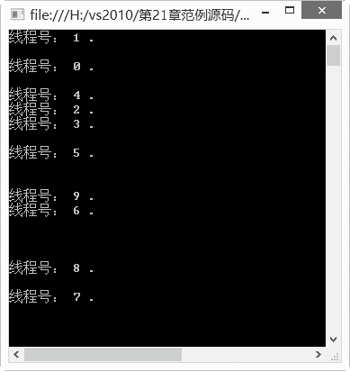

### 21.2.4　线程池

“线程池”是可以用来在后台执行多个任务的线程集合，这使得主线程可以自由地异步执行其他任务。线程池通常用于服务器应用程序。每个传入请求都将分配给线程池中的一个线程，因此可以异步处理请求，而不会占用主线程，也不会延迟后续请求的处理。

一旦池中的某个线程完成任务，它将返回到等待线程队列中，等待被再次使用。这种重用使应用程序可以避免为每个任务创建新线程的开销。线程池通常具有最大线程数限制。如果所有的线程都繁忙，那么额外的任务将放入队列中，直到有线程可用时才能够得到处理。用户可以实现自己的线程池，但是通过 ThreadPool 类使用 .NET Framework 提供的线程池则更容易一些。

ThreadPool 类提供了一个线程池，该线程池可用于发送工作项、处理异步 I/O、代表其他线程等待以及处理计时器。其主要成员如下表所示。

| 成员名称 | 说明 |
| :-----  | :-----  | :-----  | :-----  |
| QueueUserWorkItem | 将方法排入队列以便执行。此方法在有线程池线程变得可用时执行 |
| RegisterWaitForSingleObject | 注册正在等待 WaitHandle 的委托 |

QueueUserWorkItem有以下两种形式。

+ QueueUserWorkItem(WaitCallback) 将方法排入队列以便执行。此方法在有线程池线程变得可用时执行。
+ QueueUserWorkItem(WaitCallback, Object) 将方法排入队列以便执行，并指定包含该方法所用数据的对象。此方法在有线程池线程变得可用时执行。

线程池给我们提供了一种多线程处理形式，处理过程中将任务添加到队列，创建线程后自动启动这些任务。线程池线程都是后台线程。每个线程都使用默认堆栈大小，以默认的优先级运行，并处于多线程单元中。如果某个线程在托管代码中空闲（如正在等待某个事件），则线程池将插入另一个辅助线程以使所有的处理器保持繁忙。如果所有的线程池线程都始终保持繁忙，但队列中包含挂起的工作，则线程池将在一段时间之后创建另一个辅助线程。但线程的数目永远不会超过最大值。超过最大值的其他线程可以排队，但它们要等到其他线程完成后才启动。

线程池特别适合于执行一些需要多个线程的任务。使用线程池能够优化这些任务的执行过程，从而提高吞吐量，它不仅能够使系统针对此进程优化该执行过程，而且还能够使系统针对计算机上的其他进程优化该执行过程。如果需要启动多个不同的任务，而又不想分别设置每个线程的属性，就可以使用线程池。

ThreadPool是一个静态类，它没有定义任何的构造方法，我们只能够使用它的静态方法，它所要做的工作是在后台进行的。要使工作项的排队和运行更容易，可以给工作者线程传递一个状态对象。状态对象是私有的作用域，位于线程层，所以不需要进行同步。

ThreadPool中的Thread不能手动取消，也不用手动开始，所以ThreadPool并不适用比较长的线程。我们要做的只是把一个WaitCallback委托塞给ThreadPool，剩下的工作将由系统自动完成。系统会在ThreadPool的线程队列中启动线程。当线程池满时，多余的线程会在队列里排队；当线程池空闲时，系统会自动调入排队的线程，以保持系统的利用率。

我们在程序中可以使用ThreadPool来进行一些比较耗时或者需要阻塞的操作。当需要复杂的同步技术，例如事件，或需要对一个现场表调用Join方法时，线程池就不能满足需求了。在以下情况中不宜使用ThreadPool，而应该使用单独的Thread。

+ 线程需要指定优先级。
+ 线程的执行时间较长。
+ 线程在单独的线程apartment中。
+ 在线程执行的过程中对线程存在操作，如打断、挂起等。

通常是将计算密集型的操作放在worker线程池中运行，而线程池的大小会根据当前的CPU使用量自动调整。通过下面两个方法，我们可以设置线程池的大小。

```c
ThreadPool.SetMaxThreads(10, 200);
```

或者：

```c
ThreadPool.SetMinThreads(2, 40);
```

方法中的两个参数分别受WorkThread和IO Thread的限制。

**【范例21-7】 C#中的线程池。**

（1）在Visual Studio 2013中新建一个控制台应用程序，项目名称为“threadpooldemo”。 在自动生成的“Program.cs”程序中添加导入Threading命名空间语句“using System.Threading;”。

（2）在Program.cs中的Program类中添加以下代码进行测试（代码21-7-1.txt）。

```c
01  class Program
02  {
03          static void Main(string[] args)
04          {
05                  //在循环中创建线程池中的线程
06                  for (int i = 0; i < 10; i++)
07                  {
08  //在线程池中创建一个线程池线程来执行指定的方法（用委托WaitCallback来表示），并将该线程排入线程池的队列等待执行
09                  ThreadPool.QueueUserWorkItem( new WaitCallback(MethodA), i);
10                  }
11                  //等待输入，主要是为了延时
12                  Console.ReadLine();
13          }
14          static void MethodA(object Num)
15          {
16                  //转换接收到的线程号编码
17                  int QueueNum = (int)Num;
18                  //显示线程号
19                  Console.WriteLine("线程号： {0} .", Num);
20                  //输出空行，为了美观
21                  Console.WriteLine();
22          }
23  }
```

**【运行结果】**

运行结果如下图所示。


这是迄今为止我们写得较少的代码，却创建了最多的线程。在for循环内只有1行代码，却创建了10个线程，这就是线程池在创建多线程时的便捷之处。

