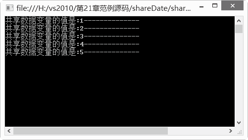

### 21.3.1　线程间数据共享

在多线程编程中，如果线程间需要共享数据，需要把共享的数据设置成静态类型的，此时可以使用关键字static。比如需要共享ShareDateInt这个整型变量，代码如下。

```c
static int ShareDateInt = 0;
```

上面的语句声明了一个静态整型变量ShareDateInt，然后创建多个线程。

```c
01  ShareData ShareDdataC                       //声明ShareData对象ShareDdataC
02  Thread[] ThreadArray;                       //声明线程数组
03  ThreadArray = new Thread[5];                //创建线程数组
04  ShareDdataC = new ShareData();              //构造ShareDdataC对象
05  for (int i = 0; i < 5; ++i)                 //使用循环的方式创建多个线程
06  {
07          ThreadArray[i] = new Thread(new ThreadStart(ShareDdataC.ThreadFunc));
08          ThreadArray[i].Start();             //线程运行
09          Thread.Sleep(500);                  //主线程睡眠
10  }
```

在上面的程序中共创建了5个线程，是到现在为止在一个程序中创建线程最多的程序。以下是完整的代码。

**【范例21-8】 线程间的数据共享。**

（1）在Visual Studio 2013中新建一个控制台应用程序，项目名称为“shareDate”。 在自动生成的“Program.cs”程序中添加导入Threading命名空间语句“using System.Threading;”。

（2）在Program.cs中的Program类中添加以下代码进行测试（代码21-8-1.txt）。

```c
//引用需要的命名空间
01  using System;       
02  using System.Collections.Generic;
03  using System.Linq;
04  using System.Text;
05  using System.Threading;
06  
07  namespace shareDate
08  {
09  class Program
10  {
11          //定义类ShareData
12          class ShareData
13          {
14                  //定义类静态整型变量ShareDateInt
15                  static int ShareDateInt = 0;
16                  //定义类方法ThreadFunc
17                  public void ThreadFunc()
18                  {
19                          {
20                                  //变量ShareDateInt加1
21                                  ++ShareDateInt;
22                          }
23                          //输出共享变量ShareDateInt的值        
24                          System.Console.WriteLine("共享数据变量的值是:{0}--------------", ShareDateInt);
25                  }
26          }
2                static void Main(string[] args)
28          {
29                  //声明ShareData对象ShareDdataC
30                  ShareData ShareDdataC;
31                  //声明线程数组
32                  Thread[] ThreadArray;
33                  //创建线程数组
34                  ThreadArray = new Thread[5];
35                  //构造ShareDdataC对象
36                  ShareDdataC = new ShareData();
37                  //使用循环的方式创建多个线程
38                  for (int i = 0; i < 5; ++i)
39                   {
40                          ThreadArray[i] = new Thread(new ThreadStart(ShareDdataC.ThreadFunc));
41                          //线程运行
42                          ThreadArray[i].Start(); 
43                          //主线程睡眠
44                          Thread.Sleep(500); 
45                  }
46          }
47  }
```

该程序的运行结果如下图所示。


在线程数组ThreadArray[i]中，ThreadArray[1]、ThreadArray[2]、ThreadArray[3]、Thread Array[4]、ThreadArray[5] 分别对共享静态变量进行了++操作，每次增加1，然后在屏幕中显示出正确的数值。

