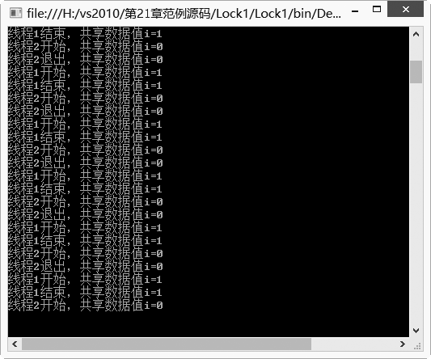
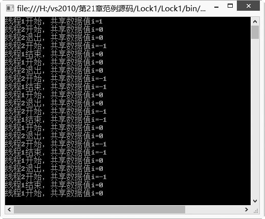

### 21.3.2　lock语句同步数据访问

在编程中，有时会遇到同时需要对某个数据进行操作的情况。如果在程序中需要处理这样的情况，两个线程需要同时操作一个队列，一个线程进行添加操作，另外一个线程进行取用元素操作，这是一个典型的生产者和消费者的问题，添加元素的线程为生产者，取用元素的线程为消费者。这个问题是多线程应用中必须解决的问题，这个问题涉及线程之间更深层次的操作：线程之间的同步和通信处理。

这些操作在以前往往不能很好地处理，自从C#语言中引入了lock这个关键字，这个问题就比较容易解决了。

lock 关键字将语句块标记为临界区，方法是获取给定对象的互斥锁，执行语句，然后释放该锁。

lock的语法如下。

```c
lock(expression) statement_block
```

其中expression是加锁对象，必须是引用类型，不能是数值类型；statement_block代表正在访问共享资源的程序段。

**【范例21-9】 创建程序，熟悉线程中lock语句的用法。**

（1）在Visual Studio 2013中新建一个控制台应用程序，项目名称为“Lock1”。

（2）在自动生成的“Program.cs”程序中添加导入Threading命名空间的语句。

```c
using System.Threading;        //引用线程命名空间
```

（3）在Program.cs中添加MethodSubA和MethodSubB两个静态方法（代码21-9-1.txt）。

```c
01  public static void MethodSubA()
02  {
03          do
04          {       //对线程内的操作进行锁定
05                  lock (LockExample)
06                  {       //在线程A中操作共享变量i
07                          i = i + 1;
08                          Console.WriteLine("线程1开始，共享数据值i={0}", i);
09                          Thread.Sleep(2000);    //线程A休眠2000毫秒
10                          //输出线程A的信息
11                          Console.WriteLine("线程1结束，共享数据值i={0}", i);
12                  }
13          } while (1 == 1);
14  }
15  
16  public static void MethodSubB()
17 {
18          do 
1                {        //对线程内的操作进行锁定
20                   lock (LockExample)
21                  {        //在线程B中操作共享变量i
22                          i = i - 1;
23                          Console.WriteLine("线程2开始，共享数据值i={0}", i);
24                          Thread.Sleep(2000);//线程B休眠2000毫秒
25                          //输出线程B的信息
26                          Console.WriteLine("线程2退出，共享数据值i={0}", i);
27                  }
28          } while (1 == 1);
29  }
```

（4）在Program.cs中添加以下代码进行测试（代码21-9-2.txt）。

```c
01  class Program
02  {
03          //声明创建加锁对象
04          public static object LockExample = new object();
05          //声明共享变量
06          static int i = 0;
07          static void Main(string[] args)
08          {
09                  //创建子线程1和子线程2
10                  Thread ThreadSubA = new Thread(new ThreadStart(MethodSubA));
11                  Thread ThreadSubB = new Thread(new ThreadStart(MethodSubB));
12                  //启动线程子线程1
13                  ThreadSubA.Start();
14                  //启动线程子线程2
15                  ThreadSubB.Start();
16                  do
17                  {
18                          //如果按e键并按Enter键则结束子线程，退出循环
19                          if (Console.Read() == 'e')
20                          {
21                                  //终止线程A
22                                  ThreadSubA.Abort();
23                                  //终止线程B
24                                  ThreadSubB.Abort();
25                                  //中断循环
26                                  break;
27                          }
28                   } while (1 == 1);
29          }
30  }
```

**【运行结果】**

运行结果如下图所示。


**【范例分析】**

主程序创建ThreadSubA和ThreadSubB两个线程，两个线程共同操作共享变量i。为了使得线程的操作有一个先后的顺序，即先由ThreadSubA线程进行 i= i + 1操作，然后再由ThreadSubB线程进行 i= i-1操作。所以在操作共享数据之前，线程都先使用lock()语句给共享数据加锁，将语句块标记为临界区，获取给定对象的互斥锁，执行语句。如果执行这个语句的时候正好有其他线程在使用共享数据，lock语句将处于等待状态，只有在加锁操作成功后才进行相应的操作。

**【拓展训练】 如果没有lock，线程将会怎样？**

如果在这段程序里取消线程中的lock语句，会出现什么情况？将程序改为以下的形式（拓展代码21-9-3.txt）。

```c
01  using System;
02  using System.Collections.Generic;
03  using System.Linq;
04  using System.Text;
05  using System.Threading;
06  
07  namespace Lock1
08  {
09      class Program
10  {
11         //声明创建加锁对象
12          public static object LockExample = new object();
13         //声明共享变量
14          static int i = 0;
15          static void Main(string[] args)
16          {
17               //创建子线程1和子线程2
18               Thread ThreadSubA = new Thread(new ThreadStart(MethodSubA));
19               Thread ThreadSubB = new Thread(new ThreadStart(MethodSubB));
20               //启动线程子线程1
21               ThreadSubA.Start();
22               //启动线程子线程2
23               ThreadSubB.Start();
24               do
25              {
26                     //如果按e键并按Enter键则结束子线程，退出循环
27                     if (Console.Read() == 'e')
28                    {
29                         //终止线程A
30                         ThreadSubA.Abort();
31                         //终止线程B
32                         ThreadSubB.Abort();
33                        //中断循环
34                        break;
35                  }
36           } while (1 == 1);
37  }
38  
39          public static void MethodSubA()
40          {
41              do
42              {
43                    //对线程内的操作进行锁定操作
44                    // lock (LockExample)
45                    {
46                              //在线程A中操作共享变量i
47                              i = i + 1;
48                              Console.WriteLine("线程1开始，共享数据值i={0}", i);
49                               //线程A休眠20毫秒
50                              Thread.Sleep(20);
51                              //输出线程A的信息
52                              Console.WriteLine("线程1结束，共享数据值i={0}", i);
53                          }
54                 } while (1 == 1);
55        }
56          public static void MethodSubB()
57          {
58                do 
59                {
60                       //对线程内的操作进行锁定
61                       //lock (LockExample)
62                                {
63                                  //在线程B中操作共享变量i
64                                   i = i - 1;
65                                   Console.WriteLine("线程2开始，共享数据值i={0}", i);
66                                   //线程B休眠2000毫秒
67                                   Thread.Sleep(2000);
68                                   //输出线程B的信息
69                                     Console.WriteLine("线程2退出，共享数据值i={0}", i);
70                                }
71                         } while (1 == 1);
72                   }
73           }
74  }
```

程序此时的输出将具有很大的随意性，线程对共享变量的操作将变得不可控制，程序此时的输入可能会如下图所示。


这就说明使用lock语句可以很好地实现互斥操作，从而保护数据在某个时刻内只有一个线程可以操作该数据，直至操作完毕才允许其他线程进行操作。这样就很好地实现了按顺序操作的设计，从而可避免不可预料的情况发生。

