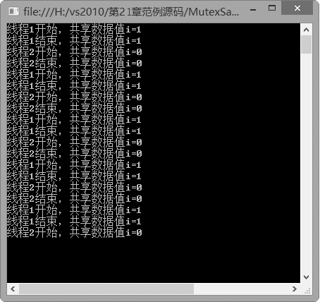
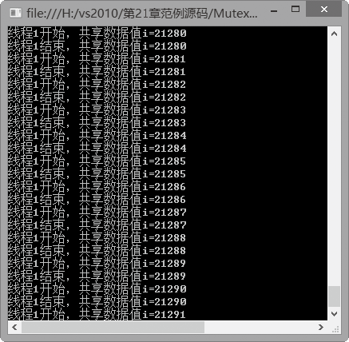

### 21.3.3　Mutex类同步数据访问

当两个或更多线程需要同时访问一个共享资源时，系统需要使用同步机制来确保一次只有一个线程使用该资源。Mutex类就是.net提供的一个非常有帮助的类，它只向一个线程授予对共享资源的独占访问权。如果一个线程获取了互斥体，那么想要获取该互斥体的第2个线程将被挂起，直到第1个线程释放该互斥体。在Mutex类中有如下表所示的3个关键的方法。

| 方法名称 | 说明 |
| :-----  | :-----  | :-----  | :-----  |
| WaitHandle.WaitOne () | 阻止当前线程，直到当前WaitHandle收到信号 |
| ReleaseMutex () | 调用线程不拥有互斥体 |
| Mutex (Boolean) | 用一个指示调用线程是否应拥有互斥体的初始所属权的布尔值来初始化 Mutex 类的新实例 |

可以使用 WaitHandle.WaitOne 方法请求互斥体的所属权。拥有互斥体的线程可以在对 WaitOne的重复调用中请求相同的互斥体而不会阻止其执行。但线程必须调用 ReleaseMutex 方法同样多的次数，以释放互斥体的所属权。

线程使用Mutex.WaitOne()方法等待Mutex对象被释放，如果它等待的Mutex对象被释放了，它就自动拥有这个对象，直到它调用Mutex.ReleaseMutex()方法释放这个对象，而在此期间，其他想要获取这个Mutex对象的线程都只能等待。

**【范例21-10】 演示Mutex类的使用。Mutex类的使用也许需要事先声明一个互斥体，我们使用一个简单的程序演示Mutex类的使用。**

（1）在Visual Studio 2013中新建一个控制台应用程序，项目名称为“MutexSample”。 在自动生成的“Program.cs”程序中添加导入Threading命名空间语句“using System.Threading;”。

（2）在Program.cs中添加SubProgram 类，SubProgram 类中包括MethodSubA和MethodSubB两个方法（代码21-10-1.txt）。

```c
01  class SubProgram
02  {
03          public  void MethodSubA()
04          {
05              do
06              {
07                   //使用WaitOne，对线程进行互斥和释放
08                  {
09                      Program.MSample.WaitOne( );
10                      //静态变量i加1
11                      Program.i = Program.i + 1;
12                      //输出线程1的共享变量的值
13                      Console.WriteLine("线程1开始，共享数据值i={0}", Program.i);
14                      Thread.Sleep(1000);
15                       //输出线程2的共享变量的值
16                      Console.WriteLine("线程1结束，共享数据值i={0}", Program.i);
17                      //调用ReleaseMutex方法
18                      Program.MSample.ReleaseMutex();
19                      Thread.Sleep(1000);                    
20                  }
21              } while (1 == 1);
22     }
23  
24         public void MethodSubB()
25       {
26          do
27                    {
28                           //使用WaitOne，对线程进行互斥和释放
29                                {
30                                         Program.MSample.WaitOne();
31                                         //静态变量i减1
32                                         Program.i = Program.i - 1;
33                                         //输出显示结果
34                                         Console.WriteLine("线程2开始，共享数据值i={0}", Program.i);
35                                         Thread.Sleep(1000);
36                                         Console.WriteLine("线程2结束，共享数据值i={0}", Program.i);
37                                         Program.MSample.ReleaseMutex();
38                                         Thread.Sleep(1000);
39                                 }
40                } while (1 == 1);
41         }
42  }
```

（3）在Program.cs中的Program类中添加以下代码进行测试（代码21-10-2.txt）。

```c
01  class Program
02     {
03   //声明互斥体
04          public static Mutex MSample;
05  //声明静态整型变量i
06          public  static int i = 0;
07          static void Main(string[] args)
08          {
09  //创建互斥体
10         MSample = new Mutex(false);
11  //创建演示需要的子线程
12         Thread ThreadSubA = new Thread(new ThreadStart(new SubProgram().MethodSubA));
13         Thread ThreadSubB = new Thread(new ThreadStart(new SubProgram().MethodSubB));
14  //启动线程
15         ThreadSubA.Start();
16         ThreadSubB.Start();
17  //主线程无限循环
18         do
19              {
20  //如果按e键并按Enter键则结束子线程，退出循环
21                  if (Console.Read() == 'e')
22                  {
23                      ThreadSubA.Abort();
24                      ThreadSubB.Abort();
25                      break;
26                  }
27              } while (1 == 1);
28          }
29      }
```

**【运行结果】**

该程序运行的结果如下图所示。


**【范例分析】**

从执行结果可以很清楚地看到，线程2的运行是以线程1的释放为条件的，两个线程依次操作，保证了共享数据的值永远在0和1的范围内。

**【拓展训练】**

关于Thread.Sleep(1000)读者可以试着修改一下，把Program.MSample.ReleaseMutex()这条语句之后的Thread.Sleep(1000)去掉以后，就会发现共享数据很有可能出现错误的情况。

运行后就会输出类似下图所示的结果。


这是因为在执行ReleaseMutex()语句之后，一定要给线程少许的时间，使得线程可以真正地把资源释放出来，如果没有这个暂停时间，下一个线程很有可能误判，从而造成程序执行中的问题。

