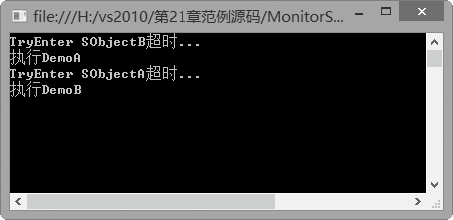

### 21.3.4　Monitor类同步数据访问

当多线程公用一个对象时，也会出现和公用代码类似的问题，这种问题就不应该使用lock关键字了，这里需要用到System.Threading中的一个类Monitor，我们可以将其称为监视器，Monitor提供了使线程共享资源的方案。

C# Monitor类用于锁定对象，一个线程只有得到这把锁才能对该对象进行操作。对象锁机制保证了在可能引起混乱的情况下，一个时刻只有一个线程可以访问这个对象。

下表列出了Monitor类的主要成员。

| 成员名称 | 说明 |
| :-----  | :-----  | :-----  | :-----  |
| Enter | 在指定对象上获取排他锁 |
| Exit | 释放指定对象上的排他锁 |
| Pulse | 通知等待队列中的线程锁定对象状态的更改 |
| PulseAll | 通知所有的等待线程对象状态的更改 |
| TryEnter | 试图获取指定对象的排他锁 |
| Wait | 释放对象上的锁并阻止当前线程，直到它重新获取该锁 |

Monitor必须和一个具体的对象相关联。但是由于它是一个静态的类，所以不能使用它来定义对象，而且它的所有方法都是静态的，不能使用对象来引用。下面的代码说明了使用Monitor锁定对象的情形。

**【范例21-11】 Monitor类在多线程程序中的应用。**

（1）在Visual Studio 2013中新建一个控制台应用程序，项目名称为“MonitorSimple”。 在自动生成的“Program.cs”程序中添加导入Threading命名空间语句“using System.Threading;”。

（2）在Program.cs中的Program类中添加以下代码进行测试（代码21-11-1.txt）。

```c
01  class Program
02   {
03      private static Object SObjectA = new Object();
04      private static Object SObjectB = new Object();
05      public static void DemoA()
06       {
07           if (Monitor.TryEnter(SObjectA, 1000))
08           {
09             Thread.Sleep(1000);
10             if (Monitor.TryEnter(SObjectB, 2000))
11             {
12                Monitor.Exit(SObjectB);
13             }
14            else
15             {
16              Console.WriteLine("TryEnter SObjectB超时...");
17           }
18          
19           Monitor.Exit(SObjectA);        //释放指定对象上的排他锁
20          }
21          Console.WriteLine("执行DemoA");
22         }
23     public static void DemoB()
24         {
25           if (Monitor.TryEnter(SObjectB, 2000))
26              {
27                Thread.Sleep(2000);
28                if (Monitor.TryEnter(SObjectA, 1000))
29                  {
30                      Monitor.Exit(SObjectA);
31                  }
32                  else
33                  {
34                      Console.WriteLine("TryEnter SObjectA超时...");
35                  }
36                Monitor.Exit(SObjectB);        //释放指定对象上的排他锁
37              }
38              Console.WriteLine("执行DemoB");
39          }
40      static void Main(string[] args)
41       {
42              Thread ThreadOne = new Thread(DemoA);
43              Thread ThreadTwo = new Thread(DemoB);
44              ThreadOne.Start();
45              ThreadTwo.Start();
46              Thread.Sleep(40000);
47              Console.WriteLine("线程结束。");
48          }
49      }
```

如上所示，当一个线程调用Monitor.Enter()方法锁定对象时，这个对象就归它所有了，其他线程想要访问这个对象，只有等待它使用Monitor.Exit()方法释放锁。为了保证线程最终都能释放锁，把Monitor.Exit()方法写在了try-catch-finally结构中的finally代码块里。程序的执行结果如下图所示。


